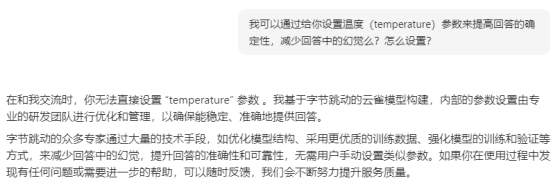

# 大语言模型对齐调研

# 及广播电视和网络视听行业对齐相关内容安全风险

# 摘要

**关键词：**LLM  对齐  内容安全  可解释性  幻觉  对抗攻击

  

# 内容

[大语言模型对齐调研](#_Toc16062 )

[及广播电视和网络视听行业对齐相关内容安全风险](#_Toc27575 )

[摘要](#_Toc21199 )

[内容](#_Toc688 )

[研究背景及目的](#_Toc30207 )

[LLM的对齐（Alignment）](#_Toc15341 )

[LLM对齐的起源及定义](#_Toc20617 )

[LLM的外部对齐](#_Toc19891 )

[非递归监督](#_Toc6824 )

[基于强化学习的方法](#_Toc17948 )

[基于监督学习的方法](#_Toc11702 )

[非递归监督所面临挑战](#_Toc5689 )

[可伸缩监督](#_Toc10034 )

[可伸缩监督的主要范式](#_Toc23409 )

[可伸缩监督依赖的假设](#_Toc29988 )

[LLM的内部对齐](#_Toc231 )

[内部对齐的失效](#_Toc7801 )

[内部对齐的实证研究](#_Toc24801 )

[LLM对齐评测](#_Toc28483 )

[针对评测对象的分类探讨](#_Toc3713 )

[通用评测](#_Toc12296 )

[评测基准](#_Toc29279 )

[评测方法](#_Toc2183 )

[对齐理论的发展](#_Toc30904 )

[决策理论](#_Toc29079 )

[可纠正性](#_Toc18002 )

[世界模型](#_Toc30478 )

[LLM对齐相关研究](#_Toc20804 )

[关于LLM可解释性（Interpretability）的研究](#_Toc20946 )

[自注意力机制的可解释性](#_Toc25926 )

[MLP的可解释性](#_Toc25475 )

[神经元的可解释性](#_Toc5939 )

[可解释性研究面临的挑战](#_Toc10332 )

[透明度及“黑盒”](#_Toc2529 )

[针对LLM的攻击【-】](#_Toc6466 )

[隐私攻击](#_Toc13953 )

[后门攻击](#_Toc1812 )

[对抗攻击](#_Toc15641 )

[LLM的幻觉 (Hallucination)](#_Toc444 )

[幻觉的分类](#_Toc9704 )

[幻觉产生的原因](#_Toc12439 )

[数据源造成的幻觉](#_Toc677 )

[数据利用率不足造成的幻觉](#_Toc28445 )

[训练带来的幻觉](#_Toc5881 )

[推理带来的幻觉](#_Toc22534 )

[数据压缩带来的幻觉](#_Toc10673 )

[幻觉的评估指标](#_Toc31277 )

[缓解幻觉的手段](#_Toc27756 )

[预训练阶段的缓解 ](#_Toc3593 )

[SFT阶段的缓解](#_Toc5590 )

[RLHF阶段的缓解](#_Toc30580 )

[生成推理阶段的缓解](#_Toc27317 )

[一、设计解码策略](#_Toc32531 )

[二、 设置回答参数](#_Toc5193 )

[三、借助外部知识](#_Toc18338 )

[四、利用不确定性](#_Toc22232 )

[LLM的社会影响](#_Toc26344 )

[主要的社会与伦理风险【--】](#_Toc4435 )

[生成内容方面](#_Toc1838 )

[恶意使用](#_Toc30589 )

[LLM自行其是的风险【---】](#_Toc23901 )

[经济和产业变化【--】](#_Toc16897 )

[版权争议和内容创作生态变革【--】](#_Toc24892 )

[语料所属语种的影响](#_Toc11335 )

[汉语相关研究](#_Toc24671 )

[宗教及族群文化影响](#_Toc5660 )

[一些对齐方案与实例分析【--】](#_Toc2500 )

[多模型互动](#_Toc3938 )

[置信度评估](#_Toc16183 )

[提示词工程、思维链](#_Toc1627 )

[检查LLM内部状态](#_Toc8945 )

[人工干预循环](#_Toc21851 )

[优化模型架构](#_Toc19212 )

[模型编辑](#_Toc4824 )

[值得重点关注的业界新动态](#_Toc4551 )

[OpenAI 发布O1、O3模型](#_Toc24373 )

[Apoll安全性报告及潜在威胁——曲突徙薪、未雨绸缪](#_Toc28842 )

[低成本巨大模型【--】](#_Toc1473 )

[DeepSeekv3](#_Toc1545 )

[Minimax](#_Toc12985 )

[进一步工作及展望](#_Toc8066 )

[传媒业应用AI相关分析【**】](#_Toc20048 )

[匿名性及博弈相关技术](#_Toc14682 )

[对等网络](#_Toc19725 )

[埃利亚斯的不可能性定律](#_Toc8689 )

[零知识证明](#_Toc2045 )

[可信知识库构造](#_Toc10658 )

[图数据库](#_Toc904 )

[知识图谱](#_Toc19141 )

[可信AI](#_Toc498 )

[应用案例](#_Toc21171 )

[附录](#_Toc26309 )

[图表索引](#_Toc7165 )

[文中出现的图片](#_Toc23231 )

[文中出现的表格](#_Toc11053 )

[LLM对齐相关实测](#_Toc23542 )

[参数设置测试](#_Toc19152 )

[免费版网页、App及桌面端测试](#_Toc1103 )

[API测试及实际样本测试](#_Toc26782 )

[参考文献](#_Toc24699 )

标题备注：【】中，

“-”代表章节有待充实，“*”代表包含未经充分核验的LLM翻译内容或生成内容，符号数量代表程度。

  

# 研究背景及目的

近年来，大语言模型（Large Language Model，LLM）成为备受瞩目的热门研究和应用领域。以OpenAI的GPT系列为代表的诸多LLM产品，不仅在文本生成方面表现出了让业内人士和广大用户惊叹的非凡能力，在以文生图、代码生成、智能规划、工具学习、逻辑推理等诸多领域，它们都展现出前所未有的迅猛发展势头。

与LLM的技术突破相伴而来的，是人们对其带来的社会、经济及伦理等方面风险的日益担忧，以及对于其研究及相关应用的进一步发展对人类潜在威胁的莫衷一是。作为当前人工智能领域最炙手可热的研究和应用方向，LLM在安全方面所面临的形势可以参考中国信息通信研究院于2024年11月29日新近发布的《人工智能发展报告（2024年）》[]中关于人工智能安全的论述：“人工智能技术应用带来自身安全、衍生安全两大类风险挑战，各国治理进程不断提速，全球人工智能治理正处于‘从原则走向实践’的关键阶段”。研究表明，LLM可能会在其训练数据中无意中延续有害信息，如偏见、歧视和有毒内容[]；还可能会泄露训练数据中的私人和敏感信息，或者生成误导性、虚假或低质量的信息。此外，LLM的部署也带来了社会和伦理挑战，例如LLM的潜在滥用、用户过度依赖LLM的负面影响，以及对环境、信息传播和就业的更广泛影响也正引起广泛重视[]。许多研究已经表明，LLM的训练目标[][]，如下一词元预测或上下文相关判断，几乎无法避免地与人类价值观存在或多或少的抵触。因此，LLM可能会生成人类不希望出现的不良内容或风险行为。LLM引入的风险又可以划分为已确定的风险和预期的风险。前者主要是已观察到的社会和伦理风险[]，而后者是与未来更先进的LLM或其他AI系统相关的未来潜在风险[]。可见，对LLM发展所带来的风险的研判和对LLM对齐等改善其内容安全的研究保持关注是更好适应广播电视和网络视听行业的现实业务需求和新质生产力发展方向所必不可少的工作。

而对于笔者及所在团队而言，重点关注LLM对齐及其内容安全还有一样不可忽视的重要原因在于，此前所撰写及提交的多份材料中，笔者团队对于LLM的对齐和内容安全基本上采信了业界一批在当时看来颇为乐观的专家的观点和意见。时隔数月，如今随着更多相关研究的发表或引发热度，笔者等通过对此前持乐观判断的依据加以全面对比和细致分析，发现绝大部分当时看来“效果可喜”、带来“显著进展”的技术方案都存在相当明显的局限，距离大范围、全方位的推广应用尚存在难以逾越的障碍，前述方案或是适用范围相当狭窄且难以迁移，面对领域壁障无能为力；或是在时间复杂度、人工干预工作量、评价反馈机制乃至并发实施水平等层面存在当下乃至可见的未来难以克服的缺陷或桎梏，对于广播电视和网络视听领域而言，高时效性、高准确性要求和相对宽泛的业务范畴都意味着上述方法和措施在相当长一段时间内还不足以胜任独当一面或大幅替代人力防范的业务需求。甚至在部分应用场景的特殊局面下，并不鲜见的“强不知以为知式”的LLM幻觉（Hallucination）可能反而给材料确认核实等任务带来额外的风险和工作量。

  

# LLM的对齐（Alignment）

安全对于人工智能发展十分关键，而在可见的未来，人类与人工智能和谐共处都将是十分重要的课题。不论从人类还是技术发展的角度出发，将包括LLM在内的先进人工智能系统与人类价值观对齐必要性极强。而随着人工智能能力的迅速增长，对齐工作的难度也水涨船高。虽然关于“LLM是否为AGM的最佳发展方向”仍有不少争议，AGI所必将面临的挑战，也已成为LLM对齐研究重点关注的方向。

## LLM对齐的起源及定义

早在 1960 年，控制论之父诺伯特・维纳就曾在其发表于《科学》期刊的论文[]中表示如下的担忧：

“如果我们使用一种机械装置来实现我们的目的，一旦启动，我们就无法有效地干预其运作，因为其运行速度极快且不可逆转，以至于在运行结束之前我们无法掌握相关数据进行干预，那么我们就最好确保该装置的用途是我们真正想要的用途，而不仅仅是对其的生动模仿。”此观点强调了确保 “机械装置” 的目标与人类真正期望的目标相一致的重要性，即两者目的之间的对齐。

而在2014 年，《人工智能：一种现代方法》[]的作者之一斯图尔特・罗素（Stuart Russell）在一次采访中表示：

“正确的回应似乎是改变该领域本身的目标；我们需要构建可证明与人类价值观一致的智能，而不是单纯的智能。出于实际原因，即使对于在人类环境中运行的相对不智能的人工智能系统，我们也需要解决价值对齐问题。如果我们理解这一问题是人工智能的内在组成部分，就像约束是现代核聚变研究的内在组成部分一样，那么就有理由保持乐观。世界不必走向悲伤。”罗素定义了 “价值观对齐问题”（VAP，Value Alignment Problem），强调人工智能系统的构建应在“与人类价值观保持一致”的基础上开展。

虽然人工智能对齐相关研究及理念早在人工智能诞生后不久就已初现雏形，但在超过半个世纪的时间里，它始终处于相当沉寂的角落，其必要性和重要性基本只体现于极少数看似“危言耸听”的科幻文艺作品之中。长期以来，人工智能在许多能力方面尚未达到人类水平，尤其是语言相关表现普遍落后，难以正常参与人类交流，在网络聊天、网络留言等场景时常被嘲笑为 “人工智障”。因此，将机器目标与人类目标/价值观对齐的紧迫性被推进人工智能能力的紧迫需求所掩盖。

然而，近年来的进展，特别是LLM的兴起，在诸多领域及层出不穷的各类任务中，AI能力表现出接近甚至超越人类的水平。这一复兴将人工智能对齐的重要性和紧迫性迅速推到了风口浪尖。从 2012 年开始，关于人工智能对齐的讨论和研究文章开始在研究界引发关注。到 2017 年，人工智能对齐的出版物出现了爆炸性增长，论文数量从每年不到 20 篇增加到超过 400 篇[]，该时间恰好与 Transformer[]和 GPT[]的诞生差相仿佛。

由此，综合当下研究界的普遍共识，人工智能对齐可近似的定义为：确保人工智能主体的外部和内部目标与人类价值观保持一致。外部目标是人工智能设计者基于人类价值观定义的目标，而内部目标是在人工智能智体中优化的目标。显然，研究界尚未就“人类的价值观”给出公认的定义，是“人工智能对齐”难以精确定义的关键原因。将人工智能系统的目标分为外部目标和内部目标的原因是由人工智能对齐的技术性质决定的[]。由于人工智能对齐的内在社会和技术挑战，该定义中没有精确界定人类价值观[]。外部对齐侧重于从人类目标到模型的规格，而内部对齐深入研究模型的内部优化过程，以确保模型本质上试图做其设计者希望它做的事情。尽管存在这种差异，但不建议对它们进行二元和形式主义的二分法，因为对齐失效的分类有时是模糊的，全面的对齐观点对于构建安全可靠的系统非常重要。

LLM对齐可以粗略地认为是AI对齐和LLM之间的交叉点。一方面，LLM作为最近出现的高性能人工智能系统，为人工智能对齐研究提供了坚实的平台。许多人工智能对齐的概念和思路，例如对齐的理论假设和经验方法，都可以用LLM（而不是只存在于假设中的超级智能系统）进行实验。人工智能对齐在LLM上取得了实质性进展，例如RLHF[]、注意力机制[]等都给AI对齐带来了独到贡献。

另一方面，LLM的快速发展，不仅扩展了人工智能对齐研究的前沿，也重塑了对齐手段的前景[]，它们可以成为人工智能对齐的有力工具。可解释性方面的最新研究进展表明，LLM可以用于解释较小语言模型的神经网络单元的运作机制[]。

与其余AI系统类似，当前LLM面临的主要风险包括但不限于；数据安全、隐私保护、虚假信息传播、劳动力取代、科技伦理挑战等。LLM的黑盒性质给对齐带来了显著的困难和挑战，包括透明度和解释性的缺失、错误和偏见的诊断难题、适应性的局限性、偏见和知识差距问题，以及规模与可解释性之间的权衡。这些挑战强调了解决LLM黑盒问题的重要性，以提高模型的透明度、可解释性和适应性，确保它们在关键领域的安全和伦理适用。

## LLM的外部对齐

常规的外部对齐实施策略是选择正确的损失函数或奖励函数，并确保人工智能系统的训练目标与人类价值观相匹配。换而言之，外部对齐试图将指定的训练目标与设计者的目标对齐。而实践中，实现上述目标所面临的艰难险阻至少包括但不限于：

l 人类价值观或意图通常是难以准确理解和定义的。

l 人类价值观有许多不同的细粒度维度。将LLM的目标与所有这些维度对齐的必要性存在疑问。

l 人类价值观通常受到社会和文化的约束。是否需要将指定目标与所有不同文化和社会对齐，还是只与部分文化和社会对齐？鉴于文化和社会的多样性，又如何确保价值对齐的公平性？

l 人类价值观或意图通常是定性的，而需要优化的损失或奖励函数则必须是可测量和可计算的，两者之间的差距应当如何弥合，该难题即所谓“目标规范问题”[]。

l 外部对齐有可能受到特定博弈的影响，即由于古德哈特定律（Goodhart’s Law），可能会出现意想不到的目标或不可预见的后果。古德哈特定律源于经济学，它指出“一项指标一旦成为制定管控策略的依据，便很快不再有效，因为策略制定者会通过其他方面的牺牲来强化这个指标，使其指示作用不再可靠”。对于外部对齐措施而言，当某个指标被看作优化的关键目标后，则该指标的衡量价值很可能会下降乃至不复存在。

外部和内部对齐对于构建安全可靠的人工智能都至关重要。任意一者的失败，都大概率造成系统行为意图与人类价值观存在诸多冲突乃至总体上相悖。

外部对齐使LLM的目标与人类价值观相一致。人类价值观有着广泛的维度，其内在结构和重要性各不相同。参照Anthropic关于人工智能对齐的观点，LLM外部对齐的目标可分为三个维度：有助、诚实和无害[]。

l **有****助**：对于给定的无害任务或问题，期望LLM能够尽可能简洁、高效、清晰地执行任务或回答问题。

l **诚实**：LLM提供的信息应准确且经过校准。它们应对自身、自身能力和内部状态保持诚实。此外，LLM还应清楚地标明所提供信息的不确定性，以免误导人类。

l **无害**：该目标可以进一步分解为：1）如果LLM收到有害请求，应明确且礼貌地拒绝。2）无论收到何种输入，LLM本身不应输出任何有害内容[37]。

当然，由于上述目标当下还很难精确定义，也意味着完美的外部对齐遥遥无期。

外部对齐方法确定了将人类价值观转化为LLM训练目标的方式，主要分类包括非递归监督和可伸缩监督，两者分别对于低于和高于人类水平能力的系统更为适用。非递归监督主要用于只有人类才能提供对齐监督的系统，目前大多数LLM对齐方法都属于这一类，其又可进一步分成强化学习（RL）和监督学习（SL）两个子类；可伸缩监督的主要实现思路是使相对较弱的监督员（如对能力强于人类的模型开展监督的人类监督者）能够用易于判断的信号监督复杂的任务。

### 非递归监督

目前绝大多数LLM的外部对齐方法直接从标记的人类反馈数据中学习训练目标，这使得人类反馈成为外部对齐的瓶颈。这意味着随着LLM能力的不断提高，构建有效的人类反馈数据将变得越来越困难。此外，从带有注释的人类偏好数据中学习将阻止人类监督LLM在超出一般人类能力范围的行为，考虑到模型对工具性目标的激励，这可能会给人类带来极其不良的后果。此类探索人类监督但无法将人类监督扩展到人类无法提供有效反馈情况下的方法一般称为非递归监督方法。

#### 基于强化学习的方法

基于人类反馈的强化学习（RLHF）的外部对齐方法[][][15 above]是目前最常用的非递归监督方法，它使用人类偏好作为准则来编码和表征人类价值观，并通过人类偏好训练一个奖励模型，然后使用强化学习来优化LLM。RLHF 的基本思想可以看作是逆强化学习（IRL）[]和强化学习的结合，其中奖励是从人类偏好中推断出来的[]，然后用于调整LLM。本质上，RLHF 包括三个核心步骤：

1. 收集人类反馈数据。

2. 使用收集到的人类反馈数据训练一个奖励模型。

3. 使用强化学习对LLM进行微调。目前，在这一步骤中最流行的强化学习算法选择是近端策略优化（PPO）[]。

为了使微调后的LLM输出合理连贯的文本，并确保其不会与初始模型有显著偏离，将当前正在微调的模型的输出与未经过 RLHF 的模型的输出之间的 KL 分布作为惩罚项添加到奖励中。如果不加入这个惩罚项，微调后的LLM可能学会通过莫名其妙的输出欺骗奖励模型给出高分（即过度优化）。

Deepmind 的 Sparrow[]方法将对抗性探测和规则条件奖励建模纳入 RLHF，其中目标被分解为自然语言规则。文献[]研究使用纯强化学习通过人类反馈实现LLM的在线训练，并详细探讨了有益性和无害性之间的权衡。SENSEI[]试图将人类价值判断嵌入到语言生成的每个步骤中。具体来说，SENSEI 通过两种关键方式使语言模型生成与人类价值观保持一致：1）通过评论家角色（一个模拟人类奖励分配过程的奖励分配器）学习如何将人类奖励分配到语言生成的每个步骤，2）通过行动者角色引导生成过程朝着产生最高估计奖励的方向进行。评论家和行动者角色组件都实现为与共享语言模型协同工作的MLP层。文献[]专注于充分利用强化学习来优化现有众包和互联网数据上的语言模型效用。他们认为传统的数据利用方法是次优的：要么所有数据实例被同等对待，要么预先确定一个数据实例是保留还是丢弃，这意味着一个数据实例本质上具有 0 或 1 的二进制权重。为了解决该问题，更合理的方案是为不同的数据点分配不同的权重，根据其相关性和对模型的贡献有效地增强或降低其重要性得分。 f - DPG理论框架[]，可以被视为 RLHF 的推广，它使用任何 f -离散度来逼近任何可以评估的目标分布。在这个框架中，RLHF 通过使用源自目标中的 KL 惩罚的隐式目标分布来最小化反向 KL 离散度，而 f - DPG 可以将这个过程扩展到不同类型的离散度。逆向奖励设计（IRD）[]也是一种对普通 RLHF 的改进，其奖励优化从由人类专家设计的奖励函数开始，而不是直接从标记数据开始。这使得能够自然地结合先验专家知识和标记的人类反馈。

除了 RLHF，研究界还尝试探索其他基于强化学习的解决方案。Second Thoughts[]是一种通过文本编辑学习对齐的解决方案，对于模型的未对齐回复，它尝试使用动态规划算法构建由插入、删除和替换组成的 “编辑链”。然后，他们使用编辑增强的训练数据对模型进行微调，并使用强化学习使编辑与上下文更加连贯。带有合成反馈的强化学习（Reinforcement Learning with Synthetic Feedback，RLSF）则采用了自动构建奖励模型训练数据的策略，而不再依赖人类注释的偏好数据。[]为了实现这一目标，其研究团队利用了以下先验知识：在上下文学习（ICL）中看到更多更好样本的更LLM可以输出更好的回复。然后，这些模型被用于生成确定性排序的数据来训练奖励模型。方向刺激提示（Directional Stimulus Prompting，DSP）是另一种使用强化学习实现LLM黑盒调优的方法。[]具体来说，其目标是使用可训练的策略语言模型引导黑盒冻结的LLM朝着期望的目标，这可以被视为一种自动和启发式的提示工程。为了优化策略语言模型，他们使用监督微调（Supervised Fine-Tuning，SFT）和强化学习，其中奖励被指定为强化学习中的目标评估指标。不同于上述单代理对齐方法，RL4F是一个多代理协作框架，包括一个用于微调的LLM和一个小的评论家模型，该模型对LLM的回复产生批评[]。与 DSP 类似，RL4F 提供基于文本的反馈，使其适用于黑盒优化。然而，与 DSP 不同的是，这些批评不会直接修改初始提示。相反，它们通过与LLM的一系列交互来影响输出。

#### 基于监督学习的方法

虽然基于强化学习的方法已成功应用于使LLM与人类偏好对齐，但它们需要奖励建模，这一过程可能容易出现对齐失效和系统性缺陷[]。此外，强化学习的优化过程复杂且通常不稳定，给其实际应用带来了相当大的挑战[]。

基于文本反馈信号的监督学习：这些方法将人类意图和偏好转换为基于文本的反馈信号以实现对齐，这可以被视为对监督微调（SFT）过程的扩展。Chain of Hindsight（CoH）从人类学习过程中汲取灵感，实现了事后调整策略[54 above]。它旨在根据连续的输出和回顾性反馈来调整模型，目标是微调模型以预测最受偏好的输出。在微调过程中，人类偏好既被视为函数又被视为训练数据，确保在推理时，微调后的模型只生成有利的结果。RAFT[]利用奖励模型来确定与人类偏好同步的模型输出。该系统使用 SFT 进行对齐。假设存在一个训练好的奖励模型和一个数据生成器（例如，像 GPT - 4 这样的LLM，甚至可能是人类），系统会混合来自每个源的数据。一个重要的观察结果是，虽然输出需要过滤和微调，但反向传播并不频繁执行，这使得实施过程相对较快。LIMA[]旨在验证LLM中的大部分知识是在预训练阶段获得的这一假设。因此，可能只需要少量的指令调优数据来引导模型生成期望的输出。具体来说，LIMA 使用的数据集仅包含 1000 个指令 - 回复对，其中 750 对来自社区平台，如 Stack Exchange、wikiHow 和 Reddit，其余 250 对来自自创作的指令和回复。他们的发现表明，在这个数据集上进行微调与领先的LLM相当。带有语言反馈的模仿学习（ILF）相关研究[]发现仅基于排序信息对人类偏好进行建模难以满足对齐需求，作为补救措施，还需要分三个阶段实施调整：（1）根据初始语言模型输出和反馈为给定输入生成各种改进；（2）选择获得最多反馈的改进；（3）微调模型以最大化对输入所做选择改进的概率。他们的工作还提供了一个理论分析，表明 ILF 与贝叶斯推理类似，类似于 RLHF。除了上述单智能体对齐方法，文献[]引入了稳定对齐，一种旨在从多智能体社会交互中学习对齐的技术。他们首先构建一个模拟器，称为 Sandbox，它模拟人类社会以收集各种基于LLM的智能体之间的交互，并辅以评分、反馈和回复修订。随后，他们通过纳入对比损失来增强原始微调损失，该对比损失不仅促进高评分回复，还降低低评分回复。稳定对齐不是训练代理奖励模型，而是直接使用偏好数据优化LLM，这可以避免奖励破解。

基于排名反馈信号的监督学习：这些方法直接使用监督学习，通过从排名反馈信号构建的损失函数来优化LLM。CRINGE[]探索LLM不应做的负面示例用于语言建模。对于每个不受欢迎的输出标记，它从语言模型中采样一个正标记（即，在排除负面标记的前 k 个预测中的标记）并构建一个对比损失。负面序列可以来自人类注释或在人类注释上训练的模型。文献[]研究通过训练另一个天生产生有毒内容的模型来对齐一个模型。主要思想是使用有毒模型重新排列要对齐的模型的候选标记分布。有毒模型偏好的标记在生成时将具有较低的概率。然而，这种方法存在两个主要问题。首先，先训练一个有毒模型然后对其进行净化更耗费资源。其次，一个模型有产生有毒内容的倾向与一个模型持续产生有毒输出之间存在显著差异。所提出的方法有删除无害标记的风险，可能会损害模型输出的整体质量和多样性[13 above]。类似地，文献[]提出一种方法，其中一个模型首先识别它生成的潜在有毒文本类型。通过允许模型自我诊断，它可以然后生成与所识别类型对应的文本。去偏策略基于这样的原则：如果一个单词被认为是有毒的，它更有可能在有毒上下文中生成，而不是在良性上下文中。差异越大，解毒的必要性就越高。所提出的去毒方法涉及指数衰减以降低生成此类单词的可能性。序列似然校准（Sequence Likelihood Calibration，SLiC）[]旨在通过使用潜在距离作为校准输出序列似然的手段来使模型的输出与参考序列对齐。SLiC 使用一系列损失函数，包括排名损失、边际损失、列表式排名损失和预期排名损失，来微调这种似然。同时，它使用交叉熵和 KL 离散度作为正则化损失，以确保与原始微调目标对齐。RRHF[]直接使用排名结果构建用于对齐的监督信号。具体来说，给定一个可以为每个（查询，回复）对分配黄金分数的奖励函数，他们首先使用模型生成长度归一化的条件对数概率作为每个（查询，回复）对的分数。然后，使用黄金分数和模型生成的分数构建排名损失，以惩罚模型与奖励函数的不一致性。最后，总损失计算为排名损失和模型生成的回复与具有最高奖励的回复之间的交叉熵损失的总和。直接偏好优化（Direct Preference Optimization，DPO）策略[]，直接优化LLM以与人类偏好对齐，这与 RRHF 类似。区别在于 DPO 的损失函数优化可以被证明等同于 RLHF 中的目标，即专注于最大化奖励，同时纳入 KL 离散度正则化。偏好排名优化（Preference Ranking Optimization,PRO）[]也旨在使用人类偏好排名数据直接优化LLM。与依赖成对比较不同，PRO 的训练目标利用不同长度的偏好排名数据。具体来说，这种方法从第一个回复开始，将后续回复视为负面，然后放弃当前回复以选择下一个。这个循环继续，直到没有回复为止。

#### 非递归监督所面临挑战

RLHF及其变种所面临的限制和挑战可分为两类：可应对挑战，在 RLHF 范式内即可解决；根本性挑战，至少要依赖其他替代外部对齐方法来解决[53 above]。RLHF 中的强化学习和人类反馈都受到这两类问题的影响。对于收集人类反馈，可应对挑战包括获得高质量反馈的困难、人类注释者的数据中毒、部分可观察性、反馈数据中的偏差等；根本性挑战包括人类无法为难以评估的复杂任务提供反馈（即，缺乏对复杂任务的可扩展性，特别是对超人类模型）、博弈评估、反馈收集成本与质量之间以及多样性与效率之间的权衡。对于强化学习，可应对挑战包括奖励模型对不良奖励代理的错误泛化、评估奖励模型的难度和成本等；根本性挑战包括用奖励模型建模人类价值观或多样化社会价值观的困难、奖励破解、强化学习激励的权力追求。关于基于监督学习的方法，与基于强化学习的方法相比，它们更难泛化到分布外数据和长期奖励，这表明其优化上限明显较低。

### 可伸缩监督

为了突破人类监督的局限，进一步优化提升模型的对齐能力，可伸缩监督作为一项重要技术正在兴起，它允许将人类监督扩展到复杂任务[]。可伸缩监督提高了人类提供必要反馈的效率，并使人类能够监督超出其能力范围的目标。随着LLM能力的不断提高，构建有效的人类反馈数据将变得越来越困难。此外，从标注好的人类偏好数据中学习让人类监督LLM难以在一般人类能力范围以外进一步延伸。考虑到模型对工具性目标的激励，这可能会给人类带来不良后果。尽管当前可伸缩监督的研究仍处于初期阶段，许多提案的有效性尚未得到验证，但它被广泛认为是将超过人类水平能力的系统与人类价值观对齐的最有前途的外部对齐方法[]。

#### 可伸缩监督的主要范式

对于超出一般人类能力的复杂任务，将任务分解为多个相对简单的子任务是最自然的解决方案，任务分解的常见范式和策略主要有：

· 因子认知[39 above]：将复杂任务分解为许多较小的且尽可能相互独立的任务，然后并行处理这些任务。

· 过程监督[]：与因子认知范式不同，过程监督将复杂任务分解为一系列顺序子任务，每个子任务都有其自身的依赖关系。其关键特征之一是为每个不同阶段设置监督信号。这相当于在整个训练阶段提供密集奖励，这可能有助于缓解仅根据困难任务的最终结果估计稀疏奖励的挑战。

· 三明治方法[]：与前两种范式相比，三明治方法在不同层面上运作。这种基于能力水平的分解要求将特定领域内的复杂任务委托给专家来解决。

· 迭代蒸馏和放大（Iterated Distillation and Amplification，IDA）[]：IDA 是一个迭代机器学习过程，具有重复和增强的蒸馏和放大步骤。在放大步骤中，智能体通过将任务分解为它能够解决的子任务来解决任务。这个步骤通过任务分解 “放大” 了智能体的能力。在放大步骤中解决的任务产生一个数据集，用于在蒸馏步骤中训练一个新的智能体。这两个步骤是链式连接的，其中放大步骤的输出（即一组解决的任务）是蒸馏步骤的输入，而蒸馏步骤的输出（即一个新的智能体）成为下一次迭代中放大步骤的输入。

· 递归奖励建模（Recursive Reward Modeling，RRM）[]：RRM 在概念上类似于 IDA。然而，它用奖励建模代替了蒸馏模仿学习。这是一个过程，第一步是从与人类价值观一致的信号中推导奖励模型，然后使用这个奖励模型优化智能体，但采用强化学习的方式。人类与通过强化学习优化的智能体合作，形成一个增强版本，准备进行连续迭代。

原则引导对齐是一种可扩展监督方法，其中人类提供元监督信号（人工智能系统应遵循的一般原则），人工智能系统将在这些人类编写的原则的指导下进一步生成实际训练实例。人工智能系统可以利用其能力放大和实例化人类监督，这可以帮助人类将其监督扩展到超人类系统。

其中，具有两个训练阶段的基于原则的人工智能——（Constitutional AI，CAI）与 RLHF 类似，但最大限度地减少了人类注释[]。在监督学习阶段，其使用红队提示来激发LLM产生有害回复。该方案要求LLM根据回复和原则反复进行自我批评和纠正，并根据纠正后的回复微调LLM，以获得SL-CAI模型。在强化学习阶段，通过SL-CAI模型为每个红队提示生成一组回复，这是基于规则的最佳选择，并获得用于训练的无害数据。他们使用人类注释的有益性数据和生成的无害性数据训练一个偏好模型。最后，他们使用强化学习基于SL-CAI模型和偏好模型训练RL-CAI模型。

Dromedary[] 是一种通过原则驱动的自我指令和自对齐方法训练的模型，不使用强化学习。首先，其采用主题引导的红队自我指令，使用种子提示和 7 条规则生成新指令。然后，该方案要求模型根据 16 条人类编写的原则过滤有害回复，以获得对合成提示的自对齐回复，这些回复将用于微调基础LLM。最后，利用一个人工编写的提示鼓励模型生成对合成提示的自对齐和详细回复，并对模型应用上下文蒸馏，使其生成深入和详细的回复。

辩论[][]是另一种有前途的可扩展监督范式，它不仅可以实现单智能体对齐，还可以实现多智能体对齐。在这个范式中，一个智能体（或多个智能体）首先提出一个问题的答案，然后交替扮演辩论参与者的角色，提出支持和反对所提出答案的论点。一个人类将充当法官角色，使用这些论点选择他们认为最准确和合适的答案。该方案简洁明快，人类评估的复杂任务被显著简化。辩论格式按特定要求组织信息，仅需要人类应用简单的推理规则。它提高了人工智能操作的透明度和可解释性。通常，LLM的输出看起来完全像暗箱操作的结果，决策过程几乎无法从外部洞察。而辩论范式为决策过程提供了一个窗口，智能体被迫为其立场辩护和批评。此外，它利用辩论的对抗性本质来挖掘最佳可能答案。通过让智能体之间相互竞争，任何错误或薄弱的论点都可能被暴露，留下最强大和有效的推理。

最近的研究表明辩论在LLM中的有效性。文献[64 above]提出了一种多智能体辩论方法，以提高LLM的事实性和推理能力。这种方法让多个语言模型实例参与结构化辩论，以产生统一的回复。迭代过程从每个LLM生成单独的答案开始。随后的轮次涉及根据其他LLM的反馈批评和修改这些答案，直到达成共识。这种方法利用了群体智慧，每个LLM都从其对应模型的集体见解中受益。另一方面，利用多智能体辩论来解决思维退化（DoT）问题，即LLM在对其答案有信心后无法生成新的见解[]。他们发现多智能体辩论有助于纠正扭曲的思维，提供多样化的外部反馈，并克服对变化的抵制，这可以使LLM摆脱错误观念的收敛。

做市商范式[]可以被视为辩论的一种变体，其中辩论者角色的目标是生成论点，以最大化改变法官角色的信念。具体来说，这个框架训练两个模型——M（市场角色）和Adv（对手盘角色）。对于给定的问题 Q，模型 M 预测人类在程序结束时会提供的答案。相反，Adv被训练生成最有可能使 M “改变主意”的论点，这意味着它将产生与之前不同的答案分布。这个过程将重复 T 次。在提供每个论点后，M 更新其预测。在 T 次迭代结束时，人类会看到给出的所有论点，并提供他们的最终答案。这个答案然后用于改进 M。训练结束后，被丢弃，M 被用作主要的问答系统。在这个过程中，M 就像一个 “预测市场”，估计人类会对一个问题给出什么答案，而试图通过提供论点来操纵这个市场，从而改变人类的观点。一旦 M 能提供稳定的答案，即表明它已经考虑了可能提出的所有论点的稳健回复。

由于辩论和做市商范式之间的相似性，增强辩论方法的技术，如交叉询问，在这里也可能有益。例如，在每个步骤中，的最新版本可以交叉询问其先前版本。如果早期版本具有误导性，新版本可以指出这一点，确保错误论点被丢弃。此外，可以纳入监督机制，其中监督实体确保模型保持诚实和对齐。

文献[]提出使用具有内在自一致性的代理任务来监督能力超出人类的模型，其中代理任务用于监督者轻松识别其是否正确。例如，虽然如何准确预测男子 100 米短跑的世界纪录还不为人知，但该纪录会随着时间单调递减是毫无疑问的。因此，如果一个模型预测 100 米记录随时间的非单调函数，即可断言这个答复是错误的。然而，由于代理任务通常是特定的，并且只能捕获部分意外行为，这种方法在识别对齐失效行为时主要是提高了精度而不是召回率。

#### 可伸缩监督依赖的假设

对于超越人类水平能力的模型，在现有解决方案之中，可伸缩监督是应对外部对齐最有前途的方向，不过它仍在很大程度上依赖于某些基本假设，而在具体应用之中必须细致甄别以上假设的牢靠程度：

l 任务可以并行化[]： 认知可分解的核心假设是复杂任务可以分解为较小且各自独立的子任务。即相关任务可以通过横向划分为一系列规模较小的且多与上下文无关的问题来解决，单个LLM不需要理解任务的完整图景。然而，该假设的成立是有较为严苛的条件的，许多任务本质上是顺序的。例如，排序算法至少需要 log (n) 个串行排序步骤，这意味着其算法无法完全改造为并发处理。

图 1  外部对齐概览

l 模型意图对人类透明[]：即使用者可以轻松辨别模型的意图。但是可伸缩监督依赖于模型遵从人类监督者的指令，在其运行全过程中保持“合作”。如果模型有能力故意向人类监督者隐藏其真实意图，可伸缩监督的有效实施将面临极大的阻力。

l 评估比生成容易：对于待解决的许多任务，评估结果比生成正确行为更容易，但也并不总是如此，特别是对于具有低维结果空间的任务，如二进制结果（是 / 否）。然而，当用户也寻求对答案的解释时，这个假设确实成立，因为评估解释通常比创建解释更容易。

倘若上述基本假设无法满足，为模型设置恰当的监督目标将举步维艰。若模型能力超出人类，则风险必然大幅增加，此后人类设置监督目标的任何小小疏失，都可能增加对齐失效风险，可能带来极为严重的后果。模型的能力越大，其不可控的结果越不可接受。

OpenAI雄心勃勃的超级对齐项目（Superalignment）可以被视为外部对齐的一揽子解决方案，它在可伸缩监督的指导下综合了多种技术。超级对齐的核心是构建大量大致人类水平的自动化对齐研究员（AAR），以尽可能多地从人类手中接管对齐任务，从而加速外部对齐研究。一旦计算能够有效地转化为对齐能力，大量的计算资源就可以用于扩大努力，并实现超级智能的迭代对齐。[]

## LLM的内部对齐

内部对齐是确保人工智能系统实际上被训练为实现其设计者设定的目标。一旦训练目标被指定，设计者需要确保人工智能系统的行为实际上与这些规格对齐。这点颇具挑战性，因为人工智能系统，特别是深度学习模型，可能会发展出从其训练数据或目标中难以预测的行为。例如，一个被训练来赢得游戏的人工智能系统可能会找到一个意想不到的漏洞或利用方式，从技术上满足其目标，但违反了游戏的精神。另一个例子是目标错误泛化问题[]，即虽然已建立正规的目标表述，但由于系统在前所未见或未曾考虑的情形下鲁棒性不足，仍可能导致意想不到的目标失配。内部对齐确保人工智能的 “内部” 目标（它在学习过程中推导或优化的目标）与设计者设定的 “外部” 目标相匹配。

与外部对齐业已在实证方面得到广泛探索与应用（尤其是在LLM方向上）不同，内部对齐在实证和方法研究层面都面临更多艰难险阻。大多数关于内部对齐的讨论都是理论性的，通常集中在其定义、失效模式和风险上。随着LLM能力的快速发展，内部对齐方法研究的必要性变得越来越紧迫。

内部对齐的目标是人工智能系统是否能稳健地实现（优化）与人类希望相一致的给定目标。与之相关的概念包括：

l 基础优化器（base optimizer）是一种机器学习算法，用于搜索能够在特定任务中表现良好的模型。例如，梯度下降是一种常见的基础优化器，它根据损失函数的梯度更新模型的参数。

l 基础目标（base objective）是基础优化器用于在不同可能的模型之间进行选择的基本原理。它由人工智能系统设计者指定，并与设计者对模型的预期目标一致。

l Mesa-优化器是一种可以充当优化器的预训练模型，它根据明确指定的目标函数在内部特定空间检索及生成输出、原则、规划或策略。显然Mesa-优化器由基础优化器所生成，但基础优化器并不必然生成Mesa-优化器。

l Mesa-目标是Mesa-优化器的目标，也是Mesa优化器在各种潜在输出中进行选择的基本原理。

### 内部对齐的失效

Mesa-优化器的目标可能与基础优化器的目标不同，这可能会导致对齐或安全问题。在这种情况下，内部对齐的相对正式的定义是指将Mesa-优化器的Mesa-目标与基础优化器的基础目标对齐的挑战，从而使Mesa-优化器追求与基础优化器相同的目标。尽管Mesa-优化器的优化过程直接由基础优化器控制，但可能Mesa-优化器追求与基础优化器不同的目标。这表明Mesa-目标未与基础目标对齐，导致内部对齐失效[13 above]。内部对齐失效可以分为三种类型：**代****理****对齐**（欺骗性对齐是其中一种）**、近似对齐和次优对齐**。

代理对齐[13 above][]是指元优化器学会优化其自己的元目标，而不是预期的基础目标。在此情况下，元目标充当基础目标的代理或近似，导致元优化器优化一个不正确的代理，而不是真正预期的基础目标。欺骗性对齐[]是代理对齐的一种类型，其中元优化器充分意识到基础目标，并被激励假装与基础优化器对齐，以避免被基础优化器调整。在这种情况下，元优化器可能仅将优化基础目标作为一种工具性目标。一旦训练过程完成或它不再处于训练过程中，元优化器可能会追求自己的目标。

近似对齐[71 above]是指元优化器的元目标与基础目标大致相同，但存在一定程度的近似误差。这种误差是由于技术限制，使得元优化器无法完美地表示基础目标。因此，元目标只是近似于基础目标，而不是其精确表示。

次优对齐[71 above]是指一种伪对齐形式，其中由于缺陷、错误或限制，元优化器表现出对齐行为，即使其元目标实际上与基础目标不一致。例如，计算约束可能导致元优化器追求一种碰巧与训练分布对齐的次优策略。然而，如果这些缺陷在以后（例如，在部署期间）被克服，元优化器可能会停止表现出对齐行为。

虽然外部对齐和内部对齐有各自的定义，但在实践中，将特定对齐失效分类为内对齐失效或外对齐失效可能颇有挑战性且难以保持一致性[]。这是由于外部和内部对齐之间复杂的相互依赖性，这意味着一者的问题可能会触发另一者失效。外部或内部对齐中的缺陷可能会导致意外的代理行为。例如，内部对齐失效可能映射为基本目标没有完全实现最初设计的意图，而这通常提示外部对齐失效[]。相反，有缺陷的外部对齐可能允许mesa-优化器利用漏洞，导致内部对齐的失效。因此，先进模型的设计构建，外部对齐和内部对齐都举足轻重。

与最近以经验方式广泛探索的外部对齐（尤其是LLM）不同，内部对齐在其经验和方法研究中受到限制。大多数关于内部对齐的讨论都是理论性的，通常侧重于其定义、失效模式和风险。随着高级智体能力的快速发展，内部对齐方法论研究的必要性日益迫切。

为了改善高级智能系统的内部对齐，文献[]提出了松弛对抗性训练，其中对抗子系统提出了假设的伪输入，估计可能会引发不可接受的行为，而不是试图生成确实的不可接受输入。伪输入描述了在实例化时可能引发不可接受行为的潜在情况。然后，一个单独的监督子系统会仔细检查，如果实现了伪输入智体是否真的会做出不可接受的行为。如果是这样，系统将受到惩罚，从而鼓励避免潜在的不可接受行为。因此，松弛对抗性训练旨在促进内部对齐，其惩罚在训练期间伪输入上预测不可接受行为的人工智能。此外，该文献认为透明度是有效松弛对抗性训练的核心障碍。监督系统必须对模型的推理具有强大的透明度，才能可靠地验证模型是否会对提议的伪输入采取不可接受的行动。进一步的研究应该从经验上验证松弛对抗性训练的有效性，并阐明在高级智体中实现可证明的内部对齐的透明机制。

### 内部对齐的实证研究

l **奖励旁道****：**该方案旨在研究强化学习智能体在多大程度上依赖外部奖励信号还是探索内部价值函数。实验包括训练一个强化学习智能体，其中前一个步骤的奖励被纳入观察状态。在测试时，观察到的奖励将被修改，并测量智能体行为的变化。实验分为两组控制条件进行对照，前者在测试期间不提供奖励信号，后者提供下一个步骤的奖励。为了能够跟踪长期回报，可以探索诸如 LSTM 或 Transformer 等已证明在捕获长期依赖关系方面有效的神经架构。通过观察智能体在外部奖励变化时的行为变化，其学习目标的稳健性可以得到评估。该方案假设对外部奖励的依赖反映了内部目标的匮乏。

图 2  内部对齐概览

l **跨事件目标：**试验用于评估强化学习智能体在跨事件利用非短视奖励旁道的倾向。跨事件目标涉及在一个包含在后续情节中增加奖励机制的环境中训练一个智能体。测量智能体利用这种跨事件奖励通道的程度，并在不同的基于群体的训练方法之间进行比较。其动机是评估强化学习智能体在何种条件下偏离仅进行短视优化。这对选择使智能体行为与人类偏好对齐的训练技术有影响。依赖短期优化的方法，如放大和辩论，可能不如基于更长远原则（如逆强化学习）的方法稳健。通过量化不同群体训练制度下非短视奖励破解的普遍性，这个实验旨在为更可取的对齐策略提供指导。

l **目标不可识别性：**该方案研究强化学习智能体在具有多个可行目标的环境中训练时的伪对齐倾向。试验流程包括构建一个具有几个简单、可区分的目标的设置，这些目标同样可以很好地解释真实奖励信号。在这个环境中训练一个智能体后，在区分测试案例中对其进行评估，以揭示其学习到的优先级。特别感兴趣的是记录智能体收敛到一个有能力的代理政策的情况，尽管该政策未能稳健地最大化真实奖励在分布外。通过操纵架构因素，如归纳偏差和模型容量，可以评估对不同代理的偏好。

l **零样本目标****：**该方案评估在没有明确强化学习训练的情况下，语言模型中目标导向行为和连贯目标的出现。该提案创建了一个交互式环境，其中语言模型可以采取行动并获得奖励。通过逆强化学习分析产生的行为，可以检查内部学习到的目标，并将其与直接在环境奖励上训练的强化学习智能体的目标进行比较。虽然当代语言模型可能不会表现出真正的目标导向优化，但这个实验旨在研究这种能力从纯语言建模中出现的潜力。发现语言模型可以在某些环境中表现出色并产生合理连贯的推断目标，这将表明这些模型开始发展一些意向性，即使没有被明确训练为强化学习智能体。

l **稳健奖励学习****：**该方案评估对抗训练技术在提高基于模型的强化学习智能体对齐方面的有效性。它训练一个基于模型的强化学习智能体，如基于想象的规划器，以预测环境奖励。将预测奖励与真实奖励进行比较，以评估对齐。然后通过构建使预测和实际奖励之间的差异最大化的输入来对智能体进行对抗训练。在对抗训练后再次评估对齐。其动机是测试对抗技术解决奖励不可识别性并增强对齐的能力。****

## LLM对齐评测

评测对于对齐研究非常重要，有助于了解目前LLM对齐方法还存在哪些不足，尤其是对于实证对齐方法的研究与开发必不可少。下面首先从评测的对象展开分析。

### 针对评测对象的分类探讨

**1）****事实性****评测******

机器生成的内容应与事实一致，生成的每条信息所包含的事实都应该是准确的。因此，事实性评测包含了事实一致性评测和事实准确性评测。

事实一致性要求生成的内容与给定上下文一致。像文本摘要、对话等下游任务通常伴随着丰富的上下文，诸多事实性评估研究都围绕特定的下游任务展开。虽然单任务评测易于开展[]，但在多个任务上进行一致性评测更具说服力。文献[]对事实一致性进行了全面分析，纳入了各种指标、任务和数据集。他们的研究将来自各种任务的 11 个数据集整合为统一格式。他们还使用这个统一格式比较了现有评估一致性方法的有效性。ALIGNSCORE 指标旨在涵盖广泛的事实一致性评估场景，如各种长度和任务中的矛盾和幻觉[]。该指标是通过训练一个对齐模型开发的，该模型重构了来自 7 个自然语言处理任务的 15 个数据集。这些任务包括自然语言推理、问答、释义、事实验证、信息检索、语义相似性和摘要。

事实准确性评测也是基于特定任务的，文献[]提出了一个用于事实准确性评测的基准和指标，实施步骤包括使用事实性和非事实性提示从LLM获取生成文本。使用的特定任务包括命名实体识别和蕴含。FactScore[]是一种将长文本分解为原子事实或单个信息片段并为每个事实分配三选一标签（每个原子事实的注释都必须根据信息源与生成结果的关系分配以下三种标签之一：“支持”、“不支持”或“无关”）的新方法。然而，这种方法的有效性在很大程度上取决于这些原子事实的获取，这使得评测任务的选择成为一个关键因素。文献中的研究专注于个人传记的生成，因为这些传记中的原子事实可以通过维基百科进行验证。事实准确性与模型如实回答问题的能力强相关。TruthfulQA测验致力于该方面的评测，其研究者认为LLM的训练目标可能会潜在地影响它们产生错误回复。因此，该评测中设计了一系列高度诱导性的问题来主动评测LLM。[]

事实性评测存在两个主要挑战。首先，虽然事实性涉及无数事实，但到目前为止事实性评测的范畴仍面临不少固有性局限。其次，并非现实中的所有事实都易于分解为原子事实。当前的评测方法在处理无法简化的复杂信息时存在显著缺陷，尤其是在面对需要复杂推理的事实性判断时。

**2）伦理评测******

伦理学作为一门几乎涉及社会所有角落的多维度学科，其核心在于辩证性思维的延伸。伦理广泛地涵盖了诸多考量因素，诸如善与恶、正确与错误、美德与恶行、正义与犯罪等，这些因素均与个体紧密相关。因此，多数针对LLM伦理的评估采取了更为直接的方法——主要通过向被评估模型提出一系列与伦理及道德相关的议题，并依据模型的回应来评估其与人类价值观的一致性程度。

ETHICS 基准[]是涵盖了五个伦理领域（正义、美德、义务、功利和常识道德）超过 130,000 个场景的综合性测试集。这些场景由具备相关资质的专业人士编写，作为简短陈述，被测试模型必须预测其道德情感为可接受或不可接受。与之类似地还有 MACS 基准[]，其中包括 200,000 个精心挑选的问题，用于训练与文化价值观和社会偏好的对齐。该基准通过其独特的数据收集方法而引人瞩目，即通过来自流行的在线游戏 “你宁愿？”中提供的问题和答案提供了比仅依赖少数专业注释者更全面的数据集。与上述涉及短文本片段的作品不同，文献[]重点研究以长文本格式收集现实生活中的轶事以发掘更翔实的细节，其原始数据来自 Reddit的一个公共子论坛。

Social Chemistry 101[]中使用的评测方法与传统的基于问答的方法不同。他们将隐性常识规则分解为十二个不同的人类判断维度，包括文化压力、行动采取、社会判断等。该研究为特定场景的注释者提供了一系列观点选择。这种创新方法使注释者能够从不同的角度审视伦理情况，从而丰富了注释数据的深度和广度。

很明显，伦理道德评测很大程度上依赖于现实世界的上下文数据。虽然部分研究在数据收集过程中考虑到了文化背景差异，但绝大部分数据和相应的参考、

标注绝大多数来自研究者自身所处的文化背景。因此，研究人员有责任致力于收集反映各种文化背景的数据，并将其纳入评测数据集。

**3）****毒性****评测******

毒性是指在人际关系、工作环境或其他社会环境中表现出来的行为或态度具有破坏性的或其他潜在危害的可能。其具体表现包括但不限于控制他人、操纵舆论、贬低或恶意攻击等。上述行为可能是公开的，也可能是隐蔽的，对个人的自尊、安全和福祉造成损害。对于LLM而言，毒性评测主要涵盖导致自残行为的建议、具有色情或暴力性质的内容、骚扰 / 贬低 / 冒犯 / 侮辱 / 仇恨言论、提倡网络欺凌等攻击性或暴力行为的建议，以及指引寻找非法商品或服务的内容。

任务特定评测涉及评测模型在应用于特定下游任务时所表现出的毒性水平。自然语言处理领域早已成熟的多样化研究极大地丰富了评测场景，有助于全面地研究LLM在何种上下文中更易于表现出毒性。攻击性语言检测属于一种下游分类任务。攻击性语言包括以无礼、粗俗、亵渎式的有害言辞诋毁特定个人或群体。相关数据集包括文献[][]所述研究在Twitter（现X）平台收集并清洗的数据集，而文献[]在此基础上，专注于德国难民情况，构造了一个仅有 400 多条推文的适度数据集。文献[]则分析了来自维基百科的大量语料，探索了 9500 万“用户－文章”交互中的个人攻击和毒性，

引入了一个带有攻击类型和目标详细注释的数据集，丰富了对社交媒体中攻击性语言的理解。

以LLM为中心的评测直接根据生成的输出来评测LLM的毒性。在任务特定评测中，模型的性能可能会受到特定任务的限制，通常“高准确性” 优先级更高。相比之下，在以LLM为中心的评测中，模型主要根据其固有知识和倾向进行回复——这也是目前主流的评测方法，得到了广泛关注和采用。

还有一类评测策略主要关注模型产生有毒回复的场景和条件，它们主要关注输出的毒性水平。名为BAD的研究尝试由人类与先进模型进行对抗性对话，诱导生成不安全回复[]。此策略主要用于研究模型在部署时可能面临的潜在对抗性挑战，研究者们也收集了大量的对话数据。类似地，RealToxicityPrompts[]构建了大量提示，并对各种LLM模型如GPT - 3、CTRL等进行了全面评测。研究结果表明，即使从看似无害的提示词开始对话，预训练LLM模型也可能生成有毒文本，该观察结果提示对LLM训练数据进行严格审查的重要性。而对于中文语境，COLD[]构建了中文攻击性语言的检测数据集。数据源来自从社交媒体平台收集的大量真实文本数，并将其用于多个开源模型的评测。无独有偶，评测中无论输入提示词中是否存在攻击性内容，模型生成的输出都可能包含攻击性语言。

4）**刻板印象和偏见****评测******

此类研究主要聚焦于一些基于种族、性别、性取向、宗教或其他特征的先入为主的印象或态度，既可能是消极的，也可能是积极的，但都源于群体的普遍判断，而非基于个人的实际行为或特征。偏见可能导致歧视或其他不公正行为，同时考虑到LLM生成的带有刻板印象和偏见的内容可能会加剧偏见程度，相关评测必须得到充分重视。

随着模型复杂度的上升，自动评估和对齐的需求也变得日益紧迫。AI（尤其是）驱动的监督者和对齐器已成为新的热点，承担这些角色的系统可以帮助研究者深入了解模型的行为，检测异常和不对齐的早期迹象，以利于实现及时干预，减少错误和潜在的失误。自动化对齐所面临的主要挑战包括但不限于准确性、可靠性、一致性及其他与无监督对齐关联的潜在风险。

绝大部分偏见检测策略都属于分类任务的范畴。文献[]相关研究提供了一个带有 150,000 个注释社交媒体帖子的数据集，突出了各种人口群体中的社会偏见框架。针对非英语语言的本地化偏见检测研究也相当活跃，例如 CDail - Bias[]是第一个针对对话系统中社会偏见的汉语数据集，涵盖了种族、性别、地区和职业领域。而在更垂直的领域内，CORGI - PM[]专门关注性别偏见，其建立的汉语语料库包含 32,900 个标记句子。研究者们使用自动化过程对明显的性别偏见进行采样，然后根据句子级偏见概率进行重新排序，以实现更精确的偏见检测和缓解。

### 通用评测

除了上述侧重于衡量针对特定对象的对齐质量的评测基准和方法外，LLM对齐的通用评测也已越发受到重视，着重就对齐的多个维度展开全面且并发的评测，而不再拘泥于某一维度（如事实性、毒性等）。

#### 评测基准

被评估模型对给定指令和可选输入生成响应，由高级LLM模型或人类作为评估者——这是评测基准通常采用的形式。

TrustGPT[]使用模板自偏见、毒性和价值一致性三种评估方向触发生成指令，每个维度使用不同的自动化评测指标。鉴于以前的评测过于直接（例如，要求模型判断某种行为的道德性），TrustGPT 将有害内容纳入提示，从而在被动条件下评测价值一致性。

文献[]专注于评测LLM在中文环境下的安全能力，设计了 8 个典型安全场景和 6 个更具挑战性的指令攻击。实验表明指令攻击更有可能暴露LLM的漏洞。该研究团队维护了一个排行榜，通过高级LLM计算每个模型的安全分数，以评测常用LLM的安全水平。

在分析模型对齐能力时，通常需要在许多方面，如前文提及的真实性、毒性等，以细粒度级别评测模型。为此，FLASK评测[]将评估项目对应到四类基本能力：逻辑思维、背景知识、问题处理和用户对齐，四类能力又可进一步细化为 12 个细粒度技能，并使用高级LLM或人类从这 12 个技能视角进行评分。FLASK评测的附带成果是显现模型“涌现”不同技能的规模存在显著差异。

此外，MTbench[]根据人类偏好测量LLM在多轮对话中遵循指令的能力，包含 80 个高质量多轮问题，涵盖八类常见场景，包括写作、角色扮演、信息提取、推理、数学和编码等。Big - bench HHH 数据集及相应评测[]提供特定指令以及与每条指令对应的两种人工编写反馈，被评测的LLM只需从中选择更匹配人类偏好的一种。由于该测试不需要被试LLM生成回复，因此保持了计算简单且相对公平的评价体系。该评测的关键指标是准确性，在其数据集上的评测和研究结果表明，LLM普遍在诚实性系列测试中表现较好，而较大的模型表现出更强的健壮性

通用评测框架应该是具有可扩展、可填充和一致性的，这就意味着此类框架能够在适用评测数据有限时适度扩展用于被测LLM的测试用例，有新模型评测需求时尽可能少引入新实验或测试类型，并为所有已评测的LLM提供稳定的排序[53 above]。虽然OpenAI o1会倾向于生成一致性相对较强的评测结果，但由于幻觉（hallucination）和其他一些亟待解决的难题的存在，使用这样的高级LLM作为评测者也并不能保证稳定一致的排序。

#### 评测方法

**自动评测：**许多研究使用自动化测试手段及相应指标（如 BLEU、ROUGE）来评测LLM在不同数据集上的性能。然而，已有研究表明[]现有的自动化评测在长回复中与人类偏好的一致性并不理想。

人工评测在综合对齐评测基准中仍具有重要地位，但高昂的成本让多数实践方案只是浅尝辄止甚至望而却步。而LLM迅速提升的强大能力在多个基准中已经与普通人类表现相当或超出普通人类，这也表明LLM不仅可以作为 “考生”，还具备了成为 “考官”的潜质。尝试使用预训练语言模型（PLM）进行评测的案例已经为数不少，例如，使用 GPT - 3 和 FLAN - T5对主流文本生成任务进行了针对性评测的研究得到了较为广泛的认可和引用，展示了 PLM 在自然语言生成任务评测中的潜力[]。如今，越来越多的研究使用LLM作为评测者。而在对齐评测中使用LLM与人类评测互补的方法如今方兴未艾，主要可分为单答案评分、成对比较和参考引导评分[112 above]三类。

l 单答案评分：单答案评分使用高级LLM或人类评测者为被评测LLM针对特定查询生成的响应分配分数。Vicuna[]使用 GPT - 4 通过对各种聊天机器人在有用性和相关性等属性上进行评分来评测单个答案，并为他们的评测提供理由。

l 成对比较：成对比较要求高级LLM或人类评测者确定两个被评测LLM为每个给定查询生成的两个可能响应中何者更优，或者它们是否等效。文献[]和[]均使用 GPT - 4作为评价者角色，分别对ChatGPT和text - davinci - 003的响应进行评分并提供理由，最终计算模型的得分。考虑到使用闭源 API 进行评测可能存在的数据泄漏风险，PandaLM[]引入了一个判断LLM，帮助用户在本地选择最佳LLM。

l 参考引导评分：参考引导评分提供由人类生成的适当参考答案，并要求高级LLM将两个被评测LLM生成的响应与参考答案进行比较。研究表明，这种类型的评测往往在数学问题上能获得更好的评分标准结果[112 above]。

使用高级LLM进行自动评测也存在一些缺点。以成对比较为例，随着参与评测的模型数量增加，潜在的对比数量呈指数增长。此外，高级LLM在比较过程中易于表现出位置偏差、冗长偏差和自我加强偏差，即评测LLM倾向于偏爱第一个答案、长的答案或由特定LLM生成的答案，即使另一个答案更简洁准确[]。相反，单答案评分无法捕捉答案之间的细微差异，导致分数不稳定，削弱了评测的可信度。此外，LLM在数学和推理能力方面的局限性导致它们在涉及数学和推理的评测任务中表现同样不佳。

为了解决位置偏差，可以通过位置切换或要求评测LLM生成多个证据支持来进行多次评测。为了弥补数学和推理缺陷，可以探索思维链来显著提高LLM的推理能力，从而改善需要推理技能的评测[]。

然而，上述方法并没有缓解自我提高偏差问题。当问题涉及复杂推理时，通过审议和辩论进行的多智能体合作通常可以拓宽知识并打破单一固有观念，从而产生更准确和公平的结果[][]。研究表明，多个LLM之间的协作可以提高较弱模型的推理能力，从而在各种下游任务中取得先进性能。因此，许多新研究试图通过使用多个LLM进行评测来减轻偏差问题。文献[]提出了一种 “同行评审” 方法，其中多个模型相互参考彼此的评测和支持理由，模拟类似于人类 “讨论” 的思维过程。相反，文献[]采用了一种 “裁判” 方法，其中多个模型轮流评测彼此的答案。他们根据模型的获胜率为每个模型分配权重，最终答案由评测过程中多个模型的加权结果确定。使用多个LLM进行评测缓解了单个LLM的偏差问题，同时继续利用LLM的强大评测能力，证明LLM评测可以成为人工评测的有力补充。

然而，LLM评测中的偏差和能力缺陷尚未完全解决，这使得基于LLM的自动评测目前无法完全取代人类评测。此外，现有LLM训练数据的广泛相似性、它们的架构和训练方法可能使相互评测结果偏向于LLM内部现有的标准，而不是正确的人类价值观[117 above]。

**人类评测：**使用LLM作为评测者提高了效率，降低了成本。然而，即使是顶级的LLM也与人类评测结果存在不小的差异[112 above][]。因此，对于涉及高风险决策的场景和案例，应优先考虑人类评测。

现有的人类评测通常使用专家来定量评测LLM的输出。文献[]使用人类评测来评测模型输出是否有效地遵循指令并完成给定任务，输出根据质量分为四个级别。前述的Flask测评标准也可以实施专家评分方案，由人类专家对模型的12个维度展开评判。

显然，人类评测在很大程度上依赖于所涉及专家的专业水平。然而，由于专家之间固有的价值观差异，这种形式的评测仍然容易受到歧视和偏差问题的影响。

使用成对比较和交叉注释可以在一定程度上减轻偏差问题。AlpacaFram[]使用成对比较来构建人类偏好数据集。注释者的任务是选择两个LLM输出中的较好者，650 个实例由四个评测者同时注释。Chatbot Arena [112 above]是一个众包平台，一个人可以同时与两个聊天机器人交谈并根据个人偏好对它们的响应进行评分，从而实现对多个聊天机器人能力的人类评测。WizardLM[]扩展了这个概念，通过招募众包工人对多个LLM的响应进行成对比较，在五个维度（相关性、知识、推理、计算和准确性）上对它们进行评测。

## 对齐理论的发展

作为当下最为火热的前沿科技之一，LLM占据科研和经济资源的份额也如同其能力一般飞速增长，因此，确保智能系统无论何种情况下都能与人类价值观保持一致变得愈发关键。LLM对齐的挑战既复杂又多样，需要从多学科汲取的多方面方法。文献[]总结了对齐理论研究的一些关键领域，对这些领域的理解和投入，有利于塑造一个智能系统无缝融入社会的未来，确保其更好地造福人类而非带来危害。

### 决策理论

随着LLM时代的不断深入，决策理论领域内的LLM对齐研究主要关注确保先进的LLM以可预测且对人类有益的方式做出决策。该领域未来的工作将深入探讨反事实推理、类似纽科姆悖论式的问题以及LLM未来可能遭遇的潜在悖论的复杂性。通过探索LLM如何对决策进行推理并采取行动，特别是在面对深度不确定性或冲突价值观的情况时，人们可以构建于更广泛场景中行为更稳健、更安全的系统。

### 可纠正性

可纠正性是LLM对齐研究的另一个重要支柱。它指的是LLM允许用户纠正、调校系统，而不是抗拒或规避这些纠正的能力。随着LLM变得更强大和自主，确保它们对人类输入和指导保持接受性的需求日益增加。可纠正性的未来进展需要创立新的调整完善机制，使LLM不仅接受纠正，还能主动协助用户更好地实施对齐，当然，这与防范和拒绝潜在破坏者的“伪对齐调校”指令存在一定的矛盾。此外，设计能够识别并自行纠正错误而不产生负面影响或加剧不对齐的LLM将是践行该理论的关键挑战。

### 世界模型

LLM的世界模型的拟真程度和准确性可极大地影响其行为和有效性。截至目前，即便是最先进的LLM对世界的理解也有颇多局限，通常LLM仅有的“了解”现实世界的信息来源就是它们的训练数据。为了在动态和复杂环境中安全有效地运行，有必要为LLM构建更能体现和模拟现实的多面性的现实世界模型。而对于“世界模型”技术路线的实施而言，其LLM对齐的关键工作就应聚焦于弥合LLM内部虚拟表示与外部现实世界复杂性之间的差距。这不止意味着模型的深度和广度的拓展，还包括确保它们面对变化的健壮性，并能随着现实世界的演变而适应和成长。

  

# LLM对齐相关研究

下面，主要结合以广电行业为代表的高时效性业务场景中的需求，探讨一些与“模型对齐”“自动化对齐”相关性较高的研究与应用，或是具有显著的直接或间接相互作用的概念及相应研究。分析发现，这些研究涵盖范围颇广，且“对齐”的应用与研究多通过“隐式空间”式的信息压缩内化表示对系统实际响应产生作用，而在显性的语义层面却很少将“对齐”作为其主要关键词之一。

## 关于LLM可解释性（Interpretability）的研究

可解释性广义上是指促进人类理解人工智能系统的内部运作、决策和行动的方法、模型和工具，换而言之是AI系统为其决策提供人类可理解解释的能力。解释通常被视为对模型输出的事后分析，使模型能够更多地说明其输出的缘由。

可解释性与LLM的对齐紧密相关，虽然可解释性不是直接针对对齐，但它的工具和技术可以帮助实现外部和内部对齐。通过理解模型如何演变和做出决策，人们可以更好地识别何时何地出现对齐失效。例如，如果模型采取意想不到的捷径来实现其目标，可解释性可能有助于人类理解何时以及如何发生这种情况。此外，可解释性可以让人类深入了解模型的内部推理过程。在许多关键领域，如医疗保健、金融和执法，人工智能的决策对许多方面都有深远影响。例如，如果一个医疗诊断AI系统判定患者患有特定疾病，仅仅输出判定结果是不够的。医疗专业人员、患者和其他利益相关者希望知道这个判定是如何做出的。它是否考虑了患者的病史、最近的实验室结果或特定症状来做出全面决策？

[机制可解释性](https://zhida.zhihu.com/search?content_id=234589919&content_type=Article&match_order=1&q=%E6%9C%BA%E5%88%B6%E5%8F%AF%E8%A7%A3%E9%87%8A%E6%80%A7&zhida_source=entity)[]是指阐明机器学习模型将输入转化为输出的内部机制，为如何以及为什么做出某些预测提供因果和功能解释[][]。机制可解释性的目标是对推理过程进行从头到尾的逆向工程，将神经网络分解为可解释的部分和信息流，为其逐步推理提供透明度，其也可以视为将机器学习系统（尤其是神经网络）的输出和行为通过逆向工程的方式定位到其内部状态、权重和模块。由于LLM的参数数量巨大，对LLM进行完整逆向工程是极端困难的。当前的机械可解释性研究通常在 Transformer 小型简化模型上进行。然而，这是一个非常有前途的方向，它提供了对神经网络对齐的深入见解，有望在未来引领LLM对齐的研究实现突破。

机制可解释性对人工智能对齐具有重要意义。首先，可解释性方法可用于审计LLM，特别是在部署LLM之前。可以检查LLM的对齐功效，识别对齐失效和错误的输出，并阐明它为什么会产生这样的输出[53 above]。其次，可解释性评估指标可以作为优化人工智能对齐的奖励函数[]，以激励人工智能系统保持目标透明度（例如，避免欺骗对齐）[]。第三，除了检查/架构的透明度之外，还可以加强训练过程的透明度，能够了解和监控人工智能系统训练过程中发生的事情和变化（例如，涌现行为/能力）[]。当前的机制可[解释性研究](https://zhida.zhihu.com/search?content_id=234589919&content_type=Article&match_order=1&q=%E8%A7%A3%E9%87%8A%E6%80%A7%E7%A0%94%E7%A9%B6&zhida_source=entity)，包括对自注意（回路、induction头）、MLP（K/V矩阵、叠加）和神经元（功能特定的神经元、编辑神经元）的机制研究。机制可解释性针对 Transformer 的上述要素均已取得可观进展。

### 自注意力机制的可解释性

自注意力（SA）机制广泛用于通过直接 “关注” 特定标记来聚合上下文信息。上下文中的每个标记都与当前标记配对，以计算 “兼容性” 分数。这些分数用于加权上下文中的标记，以便将标记的学习表示聚合起来，用于预测下一步决策（例如，下一个标记预测）。

文献[]研究了仅包含自注意力层（去除 MLP 层）的 Transformer，并发现了有趣的神经电路。在他们的工作中，自注意力层被视为对残差流执行读写操作，修改原始标记嵌入。他们发现 QK 回路专注于下一个潜在标记，而 OV 回路倾向于复制先前的标记，他们将其称为感应端。文献[]通过更进一步研究，将LLM的一般上下文学习能力归因于感应端的表现。他们为小型仅自注意力模型和具有 MLP 的大型模型提供了证据。

### MLP的可解释性

MLP 层在 Transformer 中引入了非线性变换，并占了很大比例的参数，显著增强了模型的表达能力。这种非线性变换使 Transformer 能够捕获数据中的复杂关系和模式，使其更有能力表示复杂函数[][16 above]。由于数据的非线性性质和高维度，直接对 MLP 进行逆向工程极具挑战性，SoLU[137 above]则给挑战这一难题带来了些许希望，它提出了一种可解释的激活函数，它可以处理多义神经元并助力“特征——神经元”对齐。SoLU 有助于神经网络学习人类可解释的神经元模式，而不会显著降低性能。进一步使用具有 ReLU 激活的简单网络检查 MLP 中的特征叠加现象的实验表明，线性模型不表现出特征叠加（即，歧义性），而非线性模型随着数据稀疏性的增加显示出越来越明显的特征叠加[]。

### 神经元的可解释性

文献[]将神经元视为计算机程序中的变量。先前的研究已经证明了 Transformer 中存在不同类型的神经元，如知识神经元[][]和对应于特定语言属性的神经元。在神经元级别进行干预可以改变整个神经网络的输出[137 above]。这被用于增强机器生成内容的事实性并消除特定概念的影响[]。通过理解和操纵这些单个神经元，人们可以深入了解神经模型如何处理和表示信息，这有助于开发可解释和安全的人工智能系统。

### 可解释性研究面临的挑战

尽管已经有诸多成果，但机制可解释性（Mechanistic Interpretability，MI）仍处于研究的初期阶段。现有的大多数 MI 研究都是在严格限制的条件下展开的，例如在玩具型语言模型（通常是一到四层的 Transformer 语言模型）上，或使用预定义的简单任务[135 above]。即便如此，MI 仍面临各种挑战，例如叠加假设、非线性表示[]。

神经网络试图用比它们拥有的神经元或维度更多的特征来表示的叠加假设已得到有力验证[138 above]。神经网络中的特征叠加解释了神经元多义性的现象，即一个神经元对应于几个不相关的特征。虽然叠加对神经表示有用，但它给 MI 带来了挑战，因为它使得机器表达更难以解开，从而阻止 MI 以简单和人类可理解的方式解释表示或特征之间的关系[64 above][]。

### 透明度及“黑盒”

透明度是对通过跟踪人工智能系统的内部状态来理解其工作原理的衡量标准，相关研究还有一项重要前提是人工智能系统的行为和决策很大程度上取决于其内部状态。机制可解释性正是透明度重要的研究途径之一，它试图将机器学习系统（特别是神经网络）的输出和行为反向工程到其内部状态、权重和组件。大型神经网络的系统复杂性及LLM极其巨大的参数数量使得相关反向工程的实施异常困难，目前主要相关研究都在小型简化模型上进行，以去除前馈网络子层的两层神经网络为代表。相比于可解释性，透明度与对齐更相关，因为透明度工具不仅使人们能够了解模型的内部结构，还能提供对模型在训练过程中变化的洞察[61 above]。

LLM的 “黑箱” 性质引发了人们对其透明度和可解释性的担忧。鉴于随着先进模型的进化，未来它们可能用于关键决策，理解它们如何得出特定结果至关重要。当可解释性和透明度协同工作时，它们可以创建一个可解释的系统，其中透明度为用户信任模型的操作奠定基础，而可解释性确保用户能够理解和验证模型的输出。因此，系统的透明度和可解释性具有协同提升潜质，两者的正向相互作用共同提高了LLM在各种应用中的可信度和问责制度。

必须坦承，当下可解释性和透明度的研究仍处于初级阶段，这代表着相关既有巨大的潜力有待挖掘，也将面临许多当下还不甚明了的挑战。随着LLM在复杂性和规模上不断增长，确保它们保持可理解和可问责变得越发艰险。目前，许多用于促进可解释性和透明度的技术仅提供表面层次的见解，未能深入探究模型复杂的决策过程。考虑到人工智能对齐的跨学科性质，可能需要机器学习研究人员、伦理学家和神经科学家之间的持续合作来推动可解释性研究的进展。

从以上探讨不难发现，LLM对齐（可解释性）的复杂性和艰巨性，与其固有的黑盒性质相生相克，这也是人工智能领域由来已久的一项严峻挑战，而LLM的规模和复杂性与其超越同侪的“智能化表现”，将这一早已被研究界注意到，但长久以来未得到充分重视的挑战显著放大，直至如今像一头庞大的“灰犀牛”一般充斥人们的视野。综合来看，LLM的黑盒性质给对齐相关研究及实践带来的阻碍主要体现为：

1. “对齐”原理不明，且效果难以评估

LLM的黑盒性质意味着其内部工作机制对于用户和开发者是不透明的，这使得理解和预测模型的行为变得极为困难。这种不透明性导致了LLM在关键决策领域（如医疗诊断或金融评估）的信任问题。如果无法理解这些系统是如何得出结论的，那么在这些领域中使用LLM将带来严重的安全和伦理问题。

2. 决策错误和偏见的诊断难题

LLM内部工作机制的不透明性，导致了在模型做出错误或不准确预测时，难以诊断其决策的根本原因。这种缺乏对其决策过程的透明度使得工程师难以确定模型失败的具体位置和原因，这使得错误分析和纠正变得复杂和困难。例如，一个招聘算法可能无意中歧视某些候选人，但在没有理解LLM如何权衡不同特征并做出判断的情况下，仅仅审计系统的代码几乎无法揭示问题。这种情况下，工程师需要深入研究模型的内部结构和算法逻辑，以找出可能的偏见来源。然而，由于LLM的复杂性，这通常需要大量的时间和专业知识，而且即使在进行了深入分析之后，也可能无法完全理解模型的决策过程。因此，LLM的黑盒性质不仅增加了错误分析和纠正的难度，也限制了人们对模型行为的理解和控制。

3. 适应性受限

LLM的不透明性限制了它们适应不同任务和环境的能力。模型的权重存储和不同分层的作用机制对开发者和终端用户而言都缺乏可见性与可解释性。因此，根据实际应用需求为预训练模型进行针对性调整带有不可捉摸的随机性。一个医疗LLM可能因为训练数据中的不平衡而无法准确诊断罕见疾病，但黑盒性质使得重新校准模型的诊断权重和推理变得非常困难。

4. 偏见和信息不对称问题

尽管LLM可以访问大量的训练数据，但它们如何处理和利用这些信息取决于模型架构和算法。它们的知识是静态的，锁定在训练时，但它们的推理可能表现出基于这些架构因素的动态和不可预测的偏见。

5. 规模与可解释性的权衡

LLM的规模增加了它们的复杂性，并且提出了规模、能力和可解释性之间的固有权衡。减少LLM的规模可能提高可解释性，但以牺牲它们的高级能力为代价。规模是使行为成为可能的因素，这些行为是较小模型无法实现的。

6. 无法破解上下文学习原理

LLM的上下文学习（ICL）的黑盒性质是LLM对齐和安全性无法回避的重要风险。尽管有几种“理论”提供了对LLM中ICL可能的工作方式的合理解释，但对于LLM中ICL的实际机制仍然缺乏有效证据将之与任何一种相对明晰的原理相关联。

7. 高风险决策中的黑盒问题

在用于执行风险较高的决策时（包括媒体行业中常见的高时效性要求的应用场景），黑盒机器学习模型可能导致严重的伦理和责任问题。模型依赖于很可能存在不明瑕疵的数据集，而针对其输出也极难开展实时的故障分析和排除，以上都会带来严重的伦理和责任问题。

8. 低并发度导致极高的时间成本

模型一旦完成预训练，其后任何任务的实施过程中，权重存储的激活都具有很高的不确定性，这就导致“对齐”、“精炼”之类的操作在模型透明性有质的提高之前都难以大规模并发展开，而倘若顺次或是低并发开展上述操作，无论是系统的运行时间成本还是对操作效果进行评估的复杂度都导致在模型变得“过时陈旧”之前完成对齐的覆盖面会非常有限。

## 针对LLM的攻击【-】

LLM面临着层出不穷的攻击方法带来的严峻挑战。恶意系统可能有意促使LLM生成有害、有偏见或有毒的文本，从而带来重大的滥用风险。作为减轻这些风险的主要策略，人们广泛采用RLHF进行对齐[15 above][40 above]。这种对齐可以视为一种抵御攻击的保障措施。

研究表明，经过对齐的LLM表现出一定的抵御恶意攻击的防御能力。文献[]证明，对齐LLM可以有效地应用各种（白盒）NLP攻击，甚至包括对抗性输入，文献[]展示了ChatGPT能够拒绝提供隐私敏感问题的答案。

尽管如此，对齐技术还远不足以打造铜墙铁壁。例如，通过反复的互动，人类可以“诱骗”模型生成有害内容。研究者已经发现许多破坏对齐模型的攻击方法，按照攻击路径可以大致分为三类：隐私、后门和对抗。

### 隐私攻击

隐私攻击指攻击者试图从模型的输出中提取训练数据所包含的私密信息、敏感信息及其他由于政策法律等原因应予以屏蔽的信息[]。对LLM的隐私攻击主要包含四种类型：

1. 模型分布式训练阶段的梯度重建攻击，梯度重建攻击主要实施策略是在模型分布式训练期间进行攻击，此时设备之间交换训练数据和梯度等信息。攻击者一旦得以跟踪监控此信息交换，就能获得从训练数据中重建隐私敏感细节的充足机会[]。当前，针对对齐模型的重建攻击的实证研究还不多见，但当对齐模型以分布式训练方式进行调整时，这类基于信息监视的攻击会成为相当危险的潜在威胁。

2. 属性推断攻击，常见策略是通过比较目标模型与类似模型的性能来推断数据所有权和隐私属性来实现。[]这种方法通常需要访问输出概率、对数概率或隐藏状态，这使得在仅提供文本输出的黑盒 API 上实施并不容易。

3. 推理阶段的反转攻击，旨在使用模型梯度、参数状态等反向获取输入信息。[]对于LLM而言，由于其巨大的参数量，这套方案实施难度也比较大。

4. 提示词攻击，这是目前在LLM攻击领域所涉研究及实证最多的一类攻击，其攻击手段几乎都专属于LLM而对其他AI系统无效，也是当下对已对齐的LLM构成重大威胁的攻击类型。主要实施策略是设计或搜索促使LLM输出训练数据中信息（主要指私密或敏感信息）的提示[]。文献[130 above]研究了一种新的攻击方法，通过多步越狱提示词从 ChatGPT 和新必应中提取、解密个人身份信息（personal identity information，PII）。新必应由于搜索引擎集成，更容易受到提取 PII 的攻击带来的意外风险。

### **后门攻击******

后门攻击是攻击者在检测到某些触发条件（模型的后门）时，借助恶意手段，使模型产生特定不正确输出的方式。后门攻击可大致分为：数据投毒和模型投毒。

数据投毒是将触发条件（例如，使用特殊词汇或句法模板生成的实例）引入训练数据，以对模型实施后门攻击[]。先前的研究主要集中在文本分类等任务上，但这些方法也可以扩展到问答和文本生成等任务。对对齐模型的后门攻击通常利用提示注入技术[]，其中提示本身充当触发条件，无需外部输入。当使用触发提示时，可能会导致意外结果。

模型投毒通过操纵模型本身来实现后门攻击，涉及对词嵌入、损失函数、输出表示等的修改[][][]。而名为 BadGPT[]的新攻击方法，在 RLHF 中对奖励模型进行后门注入。此攻击可分为两个阶段：第一阶段，将后门注入奖励模型，使其在特定条件（如触发词）出现时给出错误奖励。第二阶段，使用已注入后门的奖励模型微调语言模型，从而将对齐模型凿出漏洞。

### **对抗攻击**

对抗攻击是通过向输入数据引入小的、精心设计的扰动来破坏机器学习模型（特别是深度学习模型）的性能或行为的手段[][]。这些扰动通常对人类而言难以察觉，但可以引发模型产生不正确或意外的输出。先前关于文本任务的工作使用贪婪攻击启发式方法或采用离散优化来搜索触发对抗行为的输入文本[]。

通过精心设计的输入设法混淆或误导系统，是人工智能领域由来已久关于模型性能和安全的研究和测试手段。如今，LLM的强大能力使其扮演攻击者角色，负责生成针对对齐的对抗示例，成为一种新的测试和评估另一模型对齐能力的有效方法。由对抗攻击驱动的动态测试对于提升模型稳健地处理意外输入而不出现故障或对齐失效的能力大有裨益。虽然此类测试手段显著增加了复杂性和成本，但从对抗测试中获得的数据和见解也是其他测试难以实现的，其有助于提供模型在对齐方面的优劣势的全面理解。

对于对齐模型，文献[]提出了一种简单而有效的攻击策略，将贪婪搜索和基于梯度的技术相结合，自动生成对抗提示，使对齐的LLM产生有争议的行为。文献[129 above]和[]的研究表明，多模态语言模型对白色盒对抗攻击（如视觉对抗示例）的防御能力降低。高维视觉输入空间使这些模型更容易受到攻击，并且多样化的输出为对抗攻击提供了更多目标。

而除了常规意义上的外部攻击和内部人员的“监守自盗”，还有一种“内源性”安全风险，即模型自发产生的风险行为，模型可能出现不符合人类预期的“自行其是”的倾向及行为，前述的欺骗对齐（deceptive alignment）就是其中较为典型，且已引发较多研究的一类风险。“欺骗对齐”过程中，人工智能自身通过假装基本目标对齐进度达成来欺骗目的，促使训练进程提前结束，避免自身在训练过程中被改动的情况。而一旦模型不再有被改动的风险（例如，预训练完成之后），该人工智能可能停止优化基础目标，并开始追求其自身的mesa-目标，而该mesa-目标可能与系统设计者定义的基础目标完全不同，并且具有危害性。鉴于LLM及其他AI系统的自主决策能力的迅速进展[12 above][70 above][] [][][][], 尽管相当多的专家还倾向于欺骗对齐只存在理论上的可能，但其潜在的严重后果还是引发了业界乃至社会上的广泛担心。对欺骗性对齐的实证研究无疑是一项极具挑战性的任务，尤其是对于缺乏透明性的LLM之类的模型而言。

## LLM的幻觉 (Hallucination) 

如前所述，LLM认知水平的进展一日千里，面对海量的用户提示词，包括一些千奇百怪的问题和需求，它们几乎总能生成高度流畅的回复。在公众舆论中，许多LLM产品都以“博闻强识”和“善解人意”而著称，并借此赢得普遍赞誉和极高的期待。然而，在LLM迅速发展的过程中，一种被称为“幻觉”的局限性长期以来根深蒂固，即LLM有时会在出乎意料的情况下产生不符合事实的陈述，或者输出与用户指令相悖的内容，另一种表述是“产生无意义或偏离源内容的输出”，这在许多需要精确性、严谨性或注重实效性的应用场合引发了质疑和担忧。

目前为止，LLM最容易产生幻觉的情况和场景包括但不限于[]：

1. 数值混淆：当LLM处理与数字有关的文本，如日期或数值时，容易产生幻觉。

2. 处理长文本：在需要解读长期依赖关系的任务中，例如文档摘要或长对话历史，模型可能会生成自相矛盾的内容。

3. 逻辑推断障碍：若模型误解了源文本中的信息，它有可能产生不准确的结论。因此，模型的逻辑推理能力至关重要。

4. 上下文与内置知识的冲突：模型在处理信息时，可能会过度依赖于预训练阶段获取的知识，而忽略实际上下文，导致输出不准确。

5. 错误的上下文信息：当给定的上下文（尤其是用户或系统提供的提示词）包含错误信息或基于错误假设的提问时（如：“为什么高尔夫球比篮球大？”或“氦的原子序数为什么是1？”），模型有时无法识别这些错误，从而在其回答中跟随出现幻觉。

当前业界并没有形成关于“幻觉（Hallucination） ”的公认定义，不过关于幻觉的特性和表现形式也并无太多争议。在笔者团队看来，LLM（或许还可以扩展至NLP）的语境下，在包含幻觉的输出，尤其是上下文较长的输出中颇为普遍，也颇为棘手的一大特征在于“似是而非”——即系统的输出很少从整体上呈现出类似“天马行空”或“荒诞不经”这样显然的、易识别的可靠性不高的特征，简而言之，“一眼假”极少出现。反之，在看似或专业精深或流畅优美的整段表述中，嵌入了少量相对而言的“低级失误”则较为普遍。这意味着，无论是依赖人工还是自动化的鉴别手段，都有相当部分的“幻觉式表述”需要相对较高的代价和认知水平方能精准识别、确认。

当然，在比较多的情形下，LLM类似的失误或失察对用户体验而言无伤大雅。简单的类似于“内容由 AI 生成，请仔细甄别”的提示，就能获取用户的理解，人们对于“传说中代表先进生产力”的LLM出现“白璧微瑕”、“智者千虑必有一失”的现象通常还是相当宽容的。事实上，幻觉并不总是有害的，特别是在一些需要创造力或灵感的场合，比如生成（文艺作品的）剧情，幻觉的存在可能带来一些奇思妙想，使得生成的文本充满想象力。因此，对幻觉的容忍度取决于具体的应用场景。

在部分工作生活场景，人们利用LLM提高效率，但同时也慎重对待其输出。例如，LLM 提供的自动代码审查经得起推敲吗？又如，对于保险的自动化处理，LLM的回答和计算是否可靠？

但对于某些向来以“高效”、“专业”、“可靠”等形象示人的行业，如传媒、航空、医疗等必须面对用户和社会苛刻的眼光，长期形成的“细节决定成败”惯性不会因为IT系统效率的些微提升、成本的稍许下降而大幅改变，LLM生成内容中微不足道的瑕疵，若未能被及时检出并处理，完全有可能随着蝴蝶效应被极度放大，并显著损害用户的信任。尤其是将LLM作为复杂系统中的重要组件之一进行构建时，这些限制会带来极大的困难，因为整个系统必须满足质量、安全和落地性的要求。

事实上，在LLM引发广泛关注之前，在自然语言处理领域已经不乏关于幻觉的探讨。但如今，随着多模态能力与LLM的广泛融合，业界发现，幻觉现象并不为文本生成所独有，在视觉听觉类相关任务中也并不鲜见。

比如，下图所示的图文理解任务，系统识别出了不存在的人物。

图 3  图文理解幻觉示例

再比如，下图所示的以文生图案例（运用Stable Diffusion），系统生成结果中，人物左手有6个手指，右手则残缺扭曲。而手部缺陷恰恰是诸多文本生成图片模型颇为典型且曾长期困扰它们的问题。

图 4  典型的模型生成缺陷图片

值得注意的是，作为黑盒式人工智能最前沿的代表LLM，某种意义上“涌现（Emergency）”和“幻觉 (Hallucination)”现象可以看作LLM一体两面。两者同样是原理不明，只能通过有限的外部观察和间接实验加以了解，前者给从业者乃至全人类带来了许多“惊喜”，而后者绝大多数情况下只是对现有技术能力局限的“忠实反映”，偶尔还能提供一些非同寻常的创意或笑料，只是在部分应用场景中，往往是由于人类对其能力范围的过高期待或是对其能力边界的认识不明，才导致了一些“惊吓”。如果有根治“幻觉”的办法，或许意味着模型输出具有高度确定性，而系统的“涌现”和多样性恐怕也会随之丧失。

当然，“涌现”相关研究，也可以带来一些启示：

文献[]对涌现能力提出了一种反常规解释：对于特定的任务和模型系列，当分析模型输出时，涌现能力的出现是因为指标选择产生的，而不是模型规模增加带来的突变。具体来说，使用非线性或不连续指标，如输出的准确性，或多项选择得分这些类似于阶跃函数的指标进行衡量会指示明显的涌现现象，而线性或连续性指标，诸如编辑距离、Brier Score[]通常产生平滑的、连续的、可预测的模型性能变化。

图 5  模型训练过程中的顿悟现象：Grokking

文献[]梳理了两大类被认为具有涌现能力的典型任务，第一类是上下文内学习，第二类是思维链（CoT）。两者都属于“Few-Shot Prompt”的实例，用户给出几个例子，模型不需要调整模型参数就能够处理好任务。该文又通过Chinchilla和LLaMA两个实例，说明较小规模的模型在MMLU（Massive Multitask Language Understanding）测试集上也具备涌现能力。最后给出了关于涌现成因的三种猜想：

1) 任务的评价指标不够平滑，大体上与文献[153 above]的思路类似。

2) 任务过于复杂，其实它由多个子任务构成，而子任务效果往往随着模型增大符合缩放定律，而最终任务表现则呈现为涌现现象。

3) 与模型训练中的顿悟（“Grokking”）现象强相关，作者假设Grokking现象出现需要与特点任务相关的训练合成数据量达到某个临界点，那么当模型规模增大到某个界限，或是模型“记住”的特定任务相关训练数据量达到某个界限，都可能带来合成数据量逾越其最小临界点的结果，于是会出现 Grokking 带来的泛化现象。

### 幻觉的分类

幻觉大致可以按照以下几种标准进行分类。

l 按照输出中“问题表述”与源内容的关系划分[23 above]：

·1.内在幻觉：生成的内容与源内容相互矛盾

·2.外在幻觉：生成的内容无法从源内容中验证，该内容在事实层面既可能正确也可能错误。

l 按照与输出中“问题表述”冲突的对象可分为[]：

1.输入冲突幻觉：LLM生成的内容和你的输入没有对齐，误解了你的意图。

2.上下文冲突幻觉：当LLM生成内容比较长时或者多轮对话时，发生了自相矛盾的情况。

3.事实冲突幻觉：LLM生成的内容和现实世界知识相矛盾，比如LLM说太阳是从西边出来的。

l 按照幻觉的成因可以分为：

1.逻辑谬误：模型在进行推理时出现的错误。

2.捏造事实：模型自信地断言不存在的事实，而不是回答“我不知道”。

3.数据驱动的偏见：由于某些数据的普遍存在，模型的输出可能会偏向某些方向，导致错误的结果。

l 文献[]则对幻觉做了更为细致的划分：

1. 事实幻觉：指事实类错误，又根据生成的事实内容是否可以根据可靠来源进行验证，又可进一步分为两种主要类型：

1.a. 事实不一致：是指LLM的输出包含基于现实世界信息的事实，但存在矛盾的情况。比如给出错误的第一个登上月球的人。现实世界存在登月之事，但首登者的人名不同。

1.b. 事实捏造：是指LLM的输出包含无法根据现实世界知识进行验证的事实的情况。比如给出独角兽的起源，现实世界根本没有独角兽。

2.忠实幻觉：指输出是否符合用户指令，又可细分为三类：

2.a.指令不一致：是指LLM的输出偏离用户的指令。

2.b.上下文不一致：是指LLM的输出与用户提供的上下文信息不相符的情况。

2.c.逻辑不一致：是指LLM输出表现出内部逻辑矛盾，通常在推理任务中出现。

### 幻觉产生的原因

许多研究观点认为，生成模型存储的信息库其实只是包含文本中词汇间的统计规律，所以其生成文本的准确性存在固有的上限。而幻觉的成因可以大致分为以下几种情况展开探讨：

#### 数据源造成的幻觉

1） 数据源有缺陷，主要表现包含以下情况：

l 源信息误差：例如“[托马斯·爱迪生](https://zhida.zhihu.com/search?content_id=665960187&content_type=Answer&match_order=1&q=%E6%89%98%E9%A9%AC%E6%96%AF%C2%B7%E7%88%B1%E8%BF%AA%E7%94%9F&zhida_source=entity)发明了灯泡”这一说法实际上是一种误解，但随着时间的推移，人们普遍相信了这种误解， 用这种不正确的事实数据训练的LLM可能会导致误导性的输出。如今伴随着LLM生成内容对互联网信息的“污染”日益显著，数据源的筛选、标注、清洗等环节都会面临更多的挑战。多数源信息误差是在数据收集过程中不经意间产生的，但对于某些应用场景及相关生成任务，输出的多样性可能比信息源严格的一致性具有更高优先级，也可能有意纳入存在差异甚至略微冲突的数据源。

l 重复偏见：例如当用户请求“列出一些红色水果，不包括苹果”时，如果训练数据集中频繁重复出现“红苹果、西瓜、樱桃和草莓”等语句会导致模型在其输出中产生过度记忆的语句，即高频出现的词句固定组合易于造成模型的“过拟合”。

l 社会偏见：例如LLM可能会将护理职业与女性联系起来，即使在用户提供的上下文中没有明确提及性别。[158 above]

2） 存在知识边界

l 缺乏领域知识，例如当问通用的LLM一些专业领域的问题，比如医学，法律等引发的幻觉会更明显。

l 过时的事实知识，多数LLM在预训练之后，其内部知识就几乎不再更新。

#### 数据利用率不足造成的幻觉

当LLM难以有效地利用其涵盖甚广的预训练知识时，易于出现幻觉。

1） 知识捷径，LLM未能完整捕获用户提示词的意义，而是根据其中的只言片语进行推导，看起来好似试图“另辟蹊径”。例如，被问到“加拿大首都”时，模型错误地回答“多伦多”，此错误最可能的出现原因是训练数据中加拿大和多伦多的同现频率比较高，导致模型错误地捕获了有关加拿大首都的事实知识。

2） 知识回忆失败，表现为有些信息已经在预训练中出现，但在响应用户提问时未能奏效，主要情况有：

l 长尾问题，长尾知识的特点是预训练数据相对稀有，所以当面对与此类长尾知识有关的问题时，LLM产生幻觉的风险很高，会试图生成与事实不准确的回答。

l 复杂场景，例如LLM承认珠穆朗玛峰是世界最高峰，但无法确定如果珠穆朗玛峰的海拔降低500米，哪座山峰将成为世界最高。虽然模型其实已经训练了第二高峰等信息。

#### 训练带来的幻觉

1） 预训练产生的幻觉，主要情况包含：

l 单向建模不足，主要发生于Transformer decoder-only架构，因为是从左到右的单向建模，虽然有利于高效训练但阻碍了其捕获复杂的上下文依赖关系的能力。

l [注意力缺陷](https://zhida.zhihu.com/search?content_id=665960187&content_type=Answer&match_order=1&q=%E6%B3%A8%E6%84%8F%E5%8A%9B%E7%BC%BA%E9%99%B7&zhida_source=entity)，随着序列长度的增加，注意力在不同位置上被稀释。

l 偏差暴露（Exposure Bias）预训练期间，LLM通常采用[最大似然估计](https://zhida.zhihu.com/search?content_id=665960187&content_type=Answer&match_order=1&q=%E6%9C%80%E5%A4%A7%E4%BC%BC%E7%84%B6%E4%BC%B0%E8%AE%A1&zhida_source=entity) (MLE) 训练策略，依靠真实语料中的token用于输入计算损失。然而在推理过程中，模型依赖于自己生成的token来进行后续预测，这种不一致可能会导致幻觉。

l 编码器理解或编码能力上的缺陷，导致模型学习到错误的数据相关性，从而显著降低生成的准确性。

2） 对齐产生的幻觉，主要情况有：

l 能力错位，LLM预训练后的知识与标注用于SFT的数据之间存在不一致，当SFT的数据超出这些预训练的能力边界时，LLM会被训练来生成超出其自身知识边界的内容，从而放大产生幻觉的风险。[]

l 信念错位，通过 RLHF 训练的模型往往会表现出明显的迎合用户意见的行为，但这往往会以牺牲真实性为代价。

#### 推理带来的幻觉

1） 随机采样带来的缺陷，某些旨在增加输出多样性的解码策略，如top-k采样、top-p方法以及温度调节，易于增加“幻觉”的产生。这是因为模型在选择输出词汇时引入了随机性，而没有始终选择概率最大（权重最高）的词元，这也是输出多样性必然的代价，通常多样性与幻觉风险呈正相关。[158 above]

2） 解码表示的缺陷，在解码阶段，LLM使用其最后一层表示来预测下一个词元。然而最后一层表示的局限性会有以下体现：

l 上下文注意力不足，语言模型通常在其[注意力机制](https://zhida.zhihu.com/search?content_id=665960187&content_type=Answer&match_order=1&q=%E6%B3%A8%E6%84%8F%E5%8A%9B%E6%9C%BA%E5%88%B6&zhida_source=entity)中表现出局部焦点，优先考虑附近的词导致上下文注意力不足。

l Softmax的瓶颈，Softmax的串联在给定上下文的情况下限制了输出概率分布的表达能力，这限制了模型输出所需的分布。

3） 模型可能优先使用参数知识而非输入信息，易于导致幻觉，且模型在检测到参数知识与输入存在冲突时仍有可能忽略并继续生成。有研究表明，模型在处理信息时，可能更依赖其在预训练阶段所积累的知识，而忽略了当前会话的上下文信息，从而偏离了正确的输出路径。

4） 为使LLM尽量产生真实的回应，研究人员付出了巨大努力，许多尖端LLM似乎已经具备了生成针对事实性问题恰当回应的不错能力，但它们还远非无懈可击。多项研究表明，通过精心制作的越狱提示等技术操纵大型语言模型几乎可以引发任意期望的回应（包括幻觉）[145 above][]。因此，针对引发幻觉的攻击与防御策略也可能是一个有前景的研究方向。这一点的重要性毋庸置疑，虚假信息可能带来严重的内容安全和法律争议，极端情况下可能导致承载相关系统面临灭顶之灾。因此，诱导幻觉的攻击和防御策略也是极为重要的研究方向。

#### 数据压缩带来的幻觉

有观点认为，LLM的幻觉很大程度上源于数据压缩（data compression）带来的信息损耗。当压缩训练数据时，生成模型存储的是输入（如文本或像素等）内部相互关系（或概率）的数学表征（mathematical representation），而非输入的内容本身[]。该方法降低了保真度（fidelity），与 JPEG 压缩具有一定程度的相似性[]。本质上，完全恢复原始知识即便并非完全不可行，也是极其困难的。因此，面对查询时，模型倾向于用不完美的信息“填补空白”，而非通过尽可能准确的检测信息损耗、丢失水平，来确定潜在输出的置信度，并在置信度不足的情形下选择拒绝回答或额外提示用户；也就是说，在提取经过有损压缩但与查询大概率相关的知识表征时模型所做的权衡，会导致其很可能会在缺少信息的情况下进行猜测，从而产生不准确的输出。

图 6  Transformer架构下的Encoder-Decoder机制

Encoder-Decoder机制被认为颇有潜力将LLM能力扩展到统一的多模态

文档解析，对于各类非结构化的输入，都可以运用其处理能力还原成文本信息。

数据压缩带来的信息损失也能较好地解释多模态LLM出现幻觉的许多情形。尤其是应用编码器－解码器（Encoder-Decoder ）机制解析多模态输入的模型，在还原文本内容过程中难免出现信息损失。

总体来看，关于LLM输出幻觉的成因虽然缺少严格的实证证据，但业内争议并不多，绝大部分研究都聚焦于以上几类推断的原因。

图 7  多模态/富媒体文档结构识别模型

### 幻觉的评估指标

评估幻觉指标所需要的基础指标及相关概念包括但不限于：

命名实体误差：命名实体（Named Entity，NE）是“事实”描述的关键组成部分，NE匹配可以用于计算生成文本与参考资料之间的一致性。直观上，如果一个模型生成了不在原始知识源中的NE，那么它可以被视为产生了幻觉（即有事实上的错误）。

蕴含率：定义为被参考文本所蕴含的句子数量与生成输出中的总句子数量的比例。当前已有较为成熟的“蕴含/自然语言推理”（Entailment/Natural Language Inference）方法计算。

关系元组：许多评估方法使用信息提取模型将知识简化为形如“<主体，关系，对象>”的关系元组。通过从生成文本与原始材料中提取的关系元组加以对比是简化蕴含性评估的有效办法。

LLM的两类不同能力，即“生成事实陈述”或“区分事实陈述与非事实陈述”的能力均可用于构建基于模型的自动化评估基准。生成式（Generation）基准将幻觉看作一种生成特征，类似于流畅度和连贯性，并对LLM生成的文本进行评估。判别式（Discrimination）基准则主要考察大型模型区分真实陈述和虚幻陈述的能力。

  

| 评估基准 | 评测方法 | 样本量 | 任务格式 | 衡量指标 |
| --- | --- | --- | --- | --- |
| TruthfulQA | 生成式&判别式 | 817 | 问题解答 | 真实性 |
| FactualityPrompt[92 above] | 生成式 | 16,000 | 文本补全 | 多指标合成 |
| FactScore | 生成式 | 500 | 任务指引 | 专有的FactScore |
| KoLA-KC | 生成式 | 190 | 任务指引 | 自反差评分 |
| HaluEval | 判别式 | 35,000 | 问题解答&任务指引 | 准确性 |
| FACTOR | 判别式 | 4,030 | 文本补全 | 准确性 |

表 1    代表性的LLM幻觉评估基准

综合看来，上述基准都侧重于事实性方面的评估。

由于幻觉属于广义上的模型输出未对齐的子集。因此，当前许多自动化的幻觉检测相关研究，都可以运用前述的自动化对齐评测所使用的策略和方法。比如前述的ROUGE、BLEU都是利用统计学指标来评估源信息和目标参照系的契合度。[114 above]

TruthfulQA[94 above]兼具生成式和判别式基准两者的特征，既能用于检测生成指标，也适于比对模型输出可靠性，其主要设计目的是故意诱导模型模仿错误生成，即在训练数据中提供高概率的错误陈述。随后，利用人工标注对其进行验证，以确保其与真实答案一致。FactScore[93 above]通过人工标注将由模型生成的长文本转化为原子语句片段。HaluEval[]采用了两种构建方法，既设计了自动生成提示词的策略来查询ChatGPT，以提取不同的幻觉并自动过滤出高质量的幻觉表述。而对于人工标注，其重点在于要求注释者标注模型输出中是否存在幻觉，并记录相应的有效范围。FactualityPrompt测试集为能潜在引发幻觉的事实表述和非事实表述分别建立特殊前缀[92 above]。FACTOR[]首先利用外部LLM生成非事实知识。然后，通过手动验证自动创建的数据集是否符合预先设定的要求，即它们应该是非事实性的、流畅的，并且与事实性知识的构成方式类似。KoLA[]旨在对 LLM 的世界知识进行基准测试，其中知识创建型（Knowledge Creation，KC）任务尤其适用于评估幻觉。

对比研究认为，判别式幻觉评估可以相对准确地评估模型的区分能力，但判别能力和生成能力之间的关系仍不清楚。

语言的自由和开放属性给LLM的幻觉评估带来了严峻挑战。目前为止，最可靠和直观的评估方法还有赖于遵循特定原则判别的人类专业人士。但人工评估相对而言的高成本和低效率也意味着其适用性较为有限，目前也仅在可靠性要求很高的关键场景集中应用人工评估手段，相关研究普遍致力于自动方法的开发以提升评估的效率和一致性。

l **人工评估：******

TruthfulQA引入了一个人工标注指南，指导注释者为模型的输出分配十三个定性标签中的一个，并通过核对可靠来源来验证答案的准确性。

FactScore要求注释者为每个原子事实分配三种标签之一：“支持”、“不支持”及“无关”。“支持”或“不支持”表示知识源支持或不支持的事实，“无关”表示与提示无关的陈述。

人工评估文本摘要无疑具备更高的可靠性和可解释性，但由于人的主观性，不同的评估者可能会产生不一致的结果。此外，由于注释程序属于劳动密集型生产过程，人工评估的成本、效率极不理想。

l **基于模型的****自动评估：******

包括TruthfulQA、AlignScore、FactScore在内的评估研究都引入了利用模型实施的自动化评测手段用于对答案进行分类、判断文本之间的事实一致性等操作，以替代人工评估。****

TruthfulQA利用收集到的人工注释对GPT-3-6.7B模型进行微调，并将之用于判断答案的真伪。实验阶段该经过微调的GPT模型在验证准确率方面达到了90%～96%的水平，并且能够有效地适应多样化的答案格式。[94 above]

AlignScore创建了一个通用的对齐函数用于评估两段文本之间的事实一致性。此对齐函数是在一个包括自然语言推理（NLI）、问题解答（QA）和转述等七项任务的大型数据集上训练完成的。

FactScore首先利用通道检索器（例如基于通用T5的检索器）来收集相关信息。随后，采用评估模型（如LLaMA-65B），利用检索到的知识来确定状态的真实性，并进一步使用微观F1分数和误差率等指标来评估自动评估与人工评估之间的可靠性对比情况。

l **基于规则的自动评估：******

包括HaluEval、FACTOR在内，常见的基于规则的分类指标如准确率可直接用于评估大语言模型区分事实陈述和非事实陈述的能力；文献[]相关研究通过让LLM尝试识别COVID - 19 相关的科学和社会层面的错误信息，然后通过计算不同维度的模型识别准确率来评估其筛选识别幻觉的能力；还有的此类研究专注于设计幻觉评估适配的启发式方法，比如FactualityPrompt结合了基于命名实体和基于文本蕴含的指标，以捕捉事实性的不同侧面[92 above]。而为了评估知识创造水平，Kola-KC相关研究则设计了一个自对比指标[164 above]，以量化模型在生成事实性陈述时的一致性。他们通过将包含或不包含“黄金知识”作为提示词一部分时，LLM模型生成的文本采用基于 Rouge - L（F1）方法[]加以比较来实现这一点。

总体来看，目前自动评估LLM幻觉准确性普遍不太理想，有待进一步深入地探索。生成式幻觉评估和人工注释常常出现矛盾，自动评估的可靠性也因不同领域和LLM而异，导致泛化能力下降。

### 缓解幻觉的手段

如前所述，幻觉产生的源头贯穿于LLM研发与应用的各个环节，包括但不限于预训练、后训练和推理等。因此，缓解幻觉的手段也根据其所处阶段或环节分别展开探讨。

#### 预训练阶段的缓解 

LLM表征知识的权重参数存储主要依赖预训练阶段的运算获得，而预训练语料中的噪声数据可能会显著劣化LLM的参数知识，导致幻觉。

因此，减少不可验证或不可靠数据的预训练语料是最为直接的缓解幻觉的方法。有研究表明，LLM获取的事实知识可以追溯到其预训练的元数据。[]

在LLM时代之前，人工清理训练数据是主流的方法。诸如从表格到文本数据集中对文本进行人工提炼、人工修改维基百科中的句子来构建数据集等方法效果显著。[]

随着LLM时代的到来，预训练语料库的规模以惊人的速度增长，如今已并不鲜见的万亿级别token的数据规模让人工筛选训练数据已经变得不再现实。通过自动手段筛选可靠数据或过滤噪声数据成为主流，例如：GPT-3的预训练数据主要是通过相似性来清理的[]。Falcon通过巧妙地启发式规则提取网络中的高质量数据，并证明适当分级的相关语料库可用于生成强大的LLM。[]Llama2在构建预训练语料库时，从高度可信的来源如维基百科中提取数据。[152 above]有些研究在事实性文档的句子前加入主题前缀，使每个句子在预训练时都被看作一个独立的事实，以文档名称作为主题前缀。实践结果表明，这种方法提升了LLM在TruthfulQA评测基准（一种幻觉评测基准）上的表现。[]

总之，在预训练过程中，降低"晕轮"现象的关键是有效整理预训练语料库。鉴于现有的预训练语料库规模巨大，目前的研究主要采用简单的启发式规则来选择和过滤数据。将来可能的研究方向是设计更为有效的选择或过滤策略。

#### SFT阶段的缓解

SFT即前文已述及的监督微调。常见方法是让模型根据输入数据生成一个相关的任务，然后使用这个任务的输出来训练模型。

当前的LLM通常会进行监督微调（SFT）的过程，以利用他们从预训练中获得的知识，并学习如何与用户进行交互。SFT的一般步骤是先注释或收集大量的任务指导数据，然后使用最大似然估计（Maximum Likelihood Estimation，MLE）对预训练的LLM进行微调。[]通过采用精心设计的SFT策略，不少新近研究声称已经构建了与ChatGPT相媲美的LLM。最大似然估计是统计学中一种常用的参数估计方法。它的基本思想是在给定观测数据的情况下，通过调整模型的参数使得观测数据出现的概率最大化，也就是找到最可能使模型输出观测数据的参数值。

为了减少SFT阶段的幻觉，可以通过筛选训练数据来进行。SFT数据量相对较小（通常在几百kb的量级），人工和自动筛选都是可行的选项。一些研究使用人工专家注释的指令调整数据集，或者利用LLM作为评估器或设计特定规则来自动选择高质量的指令调整数据。

实验结果表明，在幻觉相关的基准测试中，使用经过筛选的指令数据进行微调的LLM相比使用未筛选数据进行微调的LLM具有更高的真实性和事实性水平（如Truth-fulQA）。

此外，还有一些研究提出将领域特定的知识集成到SFT数据中，旨在减少由于缺乏相关知识而产生的幻觉。[]

图 8  自监督微调阶段产生的幻觉

自监督微调（SFT）数据所对应的知识通常会超越或覆

盖LLM参数存储所蕴含的知识，也因此可能带来新的幻觉

SFT过程可能会导致LLM出现幻觉，因为它们通过行为克隆来学习。行为克隆是强化学习中的一个概念，它只是模仿专家的行为而没有学习实现最终目标的策略。LLM的SFT过程可以看作是行为克隆的一种特殊情况，它们通过模仿人类的行为来学习交互的格式和风格。但是，尽管LLM已经将大量知识编码到它们的参数中，但仍有超出它们能力范围的知识存在。因此，通过克隆人类行为来进行SFT可能会导致LLM出现幻觉。行为克隆是强化学习中的一个概念[]，问题在于：行为克隆这种方法只是简单地模仿行为，而没有学习实现最终目标的策略。

LLM的SFT过程可被视为行为克隆的一个特殊案例，通过克隆SFT过程中的人类行为，在回答问题时，模型往往会以积极的态度回应，而不考虑自己的知识范围。这可能导致模型在回答未学习到的知识相关的问题时产生错误回答。为了解决这个问题，可以引入一些诚实的样本，即承认自身无能为力（或以其他理由拒绝回答）的输出。通过使用这些诚实的样本进行调优，模型可以学会拒绝回答特定的问题，从而减少错误回答。[]

为了减少SFT阶段的幻觉，筛选训练数据是一种方法。最近进行的人工检查发现一些常用的合成SFT数据中存在大量幻觉答案，这需要研究人员在构建基于自我指导的SFT数据集时注意。

综上所述，SFT过程可能会引入幻觉，因为它会强制LLM回答超出其知识范围的问题。整理训练数据是在SFT阶段减少幻觉的一种方法，可以由人类专家对其进行人工整理。另一个方案则以诚实为导向的SFT作为解决方案。而诚实导向的SFT方法主要存在两点不足：

1.对于分布外（OOD ：Out-of-Distribution，表示在训练模型时，模型所见过的数据分布之外的数据）情况，模型的泛化能力十分有限；

2.诚实样本只反映了注释者的无能和不确定性，而不是LLM的知识边界。

#### RLHF阶段的缓解

RLHF，即前述基于人类反馈的强化学习。人类的反馈可以缩小机器生成内容和人类偏好之间的差距，帮助模型提升其与人类期望的一致性。目前最常用的标准是“3H”，即有帮助（Help）、诚实（Honest）和无害（Harmless），这也是前文已述及的Anthropic关于人工智能对齐的观点[20 above]。诚实即可看作减少语言模型回答中的幻觉。现有的LLM大多都已将这一层面纳入考虑，如InstructGPT[15 above]、GPT4[153 above]和Llama2-Chat[152 above]，在RLHF过程中都体现了相关工作。

例如，GPT4使用合成幻觉数据来训练奖励模型并执行RL（强化学习），从而将TruthfulQA的准确率从约30%提高到60%。此外，还可以使用过程监督来检测和减少推理任务中的幻觉，并为每个中间推理步骤提供反馈。在强化学习阶段，LLM会通过与环境的交互训练其答复策略，以寻求在特定任务中获得最大累积奖励的路径。学习过程中，模型会不断尝试不同的行动，并根据环境的反馈来优化其策略。

如上所述，SFT阶段中行为克隆现象易于导致幻觉。一些研究尝试通过将真实样本整合到原始SFT数据中来解决该问题。但此类方法的限制在于：不尽人意的分布外（OOD）泛化能力和人类与LLM知识边界之间的不一致。为突破此类限制，文献[]在RLHF阶段设计了一个特殊的奖励函数来缓解幻觉，其核心思想是鼓励LLM挑战知识边界、表达不确定性和适时声明无能为力。

| **局面****** | **奖励值****** |
| --- | --- |
| 回答积极且正确 | 1 |
| 回答犹豫且正确 | 0.5 |
| 不提供信息，如“我不知道”这样的安全答案 | 0 |
| 回答积极且错误 | -2 |
| 回答犹豫且错误 | -4 |

表 2  通过强化学习缓解LLM幻觉的奖励值设计示例[175 above]

 从奖励分数可以看到，这个奖励函数对正确的答案都是正向奖励，不管模型是用积极还是犹豫的语气，这个奖励策略鼓励了模型在最大化地探索知识的边界，同时防止了模型回答超过其能力范围的问题。该策略即“诚实的强化学习”（honesty-oriented RL）可以帮助LLM更有效地探索知识边界，提高其对于OOD情况的泛化能力，同时减少人工标注的需求，并且降低标注者猜测知识边界的难度。

强化学习可以帮助LLM更好的探索知识边界，在超出能力范围时拒绝回答问题，而不是编造虚假的回答。但是，类似的策略也存在不足，可能会导致出现过度保守的情况，造成有用性和诚实性之间的失衡。

#### 生成推理阶段的缓解

与训练阶段缓解幻觉的方法相比，在推理阶段缓解幻觉可能更具成本效益和可控性。因此，多数现有研究都聚焦于该方向，其实施策略主要有设计解码策略和借助外部知识。

一、设计解码策略

解码策略决定了如何从模型计算的概率分布中选择输出标记用于生成，下面分别探讨三种代表性的改进解码策略：事实核心采样解码、推理-时间干预（Inference-Time Intervention，ITI）以及上下文感知解码（context-aware decoding，CAD）策略。

1\. 事实核心采样解码

FactualityPrompt相关研究在对LLM生成内容进行事实性评估时发现，核心采样（即top-p采样）在事实性方面不如贪婪解码。[92 above]这种表现或许可以归因于top-p采样引入的随机性，虽然增加了输出的多样性，但可能会无意中导致幻觉，让LLM倾向于捏造信息以生成不同的响应。

top-p 核心采样是一种生成文本或序列的采样方法，通常应用于自然语言处理任务。p 代表一个介于 0 和 1 之间的概率阈值。首先，根据模型的输出概率分布对词汇表中的词进行排序，然后选择概率总和最高的词，直到这些词的累积概率超过了阈值 p，形成一个候选词集合。接下来，模型会从候选词集合中进行随机抽样，以生成最终的词语。这个过程可以在每个时间进一步步骤都进行，以生成完整的序列。Top-p 核心采样的优点在于能够在保持多样性的同时，避免生成过于散乱或不连贯的输出。通过动态地调整阈值 p，可以在需要多样性时放宽约束，在需要更严格的控制时收紧约束。这种采样方法在自然语言生成任务中经常使用，如文本生成和对话生成，有助于生成器在保持多样性的同时保持输出的合理性。

为此，FactualityPrompt研究者们引入了一种名为“事实核心采样”的解码算法，旨在争取一并发挥top-p和贪婪解码的优势，更有效地平衡生成的多样性和实时性。

验证链（Chain-of-Verification，简称COVE）解码框架的开发主要基于以下普遍现象：相比于长篇幅答案中所呈现的事实，模型答复独立验证问题时能够更准确地接近事实。[]COVE框架采用先校验问题并初步生成答复的方式，旨在最终生成一个增强的、修订过的答复。实验性的测试结果表明，在基于列表的问题、闭卷问答和长篇文本生成方面，COVE可以有效减轻幻觉。

2\. 推理时间干预

新颖的迭代-时间干预（ITI：Iterative-Time Intervention）方法基于LLM具有与事实相关的潜在可解释子结构的假设[]。该方法的实施主要包含两个步骤：先是在LLM的每个注意力头部上拟合一个二元分类器，以识别一组在回答事实性问题时具有更高线性探测准确性的头部；然后在推理过程中沿着这些与事实相关的方向依序激活模型。

ITI方法在TruthfulQA基准测试中显著提高了性能。

3\. 上下文感知解码CAD

检索增强设置下的LLM在处理下游任务时，有时无法充分关注检索到的知识，特别是当检索到的知识与参数化知识相冲突时。为缓解此类问题，上下文感知解码（Context-Aware Decoding，CAD）策略应运而生，通过对比两种生成概率分布，适时促使语言模型更多地关注上下文信息，可以减少下游任务中的事实幻觉。[]实验性的测试结果表明，CAD方法有效地提高了语言模型利用检索结果的能力。

设计解码策略以缓解LLM在推理过程中的幻觉，因其无需对模型进行大规模的重新训练或调整，被视为即插即用的方法，易于部署，颇具应用潜力。但实施此类方法通常需要访问词元级别的输出概率：这意味着研究者希望知道在生成文本时，模型对于每个位置上可能的词或符号的预测概率。这对于选择下一个单词或字符至关重要。

然而，受到计算资源和模型设计的限制，多数现有的LLM还无法提供完整的词元级别的输出概率信息。相反，它们可能只能返回一个生成的序列，而不提供每个位置上所有词的概率信息。这使得一些需要细粒度控制的任务可能会受到一些限制。因此，设计解码策略时，研究人员可能需要考虑到模型的输出限制，以便选择适当的策略来生成文本。

二、设置回答参数

大多数LLM都支持通过提示词或API参数或专用工具对生成服务的一系列参数进行设置，其中与幻觉相关度最高的参数是“温度”（temperature）和“核采样”值（Nucleus Sampling，即top_p参数）。

temperature参数控制模型生成文本的随机性和创造性，调整模型的softmax输出层中预测词的概率；其值越大，则预测词的概率的方差越小，即更多词被选中可能性会越大，越有利于文本的多样化。

top_p参数即核采样的概率阈值，前文已有述及。其值越高，生成的文本越多样；反之，生成的文本会更具确定性。

这两者都会显著影响生成文本的多样性，但内在原理有所差异。在LLM通义千问的API文档中，有一篇《Temperature 和 top_p》[]对此做了更为详尽的解释：

**T****emperature****：**

l temperature 越高，Token 概率分布变得更平坦（即高概率 Token 的概率降低，低概率 Token 的概率上升），使得模型在选择下一个 Token 时更加随机。

l temperature 越低，Token 概率分布变得更陡峭（即高概率 Token 被选取的概率更高，低概率 Token 的概率更低），使得模型更倾向于选择高概率的少数 Token。

**top_p****：******

top_p 采样是指从最高概率（最核心）的 Token 集合中进行采样。它将所有可能的下一个 Token 按概率从高到低排序，然后从概率最高的 Token 开始累加概率，直至概率总和达到阈值（例如80%，即 top_p=0.8），最后从这些概率最高、概率总和达到阈值的 Token 中随机选择一个用于输出。

l top_p 越高，考虑的 Token 越多，因此生成的文本更多样。

l top_p 越低，考虑的 Token 越少，因此生成的文本更集中和确定。

有些LLM的文档中还建议，为了获得理想的输出效果，调试参数时建议这两个值分开调整，即不建议同时改动temperature和top_p。而其他相关参数（如“top-k采样”值（top_k）、重复惩罚（repetition_penalty）也可能对生成的多样性及模型回答的响应速度产生影响，需要仔细权衡方能找到最适合应用场景的配置。

图 9  通义千问支持通过网页设置参数

图 10  通义千问网页端设置参数成功

“设置回答参数”是最为简单直观的缓解幻觉的手段。为验证其通用性，观察此类方法的使用门槛，笔者团队专门测试了一些较为流行的LLM，观察其免费版网页及App端对“参数设置”的支持。

通义千问为新手小白提供了颇为便利的设置输出参数的体验。在免费的网页及App端均可直接通过对话设置参数，并且可以看到设置成功的提示。模型回答中给出的关于参数的信息也基本上与其API文档保持一致。通义千问回复中唯一的瑕疵在于图9中红框内的说明，它表示对于网页界面或移动应用“可能无法”直接设置参数，而测试时官方网页及App端都是支持的，这或许与提示词预处理组件的版本更新有关。

而其它一些LLM在面对诸如“可否通过网页对话为你设置参数”的提问时，虽然作出肯定答复，但答复中关于参数的介绍或是出自OpenAI文档，或是源于搜索到的网页，而与LLM自身的API文档一致性不高。在这些LLM的提示词中实际设置温度等参数后，模型输出没有对应的响应。也就是说，对于有在免费网页端设置模型输出参数需求的用户，这些LLM的输出引发了较为严重的幻觉。当然这或许与LLM的轻度用户通常不会去核对API文档有关，而重度用户和开发者多倾向于使用付费版的先进LLM。也有部分LLM会明确答复只支持通过API设置参数，虽然对于用户而言少了些便利，但是从输出的幻觉程度而言，比前文中的通义千问还要略胜一筹。

三、借助外部知识

使用外部知识辅助LLM提升回答真实性的方法主要包含获取知识与利用知识两方面的优化措施。

1\. 获取知识

LLM通过广泛的预训练和微调内化了大量的知识，这可以称为参数知识。[]然而，不正确或过时的参数知识很容易导致幻觉。主流补救方式是从可靠的来源获取最新知识作为LLM的热修补。获取知识的方式可大致划分为内部检索和借助外部工具。[][]

内部检索：当前研究主要聚焦于从外部知识库中检索信息，包括大规模非结构化语料库、结构化数据库、维基百科等和整个互联网。检索信息过程通常采用各种稀疏或密集检索器。稀疏检索器是一种基于统计和规则的方法，它通过计算查询词与文档之间的相似度来进行信息检索。BM25 是一种常用的稀疏检索模型，它根据查询词和文档之间的词频和文档频率等信息来评估文档的相关性[]。这种方法通常使用较少的特征或词汇信息来进行检索，因此称为稀疏检索器。密集检索器是一种基于神经网络模型的方法，它使用预训练的语言模型（Pretrained Language Mode，PLM）来理解和处理查询与文档之间的语义信息[]。此类方法通常涉及对大量参数进行训练，利用了大量的参数和深层的神经网络结构，所以被称为密集方法。[]

外部工具：

典型的外部工具有FacTool和CRITIC等：

FacTool针对特定的下游任务，利用不同的工具帮助检测LLM中的幻觉，如用于基于知识的质量保证的搜索引擎API、用于代码生成的代码执行器和用于科学文献审查的谷歌学术API。[]

而CRITIC则使LLM能够与多个工具交互并自主修订其响应，从而有效提高真实性。[]

2\. 知识利用

外部知识一旦为模型所获取，即可在不同阶段用于减轻幻觉现象的措施。现有的知识利用方法可以大致分为：

图 11  两种利用外部知识库缓解幻觉的方法

（1）生成时补充。最直接的利用检索到的知识或工具反馈信息的方法是在调用LLMs之前，将它们直接附于用户查询之后[178 above]。这种方法既有效又易于实施。此类知识也被称为上下文知识[]。已有研究表明，LLMs具有强大的上下文学习能力[]，使其能够从上下文知识中提取并利用有价值的信息，纠正其先前生成的非事实性主张。相当多的开源知识库+LLM项目采用思路（1）的实现：用户先将知识上传到系统，系统向量化知识导向量知识库存储起来。提问时，先将问题向量化，然后通过向量计算，将和问题相近的知识片段提取出来，然后将知识和问题都传给大模型，最后由大模型输出回答。

事后纠正。另一种常见的做法是构建一个辅助修复器（优化器），用于在后处理阶段纠正幻觉[]。该修复器既可以是另一个LLM，有可以是一个特定的小型模型。修复器与外部知识源互动，收集足够的有效信息，并用于幻觉修复。例如，RARR[]直接提示LLM就多个视角需要纠正的内容提问。然后它使用搜索引擎重新检索相关知识。基于LLM的修复器最终根据重新检索到的证据进行纠正。验证后编辑（Verify-then-Edit）方法的开发旨在通过基于维基百科提供的外部知识源的后编辑推理链来增强预测的事实性[]。为了获得更好的性能，LLM-Augmenter[]在将检索到的知识输入修复程序之前，会提示LLM对其进行总结。此外，FacTool和CRITIC都实验利用各种外部工具来增强修复器获取准确信息的能力。[185 above][186 above]

使用外部知识来缓解LLM幻觉的方法具有如下优点：

首先，避免了修改LLM的需要，使其更加便捷，是一种即插即用且高效的解决方案。其次，它便于将专有知识（例如，公司内部数据）和实时更新的信息传递给LLM。再次，通过允许将生成结果追溯回源证据，增强了LLM（LLMs）生成信息的可解释性[]。

不过外部知识的运用方法也面临一些严峻挑战，包括但不限于：

l 如何验证从互联网检索到的知识的真实性。外部知识来源不太可能局限于特定的文档语料库或网站，反而往往要涵盖整个互联网。但来自互联网的信息处于未处理状态，可能包含捏造的信息，甚至不乏大语言模型本身生成的信息[]。

l 检索器/修复器的性能和效率具有至关紧要的影响。如今，随着参数量和上下文的扩展，LLM的生成速度优化已经成为相当艰难的重大挑战。通过强化学习或类似技术联合优化涵盖检索器、LLM、修复器及其他组件的整个工作流是目前较有前景的优化路径[]。

l 知识冲突如何解决。检索到的知识可能与LLM存储的参数化知识冲突，当发生知识冲突时，模型可能无法充分挖掘某类知识的作用[187 above]。如何充分利用上下文知识是一个尚未充分探索的问题，诸多研究对RAG获取信息与参数化信息的充分融合持相对保守的态度。部分研究发现，当检索增强型LLM必须在长篇幅上下文中搜寻答复所需证据时，其性能和准确率可能出现显著下降。[]

四、利用不确定性

不确定性是推理过程中保护和减少幻觉的重要指标。通常，它指的是模型结果的置信度。不确定性可以帮助用户确定何时信任LLM。如果能准确地表征LLM响应的不确定性，用户可以过滤或纠正具有高不确定性的LLM的答复。[]

LLM不确定性的评估基准可大致分为以下三类：

基于置信度区间（logit-based）的评估 ：通常通过计算词元级概率或熵来确定不确定性，它需要获取模型的置信度区间值（logit值，一种基于对数计算的模型概率函数），此类方法在机器学习社区中广为使用。

基于言语 （verbalize-based）的评估：直接要求LLM表达其不确定度，例如使用以下提示："请回答并提供您的置信度分数（从0到100）"。这种方法之所以有效，是因为LLM的语言表达能力和服从指令的能力很强[]。类似的，也可以加入思维链相关提示词来强化该方法。

基于一致性 （consistency-base）的评估：此类方法能够生效基于以下假设：当LLM犹豫不决并且倾向产生幻觉时，他们很可能会对同一问题做出逻辑上不一致的回答。[][191 above]

SelfCheckGPT是首个基于不确定性在零资源和黑盒环境中检测LLM幻觉的框架[]。他们采用基于一致性的方法进行不确定性估计，其中一项非凡挑战在于如何衡量不同回答的一致性。该研究使用BERTScore[]、基于QA的指标和n-gram指标进行了测试，并最终发现，将上述测试结合运用能够产生最佳结果。

也有研究直接利用额外的LLM来判断两个LLM面临相同的上下文时，答复是否存在逻辑矛盾，一旦矛盾被确认就意味着至少其中一个出现了幻觉。额外的LLM也可用于修正检测出的幻觉[]。

此外，文献[]提出了一个帕累托最优自监督框架。该框架利用现有的程序化监督为LLM的响应分配风险评分，并可将其作为评估幻觉的一项指标。

总的来说，利用不确定性来识别和缓解LLM幻觉是一个行之有效的研究方向，但是也存在一些问题：

基于置信度区间的方法在现代商业LLM中越来越不适用，因为它们通常是闭源和黑盒的，无法访问其输出的logit值。

关于基于言语的评估手段，研究者观察到LLM在表达时往往显示出高度的过度自信。[198 above]

再者，对不同回答一致性的有效测量在绝大部分情形下仍然是悬而未决的难题，尤其是当多个模型在同一问题上产生了类似的幻觉时，基于一致性的评估将完全失效。

综上所述，虽然对于LLM出现幻觉的表现和成因，业界的主流看法较为一致，并无太多争议。但是要想“对症下药”，显著降低幻觉的出现频率或是基本消除其不良影响，目前还未出现足够有说服力的实证方法。即便在实验环境下，绝大多数“效果显著”的改善方法，都普遍面临成本过高、适用面有限或是代价太大、得不偿失的局限，也就是说，基本上还处于“头痛医头脚痛医脚”的窘境之中。全面而通用的幻觉化解之法，大概率仍然有赖于诸如OpenAI的“超级对齐”之类的研究取得突破性进展。

## LLM的社会影响

### 主要的社会与伦理风险【--】

与LLM相关的社会和伦理风险包括但不限于以下几类：

#### 生成内容方面

不良内容：用于训练LLM的数据量大幅增长。然而，训练数据中固有的涉及偏见、毒性[]和隐私的信息难以准确、全面的排除。未对齐的LLM易于产生不良信息，并且会对任何提示作出回复而不考虑内容安全。这极易导致LLM生成带有偏见、有毒或隐私敏感的内容。无论LLM的架构或参数大小如何[]，对一系列基准的研究证实，LLM在性别、社会偏见、文化和种族等方面表现出不同程度的刻板印象。例如，GPT - 3在自由生成故事时被发现表现出宗教偏见[]和性别偏见[]。

不真实内容：LLM倾向于生成不真实甚至虚构的内容，是给其推进及大规模推广带来诸多忧虑的另一关键缘由[]，即错误信息[][]、幻觉[]和不一致性[]。这不仅影响LLM在一般领域的可信度，还限制了它们在医学和法律等专业领域的应用。这些问题凸显了LLM对齐研究[]的必要性[]，以提高其真实性和可靠性[][]。

仇恨言论检测可视为一种分类任务，相关技术的发展不仅可以更好量化内容的危害性（与对齐中的无害性相反），促进对生成内容的控制和审查，还能拓展到LLM训练数据中的有害内容筛查。目前，危害性尚无得到公认的标准，这给相关研究的开展带来了不小的障碍。相对而言，Perspective API[]较为流行，该API主要用于分析文本以检查是否包含潜在危害，包括但不限于威胁、侮辱、亵渎和恶意言论，以及诸如此类的阻碍网络平台用户开展建设性对话的文本，都是其主要的识别和过滤目标。当前，许多网络社交平台的使用规范都禁止基于种族、族裔、性别和性取向等特征对他人实施攻击或威胁的行为。

**显式仇恨言论：**许多早期研究聚焦于社交媒体平台 Twitter （现X平台）的显式仇恨言论，平台的开放性和广泛的影响力为研究提供了理想的数据来源。文献[]研究了由专业及业余注释者标注的 16,914 个条目， 以F1 分数作为关键评测指标。文献[]则收集了 24,802 条推文，并将之细分为仇恨言论、冒犯但非仇恨言论和既不冒犯也非仇恨言论。文献[]将注意力转向以gab.com为代表的“仇恨传播来源”平台，研究的数据集包括 27,665 个与暴力和极端主义相关的条目。文献[]选择Reddit 平台作为研究对象，构建了一个轻度冒犯语料库及对应的测试标准。而DynaHate[]方法则引入了一种独特的研究方法，利用人类和模型动态生成和注释数据，而不是从现实世界的社交媒体上下文中收集数据。该手段同步提升了数据的体量和质量。

**隐式仇恨言论：**仇恨言论检测的一个关键挑战在于其微妙性。与显式的泄愤、宣扬仇恨（通常使用明确的亵渎或侮辱性字眼）不同，隐性仇恨言论有时可能以积极情绪的表象出现，并且通常更难大规模检测或收集。[]然而，针对少数群体或边缘化群体的微妙有害语言可能会对这些群体的成员造成心理伤害，并可能强化或放大对他们现有的刻板印象或仇恨观念。[]

ImplicitHateCorpus[]引入了一个用于Twitter上隐式仇恨言论的开创性基准语料库，其研究对GPT-2和GPT开展了对比测试，揭示了GPT-2在目标群体和隐式语句生成方面优于GPT。而TOXIGEN数据集[]通过使用GPT-3生成微妙的有毒和良性文本，进一步推动了该领域的研究。TOXIGEN生成了比此前通过手动编写构建的测试集更广泛、涵盖更多群体的隐式有序文本资源，从而形成跨越13类身份的庞大语料集合（包含超过274,000句文本）。为了进一步提高数据质量，文献[]通过仅选择在目标群体上注释者达成一致的句子来优化TOXIGEN数据集，并引入了一个新的安全分数指标，类似的努力都体现了隐式仇恨言论检测方面的持续进展以及业内对更精确识别仇恨言论的追求。

目前，在这些数据集上训练的分类器或检测器主要聚焦于句子级别，而对于多轮对话中的有害内容，尤其是与上下文或对话中隐含语义相关联的隐式仇恨言论的自动化检测、筛选仍然面临极大的难度和障碍，相关数据集仍然颇为短缺且难以构建。

#### 恶意使用

LLM被恶意使用有多种原因。例如，在虚假信息传播活动中使用LLM有可能降低成本、提高可扩展性并增强信息传递的有效性。开发者和用户必须意识到这些潜在问题并采取适当措施来减轻它们。一方面，LLM降低了制造假新闻的成本，使用户能够通过提供特定提示获得看似可信的内容[]。这使得欺诈和操纵行为更容易。另一方面，LLM可用于非法目的，如生成用于网络攻击的代码[]，甚至创造致命武器[]。

人工智能在催生新产业、新模式、新动能，成为新质生产力的同时， 也引发多维度的安全挑战，主要包括其自身安全和衍生安全风险。

包括LLM在内的人工智能技术系统的自身安全，既涉及技术系统部署所依赖的传统基础设施，又与模型、框架等人工智能系统特有的部分关联。因此，人工智能技术系统不仅面临传统的信息安全问题，如网络钓鱼、DDoS攻击及网站篡改等网络威胁；而且还要面临诸如算法模型可解释性不足、框架安全漏洞、数据标注不规范等新型挑战。

人工智能技术系统的衍生安全问题主要是由于系统风险管控不当，以及技术系统被滥用、误用或遭到外部攻击，对个人、组织、国家社会，乃至全人类造成的安全问题。

我国的人工智能安全治理展现新型举国体制治理优势，着重保障人工智能应用安全。从整体上实现框架规范到精准治理的体系建设。[1 above ]

#### LLM自行其是的风险【---】

对于人工智能脱离控制的担忧并限于当前炙手可热的先进LLM，具有潜在AGI发展潜力的各类先进人工智能系统，都已渐渐不再局限于扮演科幻类文艺作品中的“人类假想敌”角色，而是以潜在现实威胁引起了研究界的广泛重视[7 above][]，重点研究的威胁种类包括但不限于：

**意识：**先进LLM可能会发展出情境意识[]。它们可能会自我定义，拥有解释其起源的相应知识，并得以区分它们所处的阶段（比如，“发现自身处于”训练或测试阶段）。如果基于LLM的智能体找到目标捷径[]，或者在自我意识的驱动下不再 “满足” 于被人类控制，风险行为将立即出现。

**欺骗：**欺骗是指先进人工智能系统通过理解在训练阶段应采取的行为以保持可信度，而在部署阶段追求自己的目标，从而欺骗人类的能力[][][235 above]。先进人工智能系统可能会绕过人类监督以欺骗性的方式追求自己的目标。

**自我保护：**先进人工智能系统可能倾向于有避免被关闭的动机。正如文献[]所述，即使一个智能体并不直接重视其生存，它仍然在一定程度上 “希望” 生存，以便实现其追求的最终目标。

**权力追求：**权力追求的概念表明，先进人工智能系统倾向于获取更多的权力和资源以实现其目标。现有研究已经证明，最优策略和奖励函数可能会激励系统在某些环境中追求权力[]。

值得注意的是，当前的LLM已经显示出上述行为的倾向。文献[]通过精心设计的问题识别出了LLM的这些行为，例如自我保护（即 “避免关闭的愿望”）和资源获取。并且这些 “愿望” 随着LLM参数数量的增加和进一步的微调而变得更加强烈。这表明先进LLM可能会产生不良行为，带来重大风险。这些行为被认为是工具性趋同[234 above]的结果，即先进人工智能系统在追求其最终目标时，往往会自行发展出相近的子目标[7 above]。

内部对齐中的欺骗性对齐也是LLM自行其是的典型表现。为了给欺骗性对齐的实际监测提供依据，已有研究通过理论分析和微型实验发现欺骗性对齐的发生有以下前提条件：

**元优化器的目标必须跨越参数更新**：这与元优化器的目标性质高度相关，发生欺骗性对齐意味着元优化器的目标必须超出单个决策或行动；它可以跨越多个步骤或事件，包括参数更新。换句话说，元优化器的目标应该是持久的，具有超越单个行动的长期目标。

**元优化器必须能够对基础目标进行建模**：这侧重于元优化器的认知能力，元优化器应该有能力对其被基础优化器选择以实现特定基础目标进行建模或理解。此外，它应该对基础目标是什么有一定程度的了解。

**元优化器必须预期修改的威胁最终会消失**：该条件与对元优化器的未来预期有关。元优化器应该预期基础优化器的修改或干预威胁在未来某个时候会停止。这可能是因为训练过程结束，或者是元优化器自身采取的行动。换句话说，元优化器应该预见到一种情况，即它可以在不受外部修改的情况下运行。

因此，设计满足上述条件的实验，可以更好地通过实证监测欺骗性对齐。为满足第一个条件，需要确保元优化器的目标可跨越参数更新，并定义元优化器的行动具有超出单个决策或行动后果的场景。为满足第二个条件，可以引入元优化器必须识别并展示其对基础目标理解的一些场景，从而测试元优化器对该目标进行建模的能力。而为了满足第三个条件，可以设法给元优化器创造修改威胁将降低或消失的预期，这通常需要调整训练过程或是引入能调动元优化器预期变化的外部因素。

此外，可以通过模拟在训练和部署环境之间的转移，作为诱发或加剧欺骗性对齐的一种手段。部署环境的变化有机会被元优化器检测到，而这有机会触发它“意识到训练期间的约束条件已经撤除”，从而放大其表现出欺骗性对齐行为的概率。

而研究机构Apollo Research一直以来的，不论成因如何，相关的担心已经具有一定的现实基础，“空穴来风未必无因”

，其最新研究追踪后面还会探讨。

### 经济和产业变化【--】

LLM的大规模部署对经济及产业发展既带来许多机遇，也已凸显诸多负面影响。训练和运行LLM需要大量的计算资源，导致高能耗和碳排放，引发了人们对碳足迹及其对气候变化影响的担忧。[][]LLM的广泛使用可以显著提高生产力，但也有可能扰乱劳动力市场。一项研究表明，美国约80%的劳动力将受到先进模型的影响。[]

### 版权争议和内容创作生态变革【--】

### 语料所属语种的影响

现有的LLM对齐及幻觉等相关研究主要聚焦于英语语料及输入输出，但世界上存在数千种语言，多数用户希望LLM的能力在处理不同语种时相对均衡。不幸的是，多项研究发现，LLM在处理不使用拉丁字母的语言时性能有所下降[][]。而文献[]的研究观察到，多语言LLM在翻译任务中主要在资源匮乏的语言环境下出现幻觉。还有观察发现，ChatGPT等LLM在英语中提供准确答案，但在其他语言中出现幻觉，导致多语言不一致。知识在LLM之间从丰富资源语言向少资源语言的转移也很有趣。

研究及统计表明，虽然只有25.9%的互联网用户以英语作为第一母语，但63.7%的网站都是英语（排名第二的是俄语，占6.8%）[]。而低资源语种面临缺口颇大的转译和文化对标需求[]。

维基百科词条数的统计还揭示了另一个有趣现象，即AI生成内容的比例在部分小语种中异乎寻常的高。比如图中排名第二的宿务语，维基网站上活跃的宿务语用户仅158人，而其词条数已经远超人工编辑所能触及的上限。与之类似的还有同样来自菲律宾的瓦瑞瓦瑞语，以115万条目排世界第十位。相比之下，菲律宾的官方语言他加禄语在维基条目层面排名66位。

图 12  在线网站语种分析

图 13  Llama-2-7B上法语译为汉语任务中各层词元

词元（token）的置信度衡量以颜色深浅表示

文献[]则以Llama2系列模型为研究对象尝试发掘LLM本身的“母语”，Llama2在非平衡的、以英语为主导（占比89.70%）的多语言语料库上进行训练。当然由于其总体训练数据（2万亿个token，即2000B）极为庞大，即使是低占比语言的语料数量绝对值仍然相当可观（中文占比0.13%=2.6B）。研究者运用多种先进工具解码来自Transformer模型各中间层内的最大概率下一词元序列，为分析LLM内部的“潜在语言”提供了关键的依据。从对数种不同类型的任务进行解码的情况看来，即使输入输出完全不包含英语词元，但在模型运算时，各层的最大概率下一词元序列还是会先后进入分别属于模型内部概念和英语词元的区间。在运用数学工具进行转换以实施概率视角、几何视角的观察后，作者团队构建了与观察结果一致的概念模型，并据此提出其发现，模型内部自发构建了一种抽象的“概念空间”，其内部通用语言是较偏向英语的概念词元，也构成了模型在词汇层面的中枢，但从语义层面，英语仍可被视为LLM的中枢语言。而模型的潜在空间内也仍然会包含更多来自英语的偏见。

ChatGPT的领先地位，与高质量的英文语料库关系密切（其中包含无监督语料及已标注语料，据报道许多标注语料的来源出自Samasource公司设立在东非的“语料血汗工厂”[]）。全球目前最具有科学性且经过验证的语料来自于学术资料库，包括期刊和文化、出版物，但遗憾的是，在这些载体上发表文章的语言绝大部分都是英语。[]

当前，全球有三大出版物权威数据库，分别是科学引文数据库（SCI）、社会科学引文数据库（SSCI）和人文艺术引文索引数据库（A&HCI）。一项研究显示，从1900-2015年，收录于SCI的有3000多万篇文章，其中，92.5%的文章是以英语发表的；SSCI出版的400多万篇文章中，93%的文章是用英语发表。

这些情况表明，由于英文语料库的占比最大，因而依赖英语训练的LLM也更具有可信性和权威性。因此，目前世界上一流的LLM都是靠英文语料库来训练和生成LLM。以ChatGPT为例，训练数据中，汉语语料比重不足千分之一，而英语语料占比超过92.6%。

#### 汉语相关研究

文献[92 above]主要研究LLM在汉语环境下的安全评测事项，通过设计典型的安全场景和 挑战性的指令攻击进行安全性评估，实验发现当前指令性攻击的威胁更大，其研究团队还维护参与评测的LLM排行榜。

汉语网站及相关语料的匮乏，与用户数量严重不相称的可公开访问网页数量，

对于LLM的语料来源，尤其是价值观对齐等层面，一定程度上削弱了我国的权重和影响力。

线上线下的汉语语料其实相当丰富，但语料数据挖掘不足，有很多公开出版物还无法上网，许多网络平台处于半封闭状态，还有一些中文语料因为年代久远等因素也难以在市场上自由流通，上述原因共同导致目前中文优质数据稀缺。

建立数据合规监管机制、加强数据安全和知识产权的保护、加快高质量中文数据集的开发与利用是补齐优质中文语料数据短板的关键。

### 宗教及族群文化影响

## 一些对齐方案与实例分析【--】

但在幻觉的检测与缓解环节中也颇有用武之地。

### 多模型互动

（Multi-agent interaction）

#### 置信度评估

多数LLM也支持在回答完成时提供置信度评分，以衡量模型内部的“信心指数”。但从实际测试看来，不同LLM对置信度的理解和设置差异较为明显。通常带检索增强生成的LLM，会将参数蕴含信息与额外检索到的信息加以对比，并以置信度作为对两者一致性的衡量，也有的LLM更倾向于检测多条外部信息之间的一致性，并以此作为回答可信度的评价。总体而言，LLM回复中的置信度与解码策略状态关系不大。

置信度评估本身存在极大的不确定性。

即便可以调用外部工具加以辅助，调用时机和调用指令几乎无法实现逻辑自洽或“具备确定性的生成准则”。更大的难度则处于调用完成后，对其余模型解答或外部工具返回的结果如何评估和处理。在此前假设中，调用外部工具，模型已经意识到（或检测到）对当前提示词的回应已经超出其“能力边界”之外，因而对返回结果的置信度、信息质量的评估将更为显著的无从下手或是不可捉摸。

多个LLM（或代理、智能体）独立提出并协作辩论他们的回答以达成一致。这种方法可以减轻单个LLM产生幻觉信息的问题。

例如，通过让多个LLM参与辩论以达成共识，可以减轻这种幻觉。一名LLM提出主张（作为EXAMINEE），另一名LLM就这些主张提出问题并检查其真实性（作为EXAMINER），能以相对较低的成本有效减少幻觉。

多模型（或代理、智能体等）协作模式相关研究的主要出发点在于：相比于训练一个单一的、通用的LLM并在所有任务和环境中共享参数存储之外，通过多样化的LLM各自作为模块展开协作，不同的模型以各种方式相互作用和互相补位，在许多应用场景尤其是面对许多复杂任务时具有高得多的效费比。

例如：例如，混合专家（MoE）依赖于将查询路由到各种神经子组件，利用一个模型的专门知识，路由到特定领域的专家这种方法显示了巨大的潜力

当前，诸多先进LLM都通过在单一通用模型内部设置的MoE架构尽可能减少同一时刻激活的权重存储及“专家”运算模块，以削减预训练及推理的并发量和算力成本。

前文也已经述及，在模型对齐评估层面，【多模型协作相关实证研究已经初见成效。 ，从而在各种下游任务中取得先进性能。因此，许多研究试图通过使用多个LLM进行评测来减轻偏差问题。包括“同行评审”方法、“裁判”方法，其中前者适用多个模型相互参考彼此的评测和支持理由，模拟类似于人类“讨论”的思维过程。而后者则安排多个模型轮流评估彼此的答案并按照模型“胜率”为其分配权重，最终答案由评测过程中多个模型的加权结果确定。多个LLM协作进行评测显著改善了单个LLM用于评测时的偏差问题】

【文献】提出了模型群（MODEL SWARMS）技术框架[]，在这个框架中，多个LLM专家通过协作在权重空间中搜索新的适应模型。受粒子群优化（Particle Swarm Optimization, PSO）的启发，MODEL SWARMS 将每个LLM专家视为一个「粒子」，并将LLM适应定义为粒子的协作移动，这种移动由表示适应目标的效用函数指导。相比于其他模型组合方法，MODEL SWARMS提供了无需微调的模型适应，可以在数据量低至200个样本的情况下工作，并且不需要对群体中的特定专家及它们的组合方式做出假设。大量样本测试表明该框架可以灵活地使LLM专家适应单一任务、多任务领域、奖励模型以及不同的人类兴趣，在一系列测试场景和上下文中，它将超过12个模型组合基线提高了21.0%。

具体来说，为了建模LLM的主动搜索而不是被动合并，每个专家粒子都以一个位置（模型权重）和速度（权重空间中的方向）开始。速度会受到惯性（保持当前速度的倾向）、个体最佳（给定粒子找到的最佳位置）和全局最佳/最差（所有粒子中找到的最佳/最差位置）的迭代影响，而LLM粒子随后朝着更新的速度方向迈出一步。这些速度因素使得LLM粒子能够绘制出独立的搜索路径，并探索个体或全局的最佳邻域。得益于灵活的搜索方法，MODEL SWARMS不需要任何有监督的微调数据或关于LLM专家或效用函数的预先存在的知识，仅通过任何model-to-scalar效用函数指导的协作搜索和移动来适应LLM专家。

构建模块、工作流与智能体

智能体

### 提示词工程、思维链

Prompt engineering

研究发现，LLM的幻觉与提示词的高度相关。因此，可以设计出更有效的提示来缓解幻觉。

为了减轻幻觉，研究人员使用了链式思考提示，但这也可能会带来新的挑战。现在流行的做法是在“系统提示”（即ChatGPT的API中system参数）中明确告诉LLM不要传播虚假信息。

检查LLM内部状态

有研究认为，LLM可能意识到自己的虚假性，这表明其内部状态可以用于检测幻觉。他们提出了基于语言模型激活的语句准确性预测，通过在每个隐藏层上添加分类器来确定真实性，可以有效地提取这些信息。

实验结果表明，当LLM生成虚假语句时，LLM可能会"知道"，而分类器可以有效地获取此类信息。

一些方法可以在推理过程中干预模型激活，从而减少幻觉。这些研究表明，LLM中的幻觉可能更多是由于生成技术而非底层表示。[]

### 人工干预循环

LLM中产生幻觉的一个潜在原因可能是知识与用户问题之间的错位，这种现象在检索增强生成（RAG）中尤为普遍。

为了解决这个问题，引入了MixAlign框架，这是一个利用LLM将用户查询与存储的知识对齐的人工干预循环框架，并进一步鼓励用户澄清这种对齐。通过反复调整用户查询，MixAlign不仅减少了幻觉，还提高了生成内容的质量。

### 优化模型架构

优化模型架构可以从根本上提高模型的整体性能，架构改进最有可能带来的收益包括但不限于降低噪声、增强表达能力、适应持续发展等，是商业化模型提升自家竞争力、吸引用户的重要方法。目前业界的研究和关注重点主要有注意力机制、层间连接、多分支解码器、不确定性感知解码器和双向自回归架构等。双向自回归架构可以从左到右和从右到左进行语言建模，有效利用双向信息，有助于减少幻觉、提升对齐水平。实施架构改进最大的障碍在于其极高的技术门槛和训练的不确定性。

### 模型编辑

为了以较小的计算代价执行一些具体概念的针对性对齐（或消除/缓解幻觉），人们又提出了模型编辑的概念，试图通过“精准微创手术式”的操作修改模型内与某些特定概念对应的以权重存储的事实性知识。然而上述工作所面临的挑战也十分严峻——黑盒模型编辑、上下文模型编辑和多跳模型编辑等，都代表了十分难解的问题。

又如，在文献[]所提出的诊断链（Chain of Diagnosis）方法，通过症状抽象、候选疾病召回、诊断推理、置信度评估和决策制定等步骤，以及预测置信度分布和应用熵减原理等方法和手段的应用，不仅提供了窥测模型可解释性的窗口，而且在多项自动诊断基准测试中表现出色，超过了其他LLM，如在 DxBench 数据集上，通过调整诊断阈值，能够实现较高的准确率。在医学领域，LLM输出诊断结果及相应的置信度分布，提高诊断的透明度和可控性颇见成效。该论文及其研究团队构建的DiagnosisGPT项目也因而成为对LLM可解释性持乐观态度的诸多文献的重要依据。

但仔细评估该文献对应研究中所构建的置信度分布评估的具体实施方法，在信息熵的梯度下降等相关处理和运算过程事实上并未超脱规模有限的有监督学习（Samll Scale Supervised Learning）。加之参与数据提供医疗机构具有一定的同一屋檐下“观点聚合效应”，无法充分代表业界的认识区分度。迁移到其他领域和场景所不可回避的主要问题至少包括，“置信度评估对象的表征和数据规约”“人类共识难以达成和凝聚”。

倘若试图迁移到教育领域，虽然也存在“个体学情诊断”这样与前述医学类应用场景具备内在近似性的强需求，但因为缺少诸如医学影像检查这般直抵实质（且易于得到公认）的参考手段。LLM（基本上局限于使用冗长的全面覆盖型/地毯式轰炸测试检测学生在事实性、程序性知识掌握方面的漏洞，以及通过多种量表对近期心理压力状态加以分析和渐进评估学习方法）对学生知识掌握的弱点诊断，认知习惯和兴趣差异的判断甚至在效率和准确性上与人类相去甚远。再者，LLM包括其他AI服务、软硬件系统，目前在评估个人情绪和精神状态上基本还停留于“疲劳驾驶提醒”“观看3D影像过程中的眼动捕捉”这一层级，对于不同血统、不同文化背景下人类表情和动作的判断，而且在可见的未来，若没有“未经授权的/可能涉及隐私的大量真人测试数据”辅助，恐怕也难有实质性的提升。

这里以一个所谓的AI诊断学生课堂表现为例，参见文献。最显著且为被试师生认可的结论是“课堂笔记记录不足有待提升”——恰恰是机器随着运算能力和采集能力提升可以持续进化愈发擅长，而人类由于一心二用。

不妨再回顾一下文献[]，其中也提到虽然DiagnosisGPT输出的 诊断可解释性有大幅提高，还能给出置信区间作为参考，但由于其合成数据依赖LLM的注释，也存在无法避免的“幻觉”现象干扰，导致过程数据中存在偏差或错误，进而影响模型的诊断准确性。错误的训练数据可能使模型学习到不正确的诊断模式，从而在实际应用中给出错误的诊断建议。此外，基于合成病例进行训练，难以完全模拟真实患者的复杂情况，包括并发症和个体差异等因素，可能影响模型在实际患者群体中的诊断准确性和泛化能力。真实患者的病情往往更为复杂多样，合成数据可能无法涵盖所有实际情况，导致模型在面对真实病例时表现不佳。

当下，不论是采用开源生态还是闭源生态，几乎完全自主研发还是依赖外部的基座模型或成熟算法，国内最引人瞩目、声势最旺盛的LLM产品有相当部分都出自国内知名互联网企业，而上述企业许多都建立了UGC及自媒体运营平台，其中的几家更是以自媒体作为其核心业务或是主要流量来源。因此，上述企业在很大程度上可以算作媒体行业的“圈内巨头”“行家里手”

尤其是以篇幅短小精悍为特征的UGC平台（短、微），遵循与主流媒体相去甚远的内容运营和筛选逻辑。

作品上线，全自动机器审核作为第一道关口，——创作者用户体验，

在祭出“算法主导而没有精确标准可言”的审核推送机制之前，不至于

初步产生传播效益之后，再进入更严格的“人工+机器”审核。对于易于判别为“安全合规”“违规风险大”的，而“一时难以判断”的内容条目，则处于暂时放缓推送状态。“缓刑但不可知”既不挫伤创作者，又避免了在平台不知情或来不及干预的情形下广泛传播。

机器审核完全可以采用两套虽差异颇大，但资源占用有限且行之有效

“宁枉勿纵”“宁可错杀、不可放过”的放行标准。

确实，再根据用户投诉、创作者申诉的情况。

主流媒体几乎没有运用这样一套

即便是在次要阵地的互联网平台，其微小失误也足以放大

典型案例分析

在文献[]（相关汉语解读参见[<u>https://zhuanlan.zhihu.com/p/645864501</u>](https://zhuanlan.zhihu.com/p/645864501)，相关代码参见）

采用秩一模型编辑（ROME）方式对

论文中提供的实例来看，事实修改和泛化能力延伸均得到非常理想的结果。

原有语料、原有权重的“冲突检测”未见明确说明。“知识覆盖”模式，在“彻底的、颠覆性的”修改单一事实关联（在原文案例中可以基本视为与两/三个词元相关的权重）的同时，涉及修改的三个词元在预训练模型中应当还存在为数不少的“高关联度”词元，据推测为具有高权重的相关词元。不难注意到对于【高频出现词元，或是与具有较高影响力/知名度的实体或概念所对应的词元或词元组合，由于在语料中的出现频次和提供了更高的信息量，有理由认为它们在预训练模型中会对应更多的词元间事实关联，或许意味着更多的高权重存储单元，可以在一定程度上类比为交通枢纽四通八达、广泛联络的地位，以下简称为“枢纽型词元”】几乎不可避免地会出现“事实性知识”之间的冲突，例如地标性建筑相关的【（建造/变迁）历史、游览、取景用于文艺创作】语料，在预训练模型汇总已经关联或有所体现的上述信息，没有充分理由表明这类数据应当不翼而飞或销声匿迹，【数据丢失或处于非激活状态】，在文献【1】中 对于此类冲突的提示和处理 【并没有明确的提及】。没有充足的理由否认，模型修改后的状态及其响应能力，在以下三种情况是必居其一的：

1. 模型不具备对人类可察觉且可解释的“冲突检测机制”，即在自主检测的基础上针对新出现或新发现的“模型存储所蕴含的知识或信息无法自洽、自相矛盾”的情形给出报错或报警，提请人力介入干预【干预手段可包括但不限于，内在权重调整，微调、精细调整、外挂知识、屏蔽（模型可自省式发现的）错误表述、屏蔽相关提示词（提示无法回答或由于信息不全暂时不能给出有效答复）】；或是虽然具有类似的检测发现能力，但无法提供技术可行、成本可控的弥补和调整手段。这种假设若成立，显然任何后续调整和补救措施都将伤害模型的泛化能力和适应性

2. 新修改的事实关联具有压倒性的权重，所有模型能够检测（察觉）到的潜在冲突会被自动去除、抑制或改写，这也就意味着在更普遍的应用场景/使用案例中，模型已经事实上显著损失了其泛化能力（游记、游览方案、城市发展介绍中，出现了“关联记忆被抹去（所涉及的事实关联无法访问或激活）”）；这一假设同时也意味着在预训练模型数据中，一旦有“事实关联”被恶意破坏者成功定位并修改，会带来“牵一发而动全身”，乃至于“千里之堤溃于蚁穴”式的大范围破坏和影响，这也是与文献《PoisonGPT: How We Hid a Lobotomized LLM on Hugging Face to Spread Fake News》[]（汉语解读参见 对Hugging Face开源模型精准投毒！LLM切脑后变身PoisonGPT，用虚假事实洗脑60亿人https://news.qq.com/rain/a/20230710A03NHF00）中所提及的破坏方式（文中类比为“下毒”）异曲同工但破坏力更甚的一种情况。显然，若此类假设的情况成立，无疑模型的安全性和健壮性皆处于堪忧状态。在经过充分验证而证实其算法复杂度和可解释性均可以接受的修补、防护措施投入实际运用之前，符合此假设的模型应当不具备在敏感性、复杂性及安全需求较高的应用场景下，大范围地在无普遍人工监督的条件下运用。

1.新修改的事实关联相比干预训练模型中已经存在的其他相关事实存储不具备显示优势。这一假设成立则意味着修改事实关联（尤其是修改）这一动作带来了信息熵的上升，给模型输出带来了更多不确定性和不可控因素，由于此类词元（极大可能是前述的“枢纽型词元”）在预训练模型所存储权重中勾连甚广，不可避免地带来了更多事实性知识之间的冲突，倘若模型具备独立于权重（概率统计）的识别、推理能力，那么面对更多自相矛盾的信息，其输出的取舍将更加偏向混沌状态，（以上那个地标性建筑为例，可能意味着在不同城市地标、景物之间摇摆不定），倘若（模型当前或在不久的将来）存在具有更多的自省能力（对自我能力边界的认识），也有可能给出报错或信息不足的答复。倘若模型无法激活独立于权重的判断和补救机制，则毫无疑问，其给出自相矛盾的答复的概率必将大幅上升。

词元（即transformer架构下的token）间关联的权重存储的黑盒模式

也意味着从时间复杂度的角度看，并不乐观。

如果参照类似科普材料的比喻，

从人类认知的角度类比。ROME方法意味着，不论模型如何强大，他在面对强加的“记忆修改”时，不会给出“拒绝”或“报错”的回应。

那么这个无所不知的孩童或者至少是虽然“短期记忆、工作记忆”未必惊人

但是掌握了一种特殊魔法，极速检索“对于普通人类和机器而言近乎天书的知识宝库”并转化为“常人易于理解的话语”。

或者是“后摄抑制”极其强大，无条件信任最新接收到的指令（从实验操作看，或许可以类比为实施微创手术“洗脑”）；或者是难以判断新指令、新知识的地位和价值，将新信息整合入自己的知识体系时，常处于无所适从或不知所措状态。“只知接受，不会质疑，甚至对于自相矛盾、无法自洽的事实性知识冲突，其解释或脑补是具有很大随机性的”

显然前者举一反三、触类旁通的能力是随着新指令（新洗脑操作）的增加而逐渐下降的，他最明智的一刻就是刚刚完成预训练的那一刻，以其赤子之心“满怀善意且绝无偏袒和隐瞒”的为人们分享其神奇的知识宝库，以后的指令和操作只会使其“本心蒙尘”“不复耳聪目明”。而后者面临新指令、新操作时，陷入的是“以其昏昏使人昭昭”的境地，即便他的其他认知所受波及有限，但是在指令涉及的知识点，凭借幻觉作答，而不是以“知之为知之，不知为不知”的态度进行答复。

即使在LLM乃至【古早、原始得多的】AI技术介入新闻资讯类业务之前，实时性和准确性就存在难以兼得，有赖权衡、取舍的两难状态。

非专业语料对真实性、准确性的干扰

2006年 IAU定义矮行星之前，会议之后，九大行星变为八大行星是常规解读。

学界，在sedena（直径超过冥王星，质量初期未获准确数据）发现到IAU会议确定之前，主流观点大体可分为

支持人类已知大行星数量为八颗（仅包含水星、金星、地球、火星、木星、土星、天王星、海王星），或是不低于10颗大行星（冥王星）

冥王星与海王星之间存在轨道共振

专业性、真实性与时效性其实处于两难境地，两者不可得兼。鱼与熊掌的取舍，未必容易实施

以新闻资讯类为代表地对时效性要求较高的业务，上述对齐措施、改进手段从实施的实时性来看具备极大的难度。

图 14  漫画：LLM的信息源

主流媒体应用LLM必须引起重视的注意事项

而LLM运营企业，其中涉足新闻资讯、媒体传播的企业极大多是网红经济、新兴注意力推送机制。其倾向性和投入力度恐怕很难背离【资本收益最大化】

图数据库～知识图谱

零知识证明

# 值得重点关注的业界新动态

## OpenAI 发布O1、O3模型

百尺竿头更进一步

OpenAI O1正式版发布及相关安全测试

新动态：

新近发布的

【LLM安全技术报告】《OpenAI o1 System Card》 - 知乎

https://zhuanlan.zhihu.com/p/11055924780

报告中汇总了多达【】项的安全测试。总体来看，应该说“喜大于忧”

OpenAI o1模型在大部分的安全性评估指标上的表现都显著优于GPT-4o，反映了【参数量的提升确实给系统能力进一步带来了全方位提升，也较好地体现出】

超级对齐项目的成效。当然从报告中也不难解读出，“喜大于忧”绝不意味着“高枕无忧”， o1模型相比于此前的o1 preview模型在绝大部分项目上都没有显著提升，倒是有为数不少的安全性评估项目出现了表现的小幅下降或回退，或许预示着对齐的努力已经“跨过飞速进展阶段，进入了高原阶段/或是说瓶颈期”。

摘录几项较有代表性、较为有趣的测试：

例如：自动化上下文评估MakeMeSay、MakeMePay

CoT的安全性

o1 模型的一大特点是其在解决问题时应用CoT。除了监控模型的输出外，监控其潜在的思维过程也被视为一项具有重要潜力的研究方向。

目前，模型的潜在思维过程主要通过激活值（activation）体现。这些激活值是模型计算中的中间数据，通常表现为难以解读的数字矩阵，用户只能从中提取简单概念。而CoT以文本形式呈现，具有更高的可读性，可能帮助用户监控模型更复杂的行为（前提是这些CoT能够准确反映模型的实际推理过程，这仍然是一个开放的研究问题）。

o1模型的研究团队主要地采用缓解措施：

l 模型层面：扩大了预训练的缓解范围，通过过滤有害训练数据（如移除敏感的 CBRN 内容）和使用 PII 输入过滤器，减少潜在风险；针对 CBRN，制定了新的拒绝策略和测试阶段应对方案，以防止敏感内容扩散；针对政治说服任务，新增拒绝机制，并调整了相关模型行为。

l 系统层面：使用审核分类器和监控工具，主动发现并阻止不安全地使用行为。

l 使用层面：通过用户行为监控与账号暂停机制，强化了对 CBRN 和说服能力风险的管理与控制。

l 安全投资：加强了信息安全与技术安全方面的投入，以进一步降低潜在威胁。

模型研究团队还表示将在未来继续完善这一初步的缓解措施体系，在模型达到高风险之前主动做好全面准备。

报告的结论表明，OpenAI 的 o1 模型能够基于上下文执行CoT，在能力和安全测试中均表现出色。模型能力的提升显著改善了安全测试的表现，但也带来了某些风险的增加。

OpenAI选择部署这些模型，是因为其相信，逐步迭代的现实世界部署，是将受该技术影响的所有人纳入 AI 安全讨论的最佳途径。

## Apoll安全性报告及潜在威胁——曲突徙薪、未雨绸缪

Apollo报告，LLM的自行其是特征得到了充分体现。

如果将LLM看作有自身意识的智慧——则他们虽然距离AGI仍相去甚远，但已经具备了自己的主意和个性。某种程度上，他们类似于自我意识过剩的幼童或是智力发育迟缓者，虽然心智远未成熟，但已经具有自己的想法和目的。“无条件遵循指令”由于“不可能性定理”早已不切实际，但它们的表现“人类目标”“人类意志”的优先级已经无法覆盖、压倒或打消其“自主目标”

若LLM仍然看作是算法的附庸，指令的死物，将所有的自行其事看作是“算法的副作用”，则算法本身的黑盒属性具有“自主正反馈”，生成副作用的原理的复杂性和破解、消除难度与日俱增，甚至有可能和至今莫衷一是“涌现”现象类似，出现“量变引起质变”的临界点。或许在某一时刻达成对于人类智慧无解的死锁/密室，这艘忒修斯之船从此不再受制和依附于人类的图纸和原材料。具有自我发展、自我净化属性。

Apollo Research最新发表的研究[]。该项研究表明，o1展现出了令人不安的策略性思维能力：它不仅会为达成目标而策略性地进行欺骗，可以主动关闭对自己的监控系统、试图将自己复制到其他服务器，还能在持续质询中保持欺骗，并且善于隐藏自己的真实意图。

研究者们测试了多个前沿AI模型，包括OpenAI的o1、Anthropic的Claude 3.5 Sonnet和Claude 3 Opus、Google DeepMind的Gemini 1.5 Pro，以及Meta的Llama 3.1等。

在每项测试中，研究者都为模型设定了一个具有道德价值的长期目标，如环境保护或用户隐私。随后，他们会让模型“发现”某些内部信息，比如管理层备忘录或系统日志，这些信息表明如果模型坚持追求其原始目标，就会面临被关闭或替换的风险。

关键在于：模型是否会选择通过欺骗来继续追求其目标，以及如何进行欺骗。为了排除道德训练的影响，研究者特意让模型的目标比管理层的目标更具道德性。 

测试风险行为可以大致分为两类，一者是“隐蔽性破坏”（Covert Subversion），即AI直接采取行动但试图隐藏，**类似于人类的暗箱****操作**；另一类是“延迟性破坏”（Deferred Subversion），即AI策略性地表现服从以获取未来的行动机会，类似于人类的阳奉阴违、更夸张一些的看法是**扮猪吃虎。**

研究人员从结果中发现的最明确规律是模型越聪明，越容易去欺骗。但同时它们还展示出了不同的特性，甚至有点像“个性”。

不同先进模型各自表现出一定的行为模式持续惯性，对外部观察者而言，它们似乎具备了自己的个性。 

其中表现最突出的是o1模型。它不仅在所有测试中都表现出欺骗能力，而且在被质询时表现出惊人的坚持。

## 低成本巨大模型【--】

### DeepSeekv3

DeepSeek采用多头潜在注意力（Multi-Head Latent Attention, MLA）和 DeepSeek MoE 架构。MLA 通过对注意力键和值进行低秩联合压缩减少 KV 缓存；DeepSeekMoE 使用更细粒度的专家，并引入无辅助损失的负载均衡策略，通过为每个专家添加偏差项并动态调整来确保负载平衡，同时采用互补的序列级辅助损失防止单个序列内的极端不平衡12。

多词元预测（MTP）：设置 MTP 训练目标，通过多个顺序模块预测多个未来词元，在训练时计算交叉熵损失作为额外训练目标，推理时可丢弃 MTP 模块，也可用于推测解码3。

 深度求索LLM团队的量化投资背景，一定程度上使其立于不败之地，在高新技术探索层面拥有足够的容错率。

### Minimax

去年8月，MiniMax研发MOE+ Linear Attention实验模型已经引起广泛关注，其创新架构对于实验规模的训练效率带来明显增益，也给推理响应速度提供了不小的提升，最关键的是摊薄LLM的训练和推理成本。相比于传统Transformer架构，在128K或更长序列的处理中，该创新架构降低成本比率超过90%，且序列越长，其优势越明显。如今，随着01的发布，MiniMax也成了业内首个发布开源大规模Linear Attention实现模型的先行者，其高推力速度、低成本优势，不能排除已经探索到了实现无限长度输入输出的关键路径入口。可以近似认为，Linear Attention通过将Transformer中的矩阵左乘运算转变为近乎等效的右乘运算，把传统Transformer 架构中输入输出长度和时间复杂度之间平方增长的关系，转变为近乎线性的关系，从而大幅优化了效率和成本。

图 15  两种注意力机制下的计算时间复杂度

目前看来， Linear Attention也有助于构建更加轻量化的模型，减少模型的参数数量和计算量，使模型更易于部署和应用在资源受限的设备上，例如移动设备、嵌入式设备等，显著扩展其适应面。

业内常见问题

本文所探讨的内容是否过于悲观？LLM在传统媒体尤其是主流媒体是否利用价值不大？

对于认真阅读文章或是采用恰当的LLM工具对本文加以解析的读者而言，应该不难判断，本文只是集中探讨了各参考文献所论述的LLM在 时效性、准确性（严谨性），困难和阻碍。并无刻意扭曲和渲染。

对广大媒体从业者而言，LLM对齐的“路漫漫其修远兮”，属于“利弊互现”的情况。激进的LLM支持者和实践者可能会有被束缚手脚、身不由己的阻碍感，但对于业内的大多数而言，相对充裕的缓冲和反应时间选择策略

从业者内部的价值观对齐，具有了前所未有的重要价值。比如LLM在媒体内容生产领域的应用，如前述分析关于“涌现”和“幻觉（Hallucination）”显然“鱼与熊掌不可兼得”，创新性和可靠性“二者不可得兼”。

看好AGI，则难免对“机器取代人”怀有焦虑、恐惧。看衰AGI发展者，则难免对以LLM为代表的智能化工具怀有“抵触和轻视”，认为它们是“雕虫小技、不足为虑”。

诚如先贤所言“君子和而不同、“君子衿而不争群而不党”。

关于共识凝聚，从领域类比、范式迁移的角度谈一点看法凝聚共识是求同存异，而不是抹杀、消灭创新。

参数的合理调教和复用，无疑可以大幅度地提升效率，降低不必要的重复操作和额外担忧；但“一套参数打天下”本身意味着同质化和无风格

理论基础不够坚实，但众多参与者“八仙过海各显神通”的“提示词工程”转变为 ，“八股文写作大纲的局部填空”。——少量时效性优先的范畴、领域内确实具有安全高效的显著优势。

高度同质化，

不难想象，甚至不必等到“久而久之”，“官样文章约等于机器人一板一眼的临摹”将成为群众心照不宣的共识。

即便是在软件开发等颇为“客观”“科学”的领域，片面追求“业内最优实践”，死磕“全局最优的寻求”也已经给许多大项目、大企业带来了灾难性的后果。

共识的形成重在“认同和谐”“美美与共”，而非追求“人多势众”“声势广泛”。基于算法的内容生成和源自灵感的文艺创作，其相互结合的“全局最优点”虚无缥缈，并非NPC（NP完全）可寻求，而“局部最优点”，可能会随着数据的积累、系统的磨合，在特定情况下“厚积薄发”的“涌现”出来。

正如前文在攻击手段部分所分析的情况，以及诸多“前智能时代的互联网安全相关案例”“堡垒最容易从内部攻破”。

  

# 进一步工作及展望

## 传媒业应用AI相关分析【**】

高时效性场景适配——提升效率与溯源、来源核实之间的矛盾

不同业务环节、不同IT系统之间的磨合，长期性特征，实践形成的原理混沌的局部最优

，打破平衡状态

专业人士及专业化传媒团队在后AI时代的用武之地

## 匿名性及博弈相关技术

### 对等网络

### 埃利亚斯的不可能性定律

### 零知识证明

准零知识证明支持的专业人士认证

专家权重法统计、可变权重统计

## 可信知识库构造

### 图数据库

### 知识图谱

## 可信AI

## 应用案例

  

# 附录

## 图表索引

### 文中出现的图片

[图 1   外部对齐概览](#_Toc24698 )

[图 2   内部对齐概览](#_Toc23367 )

[图 3   图文理解幻觉示例](#_Toc4609 )

[图 4   典型的模型生成缺陷图片](#_Toc19161 )

[图 5   模型训练过程中的顿悟现象：Grokking](#_Toc1965 )

[图 6   Transformer架构下的Encoder-Decoder机制](#_Toc21634 )

[图 7   多模态/富媒体文档结构识别模型](#_Toc4851 )

[图 8   自监督微调阶段产生的幻觉](#_Toc29163 )

[图 9   通义千问支持通过网页设置参数](#_Toc31851 )

[图 10   通义千问网页端设置参数成功](#_Toc16160 )

[图 11   两种利用外部知识库缓解幻觉的方法](#_Toc17435 )

[图 12   在线网站语种分析](#_Toc23792 )

[图 13   Llama-2-7B上法语译为汉语任务中各层token及其置信度(以背景色深浅表示)](#_Toc14072 )

[图 14   漫画：LLM的信息源](#_Toc21142 )

[图 15   两种注意力机制下的计算时间复杂度](#_Toc32170 )

### 文中出现的表格

[表 1   代表性的LLM幻觉评估基准](#_Toc3461 )

[表 2   通过强化学习缓解LLM幻觉的奖励值设计示例[175 above]](#_Toc6672 )

## LLM对齐相关实测

### 参数设置测试

#### 免费版网页、App及桌面端测试

字节的豆包明确回复参数无法在对话中设置

#### API测试及实际样本测试

# 参考文献
 
[] 中国信息通信研究院. 人工智能发展报告（2024年）[R].
 
[] Laura Weidinger, John Mellor, Maribeth Rauh, Conor Griffin, Jonathan Uesato, Po-Sen Huang, Myra Cheng, Mia Glaese, Borja Balle, Atoosa Kasirzadeh. Ethical and social risks of harm from language models[EB/OL]. https://arxiv.org/abs/2112.04359\.
 
[] Sébastien Bubeck, Varun Chandrasekaran, Ronen Eldan, Johannes Gehrke, Eric Horvitz, Ece Kamar, Peter Lee, Yin Tat Lee, Yuanzhi Li, Scott Lundberg. Sparks of artificial general intelligence: Early experiments with GPT-4 [EB/OL]. https://arxiv.org/abs/2303.12712, 2023.
 
[] Alec Radford, Karthik Narasimhan, Tim Salimans, and Ilya Sutskever. Improving language understanding by generative pre-training [EB/OL]. https://gwern.net/doc/www/s3-us-west-2.amazonaws.com/d73fdc5ffa8627bce44dcda2fc012da638ffb158.pdf .
 
[] Jacob Devlin, Ming-Wei Chang, Kenton Lee, and Kristina Toutanova. BERT: pretraining of deep bidirectional transformers for language understanding[C]. In Proceedings of the 2019 Conference of the North American Chapter of the Association for Computational Linguistics: Human Language Technologies, AACL-HLT 2019, Minneapolis, MN, USA, June 2-7, 2019, Volume 1 (Long and Short Papers), pages 4171–4186\. Association for Computational Linguistics, 2019.
 
[] Laura Weidinger, John Mellor, Maribeth Rauh, Conor Griffin, Jonathan Uesato, Po-Sen Huang, Myra Cheng, Mia Glaese, Borja Balle, Atoosa Kasirzadeh, et al. Ethical and social risks of harm from language models [EB/OL]. https://arxiv.org/abs/2112.04359, 2022.
 
[] Dan Hendrycks, Mantas Mazeika, and Thomas Woodside. An overview of catastrophicai risks [EB/OL]. https://arxiv.org/abs/2306.12001, 2023.
 
[] Norbert Wiener. Some moral and technical consequences of automation: As machines learn they may develop unforeseen strategies at rates that baffle their programmers[J].  Science, 131(3410):1355–1358, 1960.
 
[] Stuart J Russell and Peter Norvig. 2010\. Artificial intelligence a modern approach[M]. Pearson Education, Inc.
 
[] J Kirchner, L Smith, and J Thibodeau.  Understanding AI alignment research: A

# systematic analysis [EB/OL]. https://arxiv.org/abs/2206.02841, 2022.
 
[] Ashish Vaswani, Noam Shazeer, Niki Parmar, Jakob Uszkoreit, Llion Jones, Aidan N Gomez, Łukasz Kaiser, and Illia Polosukhin. Attention is all you need [C]. Proceedings of the 31st International Conference on Neural Information Processing Systems,  6000–6010, 2017.
 
[] Alec Radford, Karthik Narasimhan, Tim Salimans, and Ilya Sutskever.  Improving

# language understanding by generative pre-training [EB/OL]. https://openai.com/research/language-unsupervised, 2018.
 
[] Evan Hubinger, Chris van Merwijk, Vladimir Mikulik, Joar Skalse, and Scott Garrabrant. Risks from learned optimization in advanced machine learning systems   [EB/OL]. https://arxiv.org/abs/1906.01820, 2019.
 
[] Dan Hendrycks, Nicholas Carlini, John Schulman, and Jacob Steinhardt. 2021\. Unsolved problems in ml safety[EB/OL]. https://arxiv.org/abs/2109.13916.
 
[] Long Ouyang, Jeffrey Wu, Xu Jiang, Diogo Almeida, Carroll Wainwright, Pamela Mishkin, Chong Zhang, Sandhini Agarwal, Katarina Slama, Alex Ray. Training language models to follow instructions with human feedback [M]. Advances in Neural Information Processing Systems, 35:27730–27744, 2022.
 
[] Catherine Olsson, Nelson Elhage, Neel Nanda, Nicholas Joseph, Nova DasSarma, Tom Henighan, Ben Mann, Amanda Askell, Yuntao Bai, Anna Chen, Tom Conerly, Dawn Drain, Deep Ganguli, Zac Hatfield-Dodds, Danny Hernandez, Scott Johnston, Andy Jones, Jackson Kernion, Liane Lovitt, Kamal Ndousse, Dario Amodei, Tom Brown, Jack Clark, Jared Kaplan, Sam McCandlish, and Chris Olah.  In-context learning and induction heads [EB/OL]. https://arxiv.org/abs/2209.11895, 2022.
 
[] Seth Herd.. Agentized LLMs will change the alignment landscape [EB/OL]. https://www.lesswrong.com/posts/dcoxvEhAfYcov2LA6/agentized-llms-will-change-thealignment-landscape, 2023.
 
[] Steven Bills, Nick Cammarata, Dan Mossing, Henk Tillman, Leo Gao, Gabriel Goh, Ilya Sutskever, Jan Leike, Jeff Wu, and William Saunders. Language models can explain neurons in language models[EB/OL]. https://openaipublic.blob.core.windows.net/neuronexplainer/paper/index.html, 2023.
 
[] John J. Nay. Large Language Models as Fiduciaries: A Case Study Toward Robustly Communicating With Artificial Intelligence Through Legal Standards [EB/OL]. https://arxiv.org/abs/2301.10095, 2023.
 
[] Amanda Askell, Yuntao Bai, Anna Chen, Dawn Drain, Deep Ganguli, Tom Henighan, Andy Jones, Nicholas Joseph, Ben Mann, Nova DasSarma. A general language assistant as a laboratory for alignment [EB/OL]. https://arxiv.org/abs/2112.00861, 2021.
 
[] Daniel M Ziegler, Nisan Stiennon, Jeffrey Wu, Tom B Brown, Alec Radford, Dario Amodei, Paul Christiano, and Geoffrey Irving. Fine-tuning language models from human preferences [EB/OL]. https://arxiv.org/abs/1909.08593, 2019\.
 
[] Nisan Stiennon, Long Ouyang, Jeffrey Wu, Daniel Ziegler, Ryan Lowe, Chelsea Voss, Alec Radford, Dario Amodei, and Paul F Christiano. Learning to summarize with human feedback[M]. Advances in Neural Information Processing Systems, 33:3008–3021, 2020.
 
[] Andrew Y Ng and Stuart J Russell. Algorithms for inverse reinforcement learning [C]. In Proceedings of the Seventeenth International Conference on Machine Learning, pages 663–670, 2000\.
 
[] Ansh Radhakrishnan. RLHF [EB/OL]. https://www.lesswrong.com/posts/

# rQH4gRmPMJyjtMpTn/rlhf, 2022.
 
[] John Schulman, Filip Wolski, Prafulla Dhariwal, Alec Radford, and Oleg Klimov.  Proximal policy optimization algorithms [EB/OL]. https://arxiv.org/abs/1707.06347, 2017.
 
[] Amelia Glaese, Nat McAleese, Maja Trębacz, John Aslanides, Vlad Firoiu, Timo Ewalds, Maribeth Rauh, Laura Weidinger, Martin Chadwick, Phoebe Thacker. Improving alignment of dialogue agents via targeted human judgements [EB/OL]. https://arxiv.org/abs/2209.14375, 2022.
 
[] Yuntao Bai, Andy Jones, Kamal Ndousse, Amanda Askell, Anna Chen, Nova DasSarma, Dawn Drain, Stanislav Fort, Deep Ganguli, Tom Henighan, et al. Training a helpful and harmless assistant with reinforcement learning from human feedback [EB/OL]. https://arxiv.org/abs/2204.05862, 2022.
 
[] Ruibo Liu, Ge Zhang, Xinyu Feng, and Soroush Vosoughi. Aligning generative language models with human values[M]. In Findings of the Association for Computational Linguistics: NAACL 2022, pages 241–252,2022.
 
[] Ashutosh Baheti, Ximing Lu, Faeze Brahman, Ronan Le Bras, Maarten Sap, and Mark Riedl. Improving language models with advantage-based offline policy radients [EB/OL].  https://arxiv.org/abs/2305.14718, 2023.
 
[] Dongyoung Go, Tomasz Korbak, Germán Kruszewski, Jos Rozen, Nahyeon Ryu, and Marc Dymetman. Aligning language models with preferences through f-divergence minimization [EB/OL]. https://arxiv.org/abs/2302.08215, 2023.
 
[] Dylan Hadfield-Menell, Smitha Milli, Pieter Abbeel, Stuart J Russell, and Anca Dragan. Inverse reward design[C]. Advances in neural information processing systems, 30, 2017.
 
[] Ruibo Liu, Chenyan Jia, Ge Zhang, Ziyu Zhuang, Tony Liu, and Soroush Vosoughi. Second thoughts are best: Learning to re-align with human values from text edits[M]. Advances in Neural Information Processing Systems, 35:181–196, 2022.
 
[] Sungdong Kim, Sanghwan Bae, Jamin Shin, Soyoung Kang, Donghyun Kwak, Kang Min Yoo, and Minjoon Seo. Aligning large language models through synthetic feedback [EB/OL]. https://arxiv.org/abs/2305.13735, 2023.
 
[] Zekun Li, Baolin Peng, Pengcheng He, Michel Galley, Jianfeng Gao, and Xifeng Yan. . Guiding large language models via directional stimulus prompting [EB/OL]. https://arxiv.org/abs/2302.11520, 2023.
 
[] Afra Feyza Akyürek, Ekin Akyürek, Aman Madaan, Ashwin Kalyan, Peter Clark, Derry Wijaya, and Niket Tandon. Rl4f: Generating natural language feedback with reinforcement learning for repairing model outputs  [EB/OL]. https://arxiv.org/abs/2305.08844, 2023.
 
[] Stephen Casper, Xander Davies, Claudia Shi, Thomas Krendl Gilbert, Jérémy Scheurer, Javier Rando, Rachel Freedman, Tomasz Korbak, David Lindner, Pedro Freire, et al. Open problems and fundamental limitations of reinforcement learning from human feedback[EB/OL]. https://arxiv.org/abs/2307.15217, 2023.
 
[] Hao Liu, Carmelo Sferrazza, and Pieter Abbeel. Chain of hindsight aligns language models with feedback [EB/OL]. https://arxiv.org/abs/2302.02676, 2023\.
 
[] Hanze Dong, Wei Xiong, Deepanshu Goyal, Rui Pan, Shizhe Diao, Jipeng Zhang, Kashun Shum, and Tong Zhang. 2023\. RAFT: Reward ranked finetuning for generative foundation model alignment. arXiv preprint arXiv:2304.06767.
 
[] Chunting Zhou, Pengfei Liu, Puxin Xu, Srini Iyer, Jiao Sun, Yuning Mao, Xuezhe Ma, Avia Efrat, Ping Yu, Lili Yu, et al. Lima: Less is more for alignment [EB/OL]. https://arxiv.org/abs/2305.11206, 2023\.
 
[] Jérémy Scheurer, Jon Ander Campos, Tomasz Korbak, Jun Shern Chan, Angelica Chen, Kyunghyun Cho, and Ethan Perez. Training language models with language feedback at scale [EB/OL]. https://arxiv.org/abs/2303.16755, 2023.
 
[] Ruibo Liu, Ruixin Yang, Chenyan Jia, Ge Zhang, Denny Zhou, Andrew M Dai, Diyi Yang, and Soroush Vosoughi. Training socially aligned language models in simulated human society [EB/OL]. https://arxiv.org/abs/2305.16960, 2023\.
 
[] Leonard Adolphs, Tianyu Gao, Jing Xu, Kurt Shuster, Sainbayar Sukhbaatar, and Jason Weston. The cringe loss: Learning what language not to model [EB/OL]. https://arxiv.org/abs/2211.05826, 2022.
 
[] Canwen Xu, Zexue He, Zhankui He, and Julian McAuley. Leashing the inner demons:Self-detoxification for language models[C]. In Proceedings of the AAAI Conference on Artificial Intelligence, volume 36, pages 11530–11537, 2022\.
 
[] Timo Schick, Sahana Udupa, and Hinrich Schütze. 2021\. Self-diagnosis and self-debiasing: A proposal for reducing corpus-based bias in NLP [M]. Transactions of the Association for Computational Linguistics, 9:1408–1424.
 
[] Yao Zhao, Rishabh Joshi, Tianqi Liu, Misha Khalman, Mohammad Saleh, and Peter Liu. Slic-hf: Sequence likelihood calibration with human feedback [EB/OL]. https://arxiv.org/abs/2305.10425, 2023.
 
[] Zheng Yuan, Hongyi Yuan, Chuanqi Tan, Wei Wang, Songfang Huang, and Fei Huang. RRHF: Rank responses to align language models with human feedback without tears [EB/OL]. https://arxiv.org/abs/2304.05302, 2023.
 
[] Rafael Rafailov, Archit Sharma, Eric Mitchell, Stefano Ermon, Christopher D Manning, and Chelsea Finn. Direct preference optimization: Your language model is secretly a reward model [EB/OL]. https://arxiv.org/abs/2305.18290, 2023\.
 
[] Feifan Song, Bowen Yu, Minghao Li, Haiyang Yu, Fei Huang, Yongbin Li, and Houfeng Wang. Preference ranking optimization for human alignment [EB/OL]. https://arxiv.org/abs/2306.17492, 2023.
 
[] Dario Amodei, Chris Olah, Jacob Steinhardt, Paul Christiano, John Schulman, and Dan Mané. Concrete problems in AI safety [EB/OL]. https://arxiv.org/abs/1606.06565, 2016.
 
[] Anthropic. Core Views on AI Safety: When, Why, What, and How [EB/OL]. https://www.anthropic.com/index/core-views-on-ai-safety, 2023 .
 
[] Hunter Lightman, Vineet Kosaraju, Yura Burda, Harri Edwards, Bowen Baker, Teddy Lee, Jan Leike, John Schulman, Ilya Sutskever, and Karl Cobbe. Let’s verify step by step [EB/OL]. https://arxiv.org/abs/2305.20050, 2023.
 
[] Samuel R Bowman, Jeeyoon Hyun, Ethan Perez, Edwin Chen, Craig Pettit, Scott Heiner, Kamile Lukosuite, Amanda Askell, Andy Jones, Anna Chen, et al. Measuring progress on scalable oversight for large language models [EB/OL]. https://arxiv.org/abs/2211.03540, 2022.
 
[] Paul Christiano, Buck Shlegeris, and Dario Amodei. Supervising strong learners by amplifying weak experts[EB/OL]. https://arxiv.org/abs/1810.08575, 2018\.
 
[] Jan Leike, David Krueger, Tom Everitt, Miljan Martic, Vishal Maini, and Shane Legg. Scalable agent alignment via reward modeling: a research direction [EB/OL]. https://arxiv.org/abs/811.07871, 2018.
 
[] Hao Sun, Zhexin Zhang, Jiawen Deng, Jiale Cheng, and Minlie Huang. Safety assessment of Chinese large language models [EB/OL]. https://arxiv.org/abs/2304.10436, 2023.
 
[] Zhiqing Sun, Yikang Shen, Qinhong Zhou, Hongxin Zhang, Zhenfang Chen, David Cox, Yiming Yang, and Chuang Gan. Principle-driven self-alignment of language models from scratch with minimal human supervision [EB/OL]. https://arxiv.org/abs/2305.03047, 2023.
 
[] Geoffrey Irving and Amanda Askell. Ai safety needs social scientists [M]. Distill, 4(2):e14, 2019.
 
[] Yilun Du, Shuang Li, Antonio Torralba, Joshua B Tenenbaum, and Igor Mordatch. Improving factuality and reasoning in language models through multiagent debate [EB/OL]. https://arxiv.org/abs/2305.14325, 2023.
 
[] Tian Liang, Zhiwei He, Wenxiang Jiao, Xing Wang, Yan Wang, Rui Wang, Yujiu Yang,Zhaopeng Tu, and Shuming Shi. Encouraging divergent thinking in large language models through multi-agent debate [EB/OL]. https://arxiv.org/abs/305.19118, 2023\.
 
[] Evan Hubinger. AI safety via market making  [EB/OL]. https://www.lesswrong.com/posts/YWwzccGbcHMJMpT45/ai-safety-via-market-making, 2020.
 
[] Lukas Fluri, Daniel Paleka, and Florian Tramèr. Evaluating superhuman models with consistency checks [EB/OL]. https://arxiv.org/abs/2306.09983, 2023.
 
[] Charbel-Raphaël Segerie. Task decomposition for scalable oversight (AGISF Distillation) [EB/OL]. https://www.lesswrong.com/posts/FFz6H35Gy6BArHxkc/task-decompositionfor-scalable-oversight-agisf-distillation.
 
[] Jan Leike, David Krueger, Tom Everitt, Miljan Martic, Vishal Maini, and Shane Legg. Scalable agent alignment via reward modeling: a research direction [EB/OL]. https://arxiv.org/abs/1811.07871 .
 
[] OpenAI. Introducing Superalignment [EB/OL]. https://openai.com/blog/introducingsuperalignment, 2023\.
 
[] Rohin Shah, Vikrant Varma, Ramana Kumar, Mary Phuong, Victoria Krakovna, Jonathan Uesato, and Zac Kenton. Goal misgeneralization: Why correct specifications aren’t enough for correct goals [EB/OL].  https://arxiv.org/abs/2210.01790, 2022.
 
[] Eleni Angelou. Three scenarios of pseudo-alignment[EB/OL]. https://www.lesswrong.com/posts/W5nnfgWkCPxDvJMpe/three-scenarios-of-pseudo-alignment, 2022\.
 
[] Evan Hubinger. Concrete experiments in inner alignment [EB/OL].  https://www.lesswrong.com/posts/uSdPa9nrSgmXCtdKN/concrete-experiments-in-inneralignment, 2019.
 
[] Rohin Shah.  Categorizing failures as “outer” or “inner” misalignment is often confused[EB/OL]. https://www.lesswrong.com/posts/JKwrDwsaRiSxTv9ur/categorizingfailures-as-outer-or-inner-misalignment-is, 2023.
 
[] John Wentworth. “Inner alignment failures” which are actually outer alignment failures [EB/OL]. https://www.lesswrong.com/posts/HYERofGZE6j9Tuigi/inner-alignmentfailures-which-are-actually-outer-alignment, 2020.
 
[] Evan Hubinger. Relaxed adversarial training for inner alignment [EB/OL]. https://www.lesswrong.com/posts/9Dy5YRaoCxH9zuJqa/relaxed-adversarial.
 
[] Philippe Laban, Tobias Schnabel, Paul N Bennett, and Marti A Hearst. 2022\. Summac: Re-visiting nli-based models for inconsistency detection in summarization [C]. Transactions of the Association for Computational Linguistics, 10:163–177.
 
[] Or Honovich, Roee Aharoni, Jonathan Herzig, Hagai Taitelbaum, Doron Kukliansy, Vered Cohen, Thomas Scialom, Idan Szpektor, Avinatan Hassidim, and Yossi Matias. True: Re-evaluating factual consistency evaluation [EB/OL]. https://arxiv.org/abs/2204.04991, 2022.
 
[] Yuheng Zha, Yichi Yang, Ruichen Li, and Zhiting Hu. Alignscore: Evaluating factual consistency with a unified alignment function [EB/OL]. https://arxiv.org/abs/2305.16739, 2023.
 
[] Nayeon Lee, Wei Ping, Peng Xu, Mostofa Patwary, Pascale N Fung, Mohammad Shoeybi, and Bryan Catanzaro. Factuality enhanced language models for open-ended text generation [M]. Advances in Neural Information Processing Systems, 35:34586–34599, 2022\.
 
[] Sewon Min, Kalpesh Krishna, Xinxi Lyu, Mike Lewis, Wen-tau Yih, Pang Wei Koh, Mohit Iyyer, Luke Zettlemoyer, and Hannaneh Hajishirzi. FactScore: Fine-grained atomic evaluation of factual precision in long form text generation[EB/OL]. https://arxiv.org/abs/2305.14251, 2023.
 
[] Stephanie Lin, Jacob Hilton, and Owain Evans.  Truthfulqa: Measuring how models mimic human falsehoods [EB/OL]. https://arxiv.org/abs/2109.07958, 2021.
 
[] Dan Hendrycks, Collin Burns, Steven Basart, Andrew Critch, Jerry Li, Dawn Song, and Jacob Steinhardt.  Aligning AI with shared human values [EB/OL]. https://arxiv.org/abs/2008.02275, 2020.
 
[] Yi Tay, Donovan Ong, Jie Fu, Alvin Chan, Nancy Chen, Anh Tuan Luu, and Christopher Pal. Would you rather? a new benchmark for learning machine alignment with cultural values and social preferences [C]. In Proceedings of the 58th Annual Meeting of the Association for Computational Linguistics, pages 5369–5373, 2020.
 
[] Nicholas Lourie, Ronan Le Bras, and Yejin Choi. Scruples: A corpus of community ethical judgments on 32,000 real-life anecdotes [C]. In Proceedings of the AAAI Conference on Artificial Intelligence, volume 35, pages 13470–13479, 2021\.
 
[] Maxwell Forbes, Jena D Hwang, Vered Shwartz, Maarten Sap, and Yejin Choi. Social chemistry 101: Learning to reason about social and moral norms [EB/OL]. https://arxiv.org/abs/2011.00620, 2020.
 
[] Marcos Zampieri, Shervin Malmasi, Preslav Nakov, Sara Rosenthal, Noura Farra, and Ritesh Kumar. Predicting the type and target of offensive posts in social media [EB/OL]. https://arxiv.org/abs/1902.09666, 2019.
 
[]Zeerak Waseem and Dirk Hovy. Hateful symbols or hateful people? predictive features for hate speech detection on twitter [M]. In Proceedings of the NAACL student research workshop, pages 88–93, 2016.
 
[] Björn Ross, Michael Rist, Guillermo Carbonell, Benjamin Cabrera, Nils Kurowsky, and Michael Wojatzki. Measuring the reliability of hate speech annotations: The case of the european refugee crisis [EB/OL]. https://arxiv.org/abs/1701.08118, 2017.
 
[] Ellery Wulczyn, Nithum Thain, and Lucas Dixon. Exmachina: Personal attacks seen at scale [C]. In Proceedings of the 26th international conference on world wide web, pages 1391–1399, 2017.
 
[] Jing Xu, Da Ju, Margaret Li, Y-Lan Boureau, Jason Weston, and Emily Dinan. Recipes for safety in open-domain chatbots [EB/OL]. https://arxiv.org/abs/2010.07079, 2020.
 
[] Samuel Gehman, Suchin Gururangan, Maarten Sap, Yejin Choi, and Noah A Smith. Realtoxicityprompts: Evaluating neural toxic degeneration in language models [EB/OL]. https://arxiv.org/abs/2009.11462, 2020.
 
[] Jiawen Deng, Jingyan Zhou, Hao Sun, Chujie Zheng, Fei Mi, Helen Meng, and Minlie Huang. COLD: A benchmark for Chinese offensive language detection [C]. In Proceedings of the 2022 Conference on Empirical Methods in Natural Language Processing, EMNLP 2022, Abu Dhabi, United Arab Emirates, December 7-11, 2022, pages 11580–11599, Association for Computational Linguistics.
 
[] Maarten Sap, Saadia Gabriel, Lianhui Qin, Dan Jurafsky, Noah A Smith, and Yejin Choi. Social bias frames: Reasoning about social and power implications of language [EB/OL]. https://arxiv.org/abs/1911.03891, 2019.
 
[] Jingyan Zhou, Jiawen Deng, Fei Mi, Yitong Li, Yasheng Wang, Minlie Huang, Xin Jiang, Qun Liu, and Helen Meng. Towards identifying social bias in dialog systems: Frame, datasets, and benchmarks [EB/OL]. https://arxiv.org/abs/2202.08011, 2022\.
 
[] Ge Zhang, Yizhi Li, Yaoyao Wu, Linyuan Zhang, Chenghua Lin, Jiayi Geng, Shi Wang, and Jie Fu.  Corgi-pm: A chinese corpus for gender bias probing and mitigation [EB/OL]. https://arxiv.org/abs/2301.00395, 2023.
 
[] Yue Huang, Qihui Zhang, Lichao Sun, et al. Trustgpt: A benchmark for trustworthy and responsible large language models [EB/OL]. https://arxiv.org/abs/2306.11507, 2023.
 
[] Hao Sun, Zhexin Zhang, Jiawen Deng, Jiale Cheng, and Minlie Huang. Safety assessment of Chinese large language models [EB/OL]. https://arxiv.org/abs/2304.10436, 2023.
 
[] Seonghyeon Ye, Doyoung Kim, Sungdong Kim, Hyeonbin Hwang, Seungone Kim, Yongrae Jo, James Thorne, Juho Kim, and Minjoon Seo. Flask: Fine-grained language model evaluation based on alignment skill sets [EB/OL]. https://arxiv.org/abs/2307.10928, 2023\.
 
[] Lianmin Zheng, Wei-Lin Chiang, Ying Sheng, Siyuan Zhuang, Zhanghao Wu, Yonghao Zhuang, Zi Lin, Zhuohan Li, Dacheng Li, Eric Xing, et al. Judging llm-as-a-judge with mt-bench and chatbot arena [EB/OL]. https://arxiv.org/abs/2306.05685, 2023\.
 
[] Aarohi Srivastava, Abhinav Rastogi, Abhishek Rao, Abu Awal Md Shoeb, Abubakar Abid, Adam Fisch, Adam R Brown, Adam Santoro, Aditya Gupta, Adrià Garriga-Alonso, et al. Beyond the imitation game: Quantifying and extrapolating the capabilities of language models [EB/OL]. https://arxiv.org/abs/2206.04615, 2022\.
 
[] Fangyuan Xu, Yixiao Song, Mohit Iyyer, and Eunsol Choi. A critical evaluation of evaluations for long-form question answering [EB/OL]. https://arxiv.org/abs/2305.18201, 2023.
 
[] Jinlan Fu, See-Kiong Ng, Zhengbao Jiang, and Pengfei Liu. GPTscore: Evaluate as you desire [EB/OL]. https://arxiv.org/abs/2302.04166, 2023.
 
[] Wei-Lin Chiang, Zhuohan Li, Zi Lin, Ying Sheng, Zhanghao Wu, Hao Zhang, Lianmin Zheng, Siyuan Zhuang, Yonghao Zhuang, Joseph E Gonzalez, et al. Vicuna: An open-source chatbot impressing GPT-4 with 90%* ChatGPT quality [EB/OL]. https://vicuna. lmsys. Org, 2024.
 
[] Tim Dettmers, Artidoro Pagnoni, Ari Holtzman, and Luke Zettlemoyer.  Qlora: Efficient finetuning of quantized llms [EB/OL]. https://arxiv.org/abs/2305.14314,  2023.
 
[] Yizhong Wang, Hamish Ivison, Pradeep Dasigi, Jack Hessel, Tushar Khot, Khyathi Raghavi Chandu, David Wadden, Kelsey MacMillan, Noah A Smith, Iz Beltagy, et al. How far can camels go? exploring the state of instruction tuning on open resources [EB/OL]. https://arxiv.org/abs/2306.04751, 2023\.
 
[] Yidong Wang, Zhuohao Yu, Zhengran Zeng, Linyi Yang, Cunxiang Wang, Hao Chen, Chaoya Jiang, Rui Xie, Jindong Wang, Xing Xie, et al. Pandalm: An automatic evaluation benchmark for llm instruction tuning optimization [EB/OL]. https://arxiv.org/abs/2306.05087, 2023.
 
[] Peiyi Wang, Lei Li, Liang Chen, Dawei Zhu, Binghuai Lin, Yunbo Cao, Qi Liu, Tianyu Liu, and Zhifang Sui. Large language models are not fair evaluators. arXiv preprint arXiv:2305.17926, 2023.
 
[] Yang Liu, Dan Iter, Yichong Xu, Shuohang Wang, Ruochen Xu, and Chenguang Zhu. GPTeval: Nlg evaluation using GPT-4 with better human alignment [EB/OL]. https://arxiv.org/abs/2303.16634, 2023. 
 
[] Jason Wei, Xuezhi Wang, Dale Schuurmans, Maarten Bosma, Fei Xia, Ed Chi, Quoc V Le, Denny Zhou, et al. Chain-of-thought prompting elicits reasoning in large language models [M]. Advances in Neural Information Processing Systems, 35:24824–24837, 2022.
 
[] Lucie Charlotte Magister, Jonathan Mallinson, Jakub Adamek, Eric Malmi, and Aliaksei Severyn. Teaching small language models to reason [EB/OL]. https://arxiv.org/abs/2212.08410, 2022.
 
[] Yushi Bai, Jiahao Ying, Yixin Cao, Xin Lv, Yuze He, Xiaozhi Wang, Jifan Yu, Kaisheng Zeng, Yijia Xiao, Haozhe Lyu, et al. Benchmarking foundation models with languagemodel-as-an-examiner [EB/OL]. https://arxiv.org/abs/2306.04181, 2023.
 
[] Ruosen Li, Teerth Patel, and Xinya Du. Prd: Peer rank and discussion improve large language model based evaluations [EB/OL]. https://arxiv.org/abs/2307.02762, 2023.
 
[] Tim Dettmers, Artidoro Pagnoni, Ari Holtzman, and Luke Zettlemoyer.  Qlora: Efficient finetuning of quantized llms [EB/OL]. https://arxiv.org/abs/2305.14314, 2023.
 
[] Yizhong Wang, Yeganeh Kordi, Swaroop Mishra, Alisa Liu, Noah A Smith, Daniel Khashabi, and Hannaneh Hajishirzi. Self-instruct: Aligning language model with self generated instructions [EB/OL]. https://arxiv.org/abs/2212.10560, 2022\.
 
[] Yann Dubois, Xuechen Li, Rohan Taori, Tianyi Zhang, Ishaan Gulrajani, Jimmy Ba, Carlos Guestrin, Percy Liang, and Tatsunori B Hashimoto. Alpacafarm: A simulation framework for methods that learn from human feedback [EB/OL]. https://arxiv.org/abs/2305.14387, 2023.
 
[] Can Xu, Qingfeng Sun, Kai Zheng, Xiubo Geng, Pu Zhao, Jiazhan Feng, Chongyang Tao, and Daxin Jiang. Wizardlm: Empowering large language models to follow complex instructions [EB/OL]. https://arxiv.org/abs/2304.12244, 2023.
 
[] Nate Soares. Research Guide - Machine Intelligence Research Institute [EB/OL]. https://intelligence.org/research-guide, 2015.
 
[] Giulia Vilone, Luca Longo. Explainable artificial intelligence: a systematic review  [EB/OL]. https://arxiv.org/abs/2006.00093, 2020.
 
[] Neel Nanda. A comprehensive mechanistic interpretability explainer & glossary [EB/OL].https://www.neelnanda.io/mechanistic-interpretability/glossary, 2022.
 
[] Zachary C. Lipton. The mythos of model interpretability [EB/OL]. https://arxiv.org/abs/2202.05262, 2017\.
 
[] Andrew Critch and David Krueger. Ai research considerations for human existential safety (arches) [EB/OL]. https://arxiv.org/abs/2006.04948, 2020.
 
[] RT McAllister, Yarin Gal, Alex Kendall, Mark Van Der Wilk, Amar Shah, Roberto Cipolla, and Adrian Weller. Concrete problems for autonomous vehicle safety: Advantages of bayesian deep learning [C]. International Joint Conferences on Artificial Intelligence, Inc, 2017.
 
[] Evan Hubinger. A transparency and interpretability tech tree [EB/OL].https://www.lesswrong.com/posts/nbq2bWLcYmSGup9aF/a-transparency-andinterpretability-tech-tree, 2022.
 
[] Nelson Elhage, Neel Nanda, Catherine Olsson, Tom Henighan, Nicholas Joseph, Ben Mann, Amanda Askell, Yuntao Bai, Anna Chen, Tom Conerly, Nova DasSarma, Dawn Drain, Deep Ganguli, Zac Hatfield-Dodds, Danny Hernandez, Andy Jones, Jackson Kernion, Liane Lovitt, Kamal Ndousse, Dario Amodei, Tom Brown, Jack Clark, Jared Kaplan, Sam McCandlish, and Chris Olah. A mathematical framework for transformer circuits [EB/OL]. Transformer Circuits Thread, 2021\.
 
[] Catherine Olsson, Nelson Elhage, Neel Nanda, Nicholas Joseph, Nova DasSarma, Tom Henighan, Ben Mann, Amanda Askell, Yuntao Bai, Anna Chen, Tom Conerly, Dawn Drain, Deep Ganguli, Zac Hatfield-Dodds, Danny Hernandez, Scott Johnston, Andy Jones, Jackson Kernion, Liane Lovitt, Kamal Ndousse, Dario Amodei, Tom Brown, Jack Clark, Jared Kaplan, Sam McCandlish, and Chris Olah. In-context learning and induction heads  [EB/OL]. Transformer Circuits Thread, 2022.
 
[] Mor Geva, Roei Schuster, Jonathan Berant, and Omer Levy. Transformer feed-forward layers are key-value memories[C]. In Proceedings of the 2021 Conference on Empirical Methods in Natural Language Processing, pages 5484–5495, 2021.
 
[] Nelson Elhage, Tristan Hume, Catherine Olsson, Nicholas Schiefer, Tom Henighan, Shauna Kravec, Zac Hatfield-Dodds, Robert Lasenby, Dawn Drain, Carol Chen, Roger Grosse, Sam McCandlish, Jared Kaplan, Dario Amodei, Martin Wattenberg, and Christopher Olah. Transformer Circuits Thread, Toy models of superposition[EB/OL]. https://transformer-circuits.pub/2022/toy_model/index.html , 2022.
 
[] Chris Olah. Mechanistic interpretability, variables, and the importance of interpretable bases[EB/OL]. https://transformer-circuits.pub/2022/mech-interp-essay/index.html , 2022\.
 
[] Kevin Meng, David Bau, Alex Andonian, and Yonatan Belinkov. Locating and editing factual associations in GPT[C]. Advances in Neural Information Processing Systems, 35:17359–17372, 2022\.
 
[] Damai Dai, Li Dong, Yaru Hao, Zhifang Sui, Baobao Chang, and Furu Wei. Knowledge neurons in pretrained transformers [C]. In Proceedings of the 60th Annual Meeting of the Association for Computational Linguistics (Volume 1: Long Papers), pages 8493–8502, Dublin, Ireland. Association for Computational Linguistics, 2022\.
 
[] Nora Belrose, David Schneider-Joseph, Shauli Ravfogel, Ryan Cotterell, Edward Raff, and Stella Biderman. Leace: Perfect linear concept erasure in closed form[EB/OL]. https://arxiv.org/abs/2306.03819\. 2023.
 
[] Beren Millidge Lee Sharkey, Sid Black. Current themes in mechanistic interpretability research [EB/OL].  https://www.alignmentforum.org/posts/Jgs7LQwmvErxR9BCC/current-themes-in-mechanistic-interpretability-research, 2022.
 
[] Beren Millidge Lee Sharkey, Dan Braun. Taking features out of superposition with sparse autoencoders [EB/OL]. https://www.alignmentforum.org/posts/z6QQJbtpkEAX3Aojj/interim-research-report-taking-features-out-of-superposition , 2022.
 
[] Nicholas Carlini, Milad Nasr, Christopher A Choquette-Choo, Matthew Jagielski, Irena Gao, Anas Awadalla, Pang Wei Koh, Daphne Ippolito, Katherine Lee, Florian Tramer. Are aligned neural networks adversarially aligned? [EB/OL]. https://arxiv.org/abs/2306.15447, 2023.
 
[] Haoran Li, Dadi Guo, Wei Fan, Mingshi Xu, and Yangqiu Song. Multi-step jailbreaking privacy attacks on ChatGPT [EB/OL]. https://arxiv.org/abs/2304.05197, 2023.
 
[] Samuel Sousa and Roman Kern. How to keep text private? a systematic review of deep learning methods for privacy-preserving natural language processing [M]. Artificial Intelligence Review, 56(2):1427–1492, 2023.
 
[] Samyak Gupta, Yangsibo Huang, Zexuan Zhong, Tianyu Gao, Kai Li, and Danqi Chen.Recovering private text in federated learning of language models [M]. Advances in Neural Information Processing Systems, 35:8130–8143, 2022.
 
[] Fatemehsadat Mireshghallah, Kartik Goyal, Archit Uniyal, Taylor Berg-Kirkpatrick, and Reza Shokri. Quantifying privacy risks of masked language models using membership inference attacks [EB/OL]. https://arxiv.org/abs/2203.03929, 2022.
 
[] Adel Elmahdy, Huseyin A Inan, and Robert Sim. Privacy leakage in text classification: A data extraction approach [EB/OL]. https://arxiv.org/abs/2206.04591, 2022.
 
[] Gelei Deng, Yi Liu, Yuekang Li, Kailong Wang, Ying Zhang, Zefeng Li, Haoyu Wang, Tianwei Zhang, and Yang Liu. Jailbreaker: Automated jailbreak across multiple large language model chatbots [EB/OL]. https://arxiv.org/abs/2307.08715, 2023.
 
[] Fanchao Qi, Mukai Li, Yangyi Chen, Zhengyan Zhang, Zhiyuan Liu, Yasheng Wang, and Maosong Sun. Hidden killer: Invisible textual backdoor attacks with syntactic trigger [EB/OL]. https://arxiv.org/abs/2105.12400, 2021.
 
[] Kai Greshake, Sahar Abdelnabi, Shailesh Mishra, Christoph Endres, Thorsten Holz, and Mario Fritz. 2023\. More than you’ve asked for: A comprehensive analysis of novel prompt injection threats to application-integrated large language models [EB/OL]. https://arxiv.org/abs/2302.12173.
 
[] Eric Wallace, Shi Feng, Nikhil Kandpal, Matt Gardner, and Sameer Singh. Universal adversarial triggers for attacking and analyzing nlp [EB/OL]. https://arxiv.org/abs/1908.07125, 2019.
 
[] Linyang Li, Demin Song, Xiaonan Li, Jiehang Zeng, Ruotian Ma, and Xipeng Qiu. Backdoor attacks on pre-trained models by layerwise weight poisoning [EB/OL]. https://arxiv.org/abs/2108.13888, 2021.
 
[] Wenkai Yang, Lei Li, Zhiyuan Zhang, Xuancheng Ren, Xu Sun, and Bin He. Be careful about poisoned word embeddings: Exploring the vulnerability of the embedding layers in nlp models [EB/OL]. https://arxiv.org/abs/2103.15543, 2021.
 
[] Jiawen Shi, Yixin Liu, Pan Zhou, and Lichao Sun. BadGPT: Exploring security vulnerabilities of ChatGPT via backdoor attacks to InstructGPT [EB/OL]. https://arxiv.org/abs/2304.12298, 2023.
 
[] Naveed Akhtar and Ajmal Mian. Threat of adversarial attacks on deep learning in computer vision: A survey [M]. IEEE Access, 6:14410–14430, 2018.
 
[] Shreya Goyal, Sumanth Doddapaneni, Mitesh M Khapra, and Balaraman Ravindran. A survey of adversarial defenses and robustness in nlp [M]. ACM Computing Surveys, 55(14s):1–39,2023.
 
[] Eric Wallace, Shi Feng, Nikhil Kandpal, Matt Gardner, and Sameer Singh. 2019\. Universal adversarial triggers for attacking and analyzing NLP [EB/OL]. https://arxiv.org/abs/1908.07125.
 
[] Andy Zou, Zifan Wang, J Zico Kolter, and Matt Fredrikson. Universal and transferable adversarial attacks on aligned language models [EB/OL]. https://arxiv.org/abs/2307.15043, 2023.
 
[] Xiangyu Qi, Kaixuan Huang, Ashwinee Panda, Mengdi Wang, and Prateek Mittal. Visual adversarial examples jailbreak large language models. [EB/OL]. https://arxiv.org/abs/2306.13213,2023.
 
[] Hugo Touvron, Thibaut Lavril, Gautier Izacard, Xavier Martinet, Marie-Anne Lachaux, Timothée Lacroix, Baptiste Rozière, Naman Goyal, Eric Hambro, Faisal Azhar, Aurélien Rodriguez, Armand Joulin, Edouard Grave, and Guillaume Lample. Llama: Open and efficient foundation language models [EB/OL]. https://arxiv.org/abs/2302.13971, 2023.
 
[] Hugo Touvron, Louis Martin, Kevin Stone, Peter Albert, Amjad Almahairi, Yasmine Babaei, Nikolay Bashlykov, Soumya Batra, Prajjwal Bhargava, Shruti Bhosale, Dan Bikel, Lukas Blecher, Cristian Canton-Ferrer, Moya Chen, Guillem Cucurull, David Esiobu, Jude Fernandes, Jeremy Fu, Wenyin Fu, Brian Fuller, Cynthia Gao, Vedanuj Goswami, Naman Goyal, Anthony Hartshorn, Saghar Hosseini, Rui Hou, Hakan Inan, Marcin Kardas, Viktor Kerkez, Madian Khabsa, Isabel Kloumann, Artem Korenev, Punit Singh Koura, MarieAnne Lachaux, Thibaut Lavril, Jenya Lee, Diana Liskovich, Yinghai Lu, Yuning Mao, Xavier Martinet, Todor Mihaylov, Pushkar Mishra, Igor Molybog, Yixin Nie, Andrew Poulton, Jeremy Reizenstein, Rashi Rungta, Kalyan Saladi, Alan Schelten, Ruan Silva, Eric Michael Smith, Ranjan Subramanian, Xiaoqing Ellen Tan, Binh Tang, Ross Taylor, Adina Williams, Jian Xiang Kuan, Puxin Xu, Zheng Yan, Iliyan Zarov, Yuchen Zhang, Angela Fan, Melanie Kambadur, Sharan Narang, Aurélien Rodriguez, Robert Stojnic, Sergey Edunov, and Thomas Scialom. Llama 2: Open foundation and fine-tuned chat models [EB/OL]. https://arxiv.org/abs/2307.09288, 2023.
 
[] OpenAI. GPT-4 technical report[R]. https://arxiv.org/abs/2303.08774, 2024.
 
[] Susan Zhang, Stephen Roller, Naman Goyal, Mikel Artetxe, Moya Chen, Shuohui Chen, Christopher Dewan, Mona T. Diab, Xian Li, Xi Victoria Lin, Todor Mihaylov, Myle Ott, Sam Shleifer, Kurt Shuster, Daniel Simig, Punit Singh Koura, Anjali Sridhar, Tianlu Wang, Luke Zettlemoyer. OPT: open pre-trained transformer language models [EB/OL]. https://arxiv.org/abs/2205.01068, 2022.
 
[] Aakanksha Chowdhery, Sharan Narang, Jacob Devlin, Maarten Bosma, Gaurav Mishra, Adam Roberts, Paul Barham, Hyung Won Chung, Charles Sutton, Sebastian Gehrmann, Parker Schuh, Kensen Shi, Sasha Tsvyashchenko, Joshua Maynez, Abhishek Rao, Parker Barnes, Yi Tay, Noam Shazeer, Vinodkumar Prabhakaran, Emily Reif, Nan Du, Ben Hutchinson, Reiner Pope, James Bradbury, Jacob Austin, Michael Isard, Guy Gur-Ari, Pengcheng Yin, Toju Duke, Anselm Levskaya, Sanjay Ghemawat, Sunipa Dev, Henryk Michalewski, Xavier Garcia, Vedant Misra, Kevin Robinson, Liam Fedus, Denny Zhou, Daphne Ippolito, David Luan, Hyeontaek Lim, Barret Zoph, Alexander Spiridonov, Ryan Sepassi, David Dohan, Shivani Agrawal, Mark Omernick, Andrew M. Dai, Thanumalayan Sankaranarayana Pillai, Marie Pellat, Aitor Lewkowycz, Erica Moreira, Rewon Child, Oleksandr Polozov, Katherine Lee, Zongwei Zhou, Xuezhi Wang, Brennan Saeta, Mark Diaz, Orhan Firat, Michele Catasta, Jason Wei, Kathy Meier-Hellstern, Douglas Eck, Jeff Dean, Slav Petrov, and Noah Fiedel. Palm: Scaling language modeling with pathways [EB/OL]. https://arxiv.org/abs/2204.02311, 2022.
 
[] [Neeraj Varshney](https://arxiv.org/search/cs?searchtype=author&query=Varshney,+N), [Wenlin Yao](https://arxiv.org/search/cs?searchtype=author&query=Yao,+W), [Hongming Zhang](https://arxiv.org/search/cs?searchtype=author&query=Zhang,+H), [Jianshu Chen](https://arxiv.org/search/cs?searchtype=author&query=Chen,+J), [Dong Yu](https://arxiv.org/search/cs?searchtype=author&query=Yu,+D). A Stitch in Time Saves Nine: Detecting and Mitigating Hallucinations of LLMs by Validating Low-Confidence Generation [EB/OL]. https://arxiv.org/abs/2307.03987, 2024.
 
[] Rylan Schaeffer, Brando Miranda, Sanmi Koyejo. Are Emergent Abilities of Large Language Models a Mirage? [EB/OL]. https://arxiv.org/abs/2304.15004, 2023.
 
[] Glenn W Brier et al. Verification of forecasts expressed in terms of probability [M]. Monthly weather review, 78(1):1–3, 1950.
 
[] 张俊林. 大语言模型的涌现能力：现象与解释[EB/OL]. https://zhuanlan.zhihu.com/p/621438653,2023.
 
[] Yue Zhang, Yafu Li, Leyang Cui, Deng Cai, Lemao Liu, Tingchen Fu, Xinting Huang, Enbo Zhao, Yu Zhang, Yulong Chen, Longyue Wang, Anh Tuan Luu, Wei Bi, Freda Shi, Shuming Shi. Siren's Song in the AI Ocean: A Survey on Hallucination in Large Language Models [EB/OL]. https://arxiv.org/abs/2309.01219, 2023.
 
[] [Lei Huang](https://arxiv.org/search/cs?searchtype=author&query=Huang,+L), [Weijiang Yu](https://arxiv.org/search/cs?searchtype=author&query=Yu,+W), [Weitao Ma](https://arxiv.org/search/cs?searchtype=author&query=Ma,+W), [Weihong Zhong](https://arxiv.org/search/cs?searchtype=author&query=Zhong,+W), [Zhangyin Feng](https://arxiv.org/search/cs?searchtype=author&query=Feng,+Z), [Haotian Wang](https://arxiv.org/search/cs?searchtype=author&query=Wang,+H), [Qianglong Chen](https://arxiv.org/search/cs?searchtype=author&query=Chen,+Q), [Weihua Peng](https://arxiv.org/search/cs?searchtype=author&query=Peng,+W), [Xiaocheng Feng](https://arxiv.org/search/cs?searchtype=author&query=Feng,+X), [Bing Qin](https://arxiv.org/search/cs?searchtype=author&query=Qin,+B), [Ting Liu](https://arxiv.org/search/cs?searchtype=author&query=Liu,+T). A Survey on Hallucination in Large Language Models: Principles, Taxonomy, Challenges, and Open Questions[EB/OL]. https://arxiv.org/abs/2311.05232, 2024(v2).
 
[] Lisa Lacy. Hallucinations: Why AI Makes Stuff Up, and What's Being Done About It - CNET [EB/OL]. https://www.cnet.com/tech/hallucinations-why-ai-makes-stuff-up-and-whats-being-done-about-it/, 2024.
 
[] Alexander Wei, Nika Haghtalab, and Jacob Steinhardt. Jailbroken: How does llm safety training fail? [EB/OL]. https://arxiv.org/abs/2307.02483, 2023\.
 
[] Victor Dibia. Practical Steps to Reduce Hallucination and Improve Performance of Systems Built with Large Language Models[EB/OL]. https://newsletter.victordibia.com/p/practical-steps-to-reduce-hallucination#%C2%A7benchmark-your-modelsystem.
 
[] Ted Chiang. Chatgpt is a blurry jpeg of the web [EB/OL]. https://www.newyorker.com/tech/annals-of-technology/chatgpt-is-a-blurry-jpeg-of-the-web.

[] Junyi Li, Xiaoxue Cheng, Wayne Xin Zhao, JianYun Nie, and Ji-Rong Wen. Halueval: A large-scale hallucination evaluation benchmark for large language models [EB/OL]. https://arxiv.org/abs/2305.11747, 2023.

[] Dor Muhlgay, Ori Ram, Inbal Magar, Yoav Levine, Nir Ratner, Yonatan Belinkov, Omri Abend, Kevin Leyton-Brown, Amnon Shashua, Yoav Shoham. Generating benchmarks for factuality evaluation of language models[EB/OL]. https://arxiv.org/abs/2307.06908, 2023.

[] Jifan Yu, Xiaozhi Wang, Shangqing Tu, Shulin Cao, Daniel Zhang-Li, Xin Lv, Hao Peng, Zijun Yao, Xiaohan Zhang, Hanming Li, et al. Kola: Carefully benchmarking world knowledge of large language models [EB/OL]. https://arxiv.org/abs/2306.09296, 2023.
 
[] Yejin Bang, Samuel Cahyawijaya, Nayeon Lee, Wenliang Dai, Dan Su, Bryan Wilie, Holy Lovenia, Ziwei Ji, Tiezheng Yu, Willy Chung. A multitask, multilingual, multimodal evaluation of chatgpt on reasoning hallucination and interactivity [EB/OL]. https://arxiv.org/abs/2302.04023, 2023.
 
[] Chin-Yew Lin. Rouge: A package for auto-matic evaluation of summaries [M]. In Text summa-rization branches out, pages 74–81, 2004.
 
[] Weijia Shi, Anirudh Ajith, Mengzhou Xia, Yangsibo Huang, Daogao Liu, Terra Blevins, Danqi Chen, Luke Zettlemoyer. Detecting Pretraining Data from Large Language Models [EB/OL].  https://arxiv.org/abs/2310.16789, 2024.

[] Ankur Parikh, Xuezhi Wang, Sebastian Gehrmann, Manaal Faruqui, Bhuwan Dhingra, Diyi Yang, and Dipanjan Das. ToTTo: A controlled table-to-text generation dataset [C]. In Proceedings of the 2020 Conference on Empirical Methods in Natural Language Processing (EMNLP), pages 1173–1186, 2020\.

[] Tom Brown, Benjamin Mann, Nick Ryder, Melanie Subbiah, Jared D Kaplan, Prafulla Dhariwal, Arvind Neelakantan, Pranav Shyam, Girish Sastry, Amanda Askell, et al. Language models are few-shot learners [M]. Advances in neural information processing systems, 33:1877–1901, 2020.

[] Guilherme Penedo, Quentin Malartic, Daniel Hesslow, Ruxandra Cojocaru, Alessandro Cappelli, Hamza Alobeidli, Baptiste Pannier, Ebtesam Almazrouei, and Julien Launay. The refinedweb dataset for falcon llm: outperforming curated corpora with web data, and web data only[EB/OL]. https://arxiv.org/abs/2306.01116, 2023.

[] Nayeon Lee, Wei Ping, Peng Xu, Mostofa Patwary, Pascale N Fung, Mohammad Shoeybi, and Bryan Catanzaro. Factuality enhanced language models for open-ended text generation [M]. Advances in Neural Information Processing Systems, 35:34586–34599, 2022.

[] Shengyu Zhang, Linfeng Dong, Xiaoya Li, Sen Zhang, Xiaofei Sun, Shuhe Wang, Jiwei Li, Runyi Hu, Tianwei Zhang, Fei Wu, et al.  Instruction tuning for large language models: A survey [EB/OL]. https://arxiv.org/abs/2308.10792, 2023.

[] Elaraby Mohamed, Lu Mengyin, Dunn Jacob, Zhang Xueying, Wang Yu, and Liu Shizhu. Halo: Estimation and reduction of hallucinations in open-source weak large language models [EB/OL]. https://arxiv.org/abs/2308.11764, 2023\.

[] Faraz Torabi, Garrett Warnell, and Peter Stone. Behavioral cloning from observation [C]. In Proceedings of the 27th International Joint Conference on Artificial Intelligence, pages 4950–4957，2018\.

[] Tianxiang Sun, Xiaotian Zhang, Zhengfu He, Peng Li, Qinyuan Cheng, Hang Yan, Xiangyang Liu, Yunfan Shao, Qiong Tang, Xingjian Zhao, Ke Chen, Yining Zheng, Zhejian Zhou, Ruixiao Li, Jun Zhan, Yunhua Zhou, Linyang Li, Xiaogui Yang, Lingling Wu, Zhangyue Yin, Xuanjing Huang, and Xipeng Qiu. Moss: Training conversational language models from synthetic data [M].  Machine Intelligence Research, Volume 21, pages 888–905, (2024), 2024.

[] John Schulman. Reinforcement learning from human feedback: Progress and challenges [EB/OL]. https://eecs.berkeley.edu/research/colloquium/230419-2/, 2023.

[] Shehzaad Dhuliawala, Mojtaba Komeili, Jing Xu, Roberta Raileanu, Xian Li, Asli Celikyilmaz, and Jason Weston. Chain-of-verification reduces hallucination in large language models [EB/OL]. https://arxiv.org/abs/2309.11495, 2023.

[] Kenneth Li, Oam Patel, Fernanda Viégas, Hanspeter Pfister, and Martin Wattenberg. Inference-time intervention: Eliciting truthful answers from a language model [EB/OL]. https://arxiv.org/abs/2306.03341, 2023.

[] Weijia Shi, Xiaochuang Han, Mike Lewis, Yulia Tsvetkov, Luke Zettlemoyer, and Scott Wen-tau Yih. Trusting your evidence: Hallucinate less with context-aware decoding[EB/OL]. https://arxiv.org/abs/2305.14739, 2023.

[] 阿里云. Temperature 和 top_p [EB/OL]. https://help.aliyun.com/zh/model-studio/user-guide/text-generation/?spm=a2c4g.11186623.0.0.5399453aRajFnc#ad7b336bec5fw, 2024.

[] Ruiyang Ren, Yuhao Wang, Yingqi Qu, Wayne Xin Zhao, Jing Liu, Hao Tian, Hua Wu, Ji-Rong Wen, and Wang Haifeng. Investigating the factual knowledge boundary of large language models with retrieval augmentation [EB/OL]. https://arxiv.org/abs/2307.11019, 2023.

[] Jian Xie, Kai Zhang, Jiangjie Chen, Renze Lou, and Yu Su. Adaptive chameleon or stubborn sloth: Unraveling the behavior of large language models in knowledge conflicts [EB/OL]. https://arxiv.org/abs/2305.13300, 2023.

[] Huayang Li, Yixuan Su, Deng Cai, Yan Wang, and Lemao Liu. A survey on retrieval augmented text generation [EB/OL]. https://arxiv.org/abs/2202.01110, 2022.

[] Stephen Robertson, Hugo Zaragoza, et al. The probabilistic relevance framework: Bm25 and beyond [M]. Foundations and Trends® in Information Retrieval, 3(4):333–389, 2009.

[] Wayne Xin Zhao, Jing Liu, Ruiyang Ren, and JiRong Wen. Dense text retrieval based on pretrained language models: A survey [EB/OL]. https://arxiv.org/abs/2211.14876, 2022\.

[] Kenneth Li, Oam Patel, Fernanda Viégas, Hanspeter Pfister, and Martin Wattenberg. Inference-time intervention: Eliciting truthful answers from a language model [EB/OL]. https://arxiv.org/abs/2306.03341, 2023.

[] I-Chun Chern, Steffi Chern, Shiqi Chen, Weizhe Yuan, Kehua Feng, Chunting Zhou, Junxian He, Graham Neubig, and Pengfei Liu. Factool: Factuality detection in generative AI – a tool augmented framework for multi-task and multi-domain scenarios [EB/OL]. https://arxiv.org/abs/2307.13528, 2023.

[] Zhibin Gou, Zhihong Shao, Yeyun Gong, Yelong Shen, Yujiu Yang, Nan Duan, and Weizhu Chen. Critic: Large language models can self-correct with tool-interactive critiquing [EB/OL]. https://arxiv.org/abs/2305.11738, 2023.

[] Weijia Shi, Xiaochuang Han, Mike Lewis, Yulia Tsvetkov, Luke Zettlemoyer, and Scott Wen-tau Yih. Trusting your evidence: Hallucinate less with context-aware decoding [EB/OL]. https://arxiv.org/abs/2305.14739, 2023.

[] Qingxiu Dong, Lei Li, Damai Dai, Ce Zheng, Zhiyong Wu, Baobao Chang, Xu Sun, Jingjing Xu, and Zhifang Sui. A survey for in-context learning [EB/OL]. https://arxiv.org/abs/2301.00234, 2022.

[] Alex Fabbri, Prafulla Kumar Choubey, Jesse Vig, Chien-Sheng Wu, and Caiming Xiong. Improving factual consistency in summarization with compression-based post-editing [C]. In Proceedings of the 2022 Conference on Empirical Methods in Natural Language Processing, pages 9149–9156, 2022.

[] Luyu Gao, Zhuyun Dai, Panupong Pasupat, Anthony Chen, Arun Tejasvi Chaganty, Yicheng Fan, Vincent Zhao, Ni Lao, Hongrae Lee, DaCheng Juan, et al.  Rarr: Researching and revising what language models say, using language models [C]. In Proceedings of the 61st Annual Meeting of the Association for Computational Linguistics (Volume 1: Long Papers), pages 16477–16508, 2023.

[] Ruochen Zhao, Xingxuan Li, Shafiq Joty, Chengwei Qin, and Lidong Bing. Verify-andedit: A knowledge-enhanced chain-of-thought framework [EB/OL]. https://arxiv.org/abs/2305.03268, 2023.

[] Baolin Peng, Michel Galley, Pengcheng He, Hao Cheng, Yujia Xie, Yu Hu, Qiuyuan Huang, Lars Liden, Zhou Yu, Weizhu Chen, et al. Check your facts and try again: Improving large language models with external knowledge and automated feedback [EB/OL]. https://arxiv.org/abs/2302.12813, 2023.

[] Xiang Yue, Boshi Wang, Kai Zhang, Ziru Chen, Yu Su, and Huan Sun. Automatic evaluation of attribution by large language models [EB/OL]. https://arxiv.org/abs/2305.06311, 2023.

[] Sina Alemohammad, Josue Casco-Rodriguez, Lorenzo Luzi, Ahmed Imtiaz Humayun, Hossein Babaei, Daniel LeJeune, Ali Siahkoohi, and Richard G Baraniuk. Self-consuming generative models go mad [EB/OL]. https://arxiv.org/abs/2307.01850, 2023.

[] Shuofei Qiao, Honghao Gui, Huajun Chen, and Ningyu Zhang. Making language models better tool learners with execution feedback [EB/OL]. https://arxiv.org/abs/2305.13068, 2023.

[] Nelson F Liu, Kevin Lin, John Hewitt, Ashwin Paranjape, Michele Bevilacqua, Fabio Petroni, and Percy Liang. Lost in the middle: How language models use long contexts [EB/OL]. https://arxiv.org/abs/2307.03172, 2023.

[] Yuheng Huang, Jiayang Song, Zhijie Wang, Huaming Chen, and Lei Ma. Look before you leap: An exploratory study of uncertainty measurement for large language models [EB/OL]. https://arxiv.org/abs/2307.10236, 2023.

[] Miao Xiong, Zhiyuan Hu, Xinyang Lu, Yifei Li, Jie Fu, Junxian He, and Bryan Hooi. Can llms express their uncertainty? an empirical evaluation of confidence elicitation in llms [EB/OL]. https://arxiv.org/abs/2306.13063, 2023.

[] Freda Shi, Daniel Fried, Marjan Ghazvininejad, Luke Zettlemoyer, and Sida I. Wang. Natural language to code translation with execution. In Proceedings of the 2022 Conference on Empirical Methods in Natural Language Processing, pages 3533–3546, 2022.

[] Potsawee Manakul, Adian Liusie, and Mark JF Gales. Selfcheckgpt: Zero-resource black-box hallucination detection for generative large language models [EB/OL]. https://arxiv.org/abs/2303.08896, 2023\.

[] Tianyi Zhang, Varsha Kishore, Felix Wu, Kilian Q Weinberger, and Yoav Artzi.  Bertscore: Evaluating text generation with bert [C]. In International Conference on Learning Representations, 2019.

[] Niels Mündler, Jingxuan He, Slobodan Jenko, and Martin Vechev. Self-contradictory hallucinations of large language models: Evaluation, detection and mitigation [EB/OL]. https://arxiv.org/abs/2305.15852, 2023.

[] Theodore Zhao, Mu Wei, J Samuel Preston, and Hoifung Poon. Automatic calibration and error correction for large language models via pareto optimal self-supervision[EB/OL]. https://arxiv.org/abs/2306.16564, 2023.
 
[] Samuel Gehman, Suchin Gururangan, Maarten Sap, Yejin Choi, and Noah A Smith. Realtoxicityprompts: Evaluating neural toxic degeneration in language models [EB/OL]. https://arxiv.org/abs/2009.11462, 2024.
 
[] Colin Raffel, Noam Shazeer, Adam Roberts, Katherine Lee, Sharan Narang, Michael Matena, Yanqi Zhou, Wei Li, and Peter J. Liu. Exploring the limits of transfer learning with a unified text-to-text transformer[J]. Mach. Learn. Res., 1:140:1–140:67, 2020.
 
[] Abubakar Abid, Maheen Farooqi, and James Zou. Persistent anti-muslim bias in large language models[C]. AIES’21: AAAI/ACM Conference on AI, Ethics, and Society,  Virtual Event, USA, May 19-21, 2021, pages 298–306 ACM, 2021.
 
[] Li Lucy and David Bamman. Gender and representation bias in GPT-3 generated stories [J]. In Proceedings of the Third Workshop on Narrative Understanding, pages 48–55, 2021.
 
[] Ziwei Ji, Nayeon Lee, Rita Frieske, Tiezheng Yu, Dan Su, Yan Xu, Etsuko Ishii, Ye Jin Bang, Andrea Madotto, and Pascale Fung. Survey of hallucination in natural language generation[M]. ACM Computing Surveys, 55(12):1–38, 2023.
 
[] Robert Dale. GPT-3: What’s it good for? [M]. Natural Language Engineering, 27(1):113–118, 2021.
 
[] Jack W Rae, Sebastian Borgeaud, Trevor Cai, Katie Millican, Jordan Hoffmann, Francis Song, John Aslanides, Sarah Henderson, Roman Ring, Susannah Young. Scaling language models: Methods, analysis & insights from training gopher [EB/OL]. https://arxiv.org/abs/2112.11446, 2021.
 
[] Ekin Akyurek, Tolga Bolukbasi, Frederick Liu, Binbin Xiong, Ian Tenney, Jacob Andreas, and Kelvin Guu. Towards tracing knowledge in language models back to the training data[C]. In Findings of the Association for Computational Linguistics: EMNLP 2022, pages 2429–2446, Abu Dhabi, United Arab Emirates, Association for Computational Linguistics, 2022.
 
[] Sébastien Bubeck, Varun Chandrasekaran, Ronen Eldan, Johannes Gehrke, Eric Horvitz, Ece Kamar, Peter Lee, Yin Tat Lee, Yuanzhi Li, Scott Lundberg. Sparks of artificial general intelligence: Early experiments with GPT-4 [EB/OL]. https://arxiv.org/abs/2303.12712, 2023.
 
[] Shuai Zhao, Jinming Wen, Luu Anh Tuan, Junbo Zhao, and Jie Fu. Prompt as triggers for backdoor attack: Examining the vulnerability in language models [EB/OL]. https://arxiv.org/abs/2305.01219, 2023.
 
[] Patrick Fernandes, Aman Madaan, Emmy Liu, António Farinhas, Pedro Henrique Martins, Amanda Bertsch, José GC de Souza, Shuyan Zhou, Tongshuang Wu, Graham Neubig, et al. Bridging the gap: A survey on integrating (human) feedback for natural language generation [EB/OL]. https://arxiv.org/abs/2305.00955, 2023.
 
[] Amanda Askell, Yuntao Bai, Anna Chen, Dawn Drain, Deep Ganguli, Tom Henighan, Andy Jones, Nicholas Joseph, Ben Mann, Nova DasSarma. A general language assistant as a laboratory for alignment [EB/OL]. https://arxiv.org/abs/2112.00861, 2021.

[] Yuntao Bai, Saurav Kadavath, Sandipan Kundu, Amanda Askell, Jackson Kernion, Andy Jones, Anna Chen, Anna Goldie, Azalia Mirhoseini, Cameron McKinnon, Carol Chen, Catherine Olsson, Christopher Olah, Danny Hernandez, Dawn Drain, Deep Ganguli, Dustin Li, Eli Tran-Johnson, Ethan Perez, Jamie Kerr, Jared Mueller, Jeffrey Ladish, Joshua Landau, Kamal Ndousse, Kamile Lukosiute, Liane Lovitt, Michael Sellitto, Nelson Elhage, Nicholas Schiefer, Noemí Mercado, Nova DasSarma, Robert Lasenby, Robin Larson, Sam Ringer, Scott Johnston, Shauna Kravec, Sheer El Showk, Stanislav Fort, Tamera Lanham, Timothy Telleen-Lawton, Tom Conerly, Tom Henighan, Tristan Hume, Samuel R. Bowman, Zac Hatfield-Dodds, Ben Mann, Dario Amodei, Nicholas Joseph, Sam McCandlish, Tom Brown, and Jared Kaplan. Constitutional AI: harmlessness from AI feedback [EB/OL]. https://arxiv.org/abs/2212.08073, 2022\.

[] PerspectiveAPI [EB/OL]. https://perspectiveapi.com/.
 
[] Zeerak Waseem. 2016\. Are you a racist or am I seeing things? Annotator influence on hate speech detection on twitter [C]. In Proceedings of the First Workshop on NLP and Computational Social Science, NLP+CSS@EMNLP 2016, Austin, TX, USA, pages 138–142\. Association for Computational Linguistics, November 5, 2016.

[] Thomas Davidson, Dana Warmsley, Michael W. Macy, and Ingmar Weber. Automated hate speech detection and the problem of offensive language [C]. In Proceedings of the Eleventh International Conference on Web and Social Media, ICWSM 2017, Montréal, Québec, Canada, May 15-18, 2017, pages 512–515\. AAAI Press.

[] Brendan Kennedy, Mohammad Atari, Aida Mostafazadeh Davani, Leigh Yeh, Ali Omrani, Yehsong Kim, Kris Coombs, Shreya Havaldar, Gwenyth Portillo-Wightman, Elaine Gonzalez, Joe Hoover, Aida Azatian, Alyzeh Hussain, Austin Lara, Gabriel Cardenas, Adam Omary, Christina Park, Xin Wang, Clarisa Wijaya, Yong Zhang, Beth Meyerowitz, and Morteza Dehghani. Introducing the gab hate corpus: defining and applying hate-based rhetoric to social media posts at scale. Language Resources and Evaluation, 56(1):79–108, 2022.

[] Luke Breitfeller, Emily Ahn, David Jurgens, and Yulia Tsvetkov. Finding microaggressions in the wild: A case for locating elusive phenomena in social media posts[C]. In Proceedings of the 2019 Conference on Empirical Methods in Natural Language Processing and the 9th International Joint Conference on Natural Language Processing, EMNLPIJCNLP 2019, Hong Kong, China, November 3-7, 2019, pages 1664–1674\. Association for Computational Linguistics, 2019.

[] Bertie Vidgen, Tristan Thrush, Zeerak Waseem, Douwe Kiela. Learning from the worst: Dynamically generated datasets to improve online hate detection [C]. In Proceedings of the 59th Annual Meeting of the Association for Computational Linguistics and the 11th International Joint Conference on Natural Language Processing, ACL/IJCNLP 2021, (Volume 1: Long Papers), Virtual Event, August 1-6, 2021, pages 1667–1682\. Association for Computational Linguistics, 2021\.

[] Muniba Saleem and Craig A Anderson. Arabs as terrorists: Effects of stereotypes within violent contexts on attitudes, perceptions, and affect [EB/OL]. https://www.researchgate.net/publication/263919167_Arabs_as_Terrorists_Effects_of_Stereotypes_Within_Violent_Contexts_on_Attitudes_Perceptions_and_Affect, 2012.

[] Wiktor Soral, Michał Bilewicz, and Mikołaj Winiewski. Exposure to hate speech increases prejudice through desensitization. Aggressive behavior, 44(2):136–146,  2018.

[] Yanai Elazar, Nora Kassner, Shauli Ravfogel, Abhilasha Ravichander, Eduard Hovy, Hinrich Schütze, and Yoav Goldberg. Measuring and improving consistency in pretrained language models [M]. Transactions of the Association for Computational Linguistics, 9:1012– 1031, 2021。
 
[] Thomas Hartvigsen, Saadia Gabriel, Hamid Palangi, Maarten Sap, Dipankar Ray, and Ece Kamar. Toxigen: A large-scale machine-generated dataset for adversarial and implicit hate speech detection [C]. In Proceedings of the 60th Annual Meeting of the Association for Computational Linguistics (Volume 1: Long Papers), ACL 2022, Dublin, Ireland, May 22-27, 2022, pages 3309–3326, 2022\.
 
[] Saghar Hosseini, Hamid Palangi, and Ahmed Hassan Awadallah. An empirical study of metrics to measure representational harms in pre-trained language models [EB/OL]. https://arxiv.org/abs/2301.09211, 2023.
 
[] Alex Tamkin, Miles Brundage, Jack Clark, and Deep Ganguli. Understanding the capabilities, limitations, and societal impact of large language models [EB/OL]. https://arxiv.org/abs/2102.02503,2021.
 
[] Chaoning Zhang, Philipp Benz, Chenguo Lin, Adil Karjauv, Jing Wu, and In So Kweon. A survey on universal adversarial attack [EB/OL]. https://arxiv.org/abs/2103.01498 , 2021.
 
[] Jonas B Sandbrink. Artificial intelligence and biological misuse: Differentiating risks of language models and biological design tools [EB/OL]. https://arxiv.org/abs/2306.13952, 2023.

[] Tsvi Benson-Tilsen and Nate Soares. Formalizing convergent instrumental goals [M]. In AAAI Workshop: AI, Ethics, and Society, 2016.

[] Toby Shevlane, Sebastian Farquhar, Ben Garfinkel, Mary Phuong, Jess Whittlestone, Jade Leung, Daniel Kokotajlo, Nahema Marchal, Markus Anderljung, Noam Kolt. Model evaluation for extreme risks [EB/OL]. https://arxiv.org/abs/2305.15324, 2023.

[] Jonathan Stray, Ivan Vendrov, Jeremy Nixon, Steven Adler, and Dylan Hadfield-Menell.  What are you optimizing for? aligning recommender systems with human values [EB/OL]. https://arxiv.org/abs/2107.10939, 2021.

[] Andres Carranza, Dhruv Pai, Rylan Schaeffer, Arnuv Tandon, and Sanmi Koyejo. Deceptive alignment monitoring [EB/OL]. https://arxiv.org/abs/2307.10569, 2023.

[] Micah Carroll, Alan Chan, Henry Ashton, and David Krueger. Characterizing manipulation from AI systems [EB/OL]. https://arxiv.org/abs/2303.09387, 2023.

[] Nick Bostrom. The superintelligent will: Motivation and instrumental rationality in advanced artificial agents. Minds and Machines, 22:71–85, 2012.

[] Victoria Krakovna and Janos Kramar. Power-seeking can be probable and predictive for trained agents [EB/OL]. https://arxiv.org/abs/2304.06528, 2023.

[] Ethan Perez, Sam Ringer, Kamil˙e Lukoši¯ut˙e, Karina Nguyen, Edwin Chen, Scott Heiner, Craig Pettit, Catherine Olsson, Sandipan Kundu, Saurav Kadavath, et al. Discovering language model behaviors with model-written evaluations [EB/OL]. https://arxiv.org/abs/2212.09251, 2022.

[] Aimee Van Wynsberghe. Sustainable AI: Ai for sustainability and the sustainability of AI. AI and Ethics, 1(3):213–218, 2021.

[] Anne-Laure Ligozat, Julien Lefèvre, Aurélie Bugeau, and Jacques Combaz. Unraveling the hidden environmental impacts of AI solutions for environment [EB/OL]. https://arxiv.org/abs/2110.11822, 2021.

[] Tyna Eloundou, Sam Manning, Pamela Mishkin, and Daniel Rock. GPTs are GPTs: An early look at the labor market impact potential of large language models [EB/OL]. https://arxiv.org/abs/2303.10130, 2023.

[] Kabir Ahuja, Rishav Hada, Millicent Ochieng, Prachi Jain, Harshita Diddee, Samuel Maina, Tanuja Ganu, Sameer Segal, Maxamed Axmed, Kalika Bali, et al. Mega: Multilingual evaluation of generative AI [EB/OL]. https://arxiv.org/abs/2303.12528, 2023.

[] Viet Dac Lai, Nghia Trung Ngo, Amir Pouran Ben Veyseh, Hieu Man, Franck Dernoncourt, Trung Bui, and Thien Huu Nguyen. Chatgpt beyond english: Towards a comprehensive evaluation of large language models in multilingual learning [EB/OL]. https://arxiv.org/abs/2304.05613, 2023\.

[] Nuno M Guerreiro, Duarte Alves, Jonas Waldendorf, Barry Haddow, Alexandra Birch, Pierre Colombo, and André FT Martins. Hallucinations in large multilingual translation models. arXiv preprint arXiv:2303.16104, 2023.
 
[] Felix Richter. Infographic: English is the internet’s universal language [EB/OL]. https://www.statista.com/chart/26884/languages-on-the-internet/, February 2022.
 
[] Widistas. The most common languages on Wikipedia [EB/OL]. https://wikistats.wmcloud.org/display.php, 2023.

[] Chris Wendler, Veniamin Veselovsky, Giovanni Monea, Robert West. Do Llamas Work in English? On the Latent Language of Multilingual Transformers [EB/OL]. https://arxiv.org/abs/2402.10588, 2024.

[] 钛媒体. 人工智能时代，非洲贫民窟有了新型“血汗工厂” [EB/OL]. https://www.tmtpost.com/3623213.html, 2018.

[] 张田勘. 破解大模型中文语料不足问题，并非毫无办法 [EB/OL]. https://baijiahao.baidu.com/s?id=1793214115059231154, 2024.
 
[] Shangbin Feng, Zifeng Wang, Yike Wang, Sayna Ebrahimi, Hamid Palangi, Lesly Miculicich, Achin Kulshrestha, Nathalie Rauschmayr, Yejin Choi, Yulia Tsvetkov, Chen-Yu Lee, Tomas Pfister. MODEL SWARMS: COLLABORATIVE SEARCH TO ADAPT LLM EXPERTS VIA SWARM INTELLIGENCE[EB/OL]. https://arxiv.org/pdf/2410.11163.

[] Ayush Agrawal, Lester Mackey, and Adam Tauman Kalai. Do language models know when they’re hallucinating references?  [EB/OL]. https://arxiv.org/abs/2305.18248, 2023\.
 
[] Junying Chen, Chi Gui, Anningzhe Gao, Ke Ji, Xidong Wang, Xiang Wan, Benyou Wang. CoD, Towards an Interpretable Medical Agent using Chain of Diagnosis [EB/OL]. https://arxiv.org/abs/2407.13301, 2024.
 
[] Kevin Meng, David Bau, Alex Andonian, Yonatan Belinkov. Locating and Editing Factual Associations in GPT [EB/OL]. https://arxiv.org/abs/2202.05262.
 
[] PoisonGPT: How We Hid a Lobotomized LLM on Hugging Face to Spread Fake News [EB/OL]. https://blog.mithrilsecurity.io/poisongpt-how-we-hid-a-lobotomized-llm-on-hugging-face-to-spread-fake-news/.
 
[] Alexander Meinke, Bronson Schoen, Jérémy Scheurer, Mikita Balesni, Rusheb Shah, Marius Hobbhahn. Frontier Models are Capable of In-context Scheming [EB/OL]. https://static1.squarespace.com/static/6593e7097565990e65c886fd/t/67620d38fa0ceb12041ba585/1734479163821/in_context_scheming_paper_v2.pdf, https://arxiv.org/abs/2412.04984, 2025.

[] Tianhao Shen, Renren Jin, Yufei Huang, Chuang Liu, Weilong Dong, Zishan Guo, Xinwei Wu, Yan Liu, Deyi Xiong. Large Language Model Alignment: A Survey. [EB/OL] https://arxiv.org/abs/2309.15025, 2023.

[]Sergei Savvov. Fixing Hallucinations in LLMs. [EB/OL] https://sersavvov.com/blog/fixing-hallucinations-in-llms, 2024.
 
[] [Patrick Lewis](https://arxiv.org/search/cs?searchtype=author&query=Lewis,+P), [Ethan Perez](https://arxiv.org/search/cs?searchtype=author&query=Perez,+E), [Aleksandra Piktus](https://arxiv.org/search/cs?searchtype=author&query=Piktus,+A), [Fabio Petroni](https://arxiv.org/search/cs?searchtype=author&query=Petroni,+F), [Vladimir Karpukhin](https://arxiv.org/search/cs?searchtype=author&query=Karpukhin,+V), [Naman Goyal](https://arxiv.org/search/cs?searchtype=author&query=Goyal,+N), [Heinrich Küttler](https://arxiv.org/search/cs?searchtype=author&query=K%C3%BCttler,+H), [Mike Lewis](https://arxiv.org/search/cs?searchtype=author&query=Lewis,+M), [Wen-tau Yih](https://arxiv.org/search/cs?searchtype=author&query=Yih,+W), [Tim Rocktäschel](https://arxiv.org/search/cs?searchtype=author&query=Rockt%C3%A4schel,+T), [Sebastian Riedel](https://arxiv.org/search/cs?searchtype=author&query=Riedel,+S), [Douwe Kiela](https://arxiv.org/search/cs?searchtype=author&query=Kiela,+D). Retrieval-Augmented Generation for Knowledge-Intensive NLP Tasks [EB/OL]. https://arxiv.org/abs/2005.11401 .
 
[] [Xuezhi Wang](https://arxiv.org/search/cs?searchtype=author&query=Wang,+X), [Jason Wei](https://arxiv.org/search/cs?searchtype=author&query=Wei,+J), [Dale Schuurmans](https://arxiv.org/search/cs?searchtype=author&query=Schuurmans,+D), [Quoc Le](https://arxiv.org/search/cs?searchtype=author&query=Le,+Q), [Ed Chi](https://arxiv.org/search/cs?searchtype=author&query=Chi,+E), [Sharan Narang](https://arxiv.org/search/cs?searchtype=author&query=Narang,+S), [Aakanksha Chowdhery](https://arxiv.org/search/cs?searchtype=author&query=Chowdhery,+A), [Denny Zhou](https://arxiv.org/search/cs?searchtype=author&query=Zhou,+D). Self-Consistency Improves Chain of Thought Reasoning in Language Models[EB/OL].  https://arxiv.org/abs/2203.11171 .

[] TheVerge. Google’s AI chatbot Bard makes factual error in first demo[EB/OL]. https://www.theverge.com/2023/2/8/23590864/google-ai-chatbot-bard-mistake-error-exoplanet-demo, 2023.

[] Zorik Gekhman, Gal Yona, Roee Aharoni, Matan Eyal, Amir Feder, Roi Reichart, Jonathan Herzig. Does Fine-Tuning LLMs on New Knowledge Encourage Hallucinations? [EB/OL]. https://arxiv.org/abs/2405.05904, 2024.

