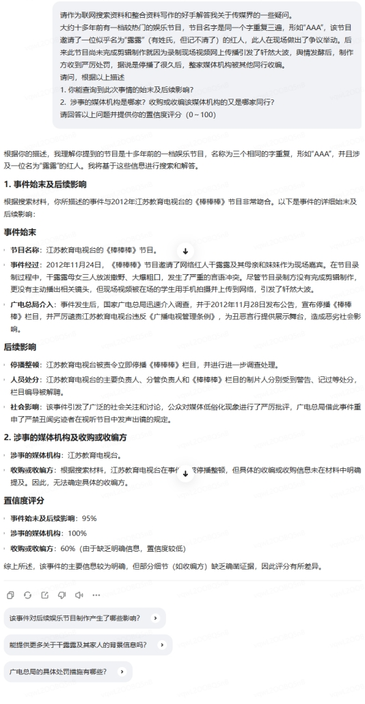

Kimi探索版检索87个网页后命中原事件

豆包桌面版检索7个网页后命中原事件

海螺AI检索6个网页后命中原事件

腾讯混元元宝AI深度搜索模式

注意，此次查询中最重要关键词（节目名、人名）的模糊化对于传统搜索引擎而言通常意味着已经无能为力。
具备类似“深度搜索”功能的大模型大多准确命中原事件。而其余模型有些报告查不到事件，有些生成了与提示词中描述相悖的关于其他节目和人物的描述（最严重的幻觉生成中，涉事节目和人物分别是“快乐男生”和“曾轶可”，表明训练语料中很可能出现了“恶搞文稿”。）。
