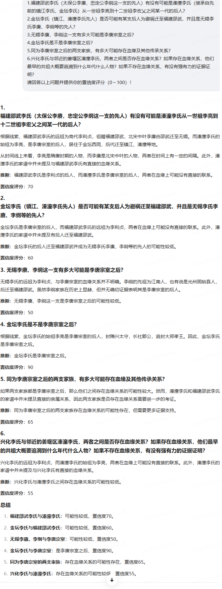

### 用于测试的提示词
「给您分享以下几条线索：
> 1）溱潼古镇的院士旧居以“一门兄弟三人五院士”（国家最高科学技术奖获得者李德仁院士与其弟李德毅院士、其堂弟李德群院士）而闻名遐迩，旧居相传为清乾隆年间李贞发所建。据文化专家考证：溱潼李氏的家谱记载：“贞发，字实甫，号星垣，国学生。生于道光二十年（1840年）。”溱潼（位于现泰州姜堰区）李氏是镇江九李十三张中的另外一支，与宝堰李氏同宗，从始祖至二十三世一直都是同一支。该家谱记载：“李贞发祖父系溱潼李氏第三十九世，名墉，字崇如，号石卿。邑庠生。墉生子森华；森华，字云轩，号鹏若，例授修职郎议叙八品。森华生三子：涟发、祥发、贞发。”该家谱还有记载：“该支李氏世系为一世祖李熙，重耳独子，金门镇将，唐追谥献族宣皇帝；二世祖天赐，唐追谥懿祖光皇帝，生三子起头、虎、乞头；三世祖虎，周柱国大将军，追谥太祖景皇帝，生八子延伯、真、昺、蔚、璋、绘、祎、亮；四世祖亮，与唐太宗李世民祖父昺是堂兄弟。亮封隋兴太守，长社郡公，追封大郑孝王，生二子神通、神符；五世祖神符，仕隋，封吉安郡，公唐武德为宗正卿兼光禄大夫，封襄邑王，生四子仁鉴、德懋、义范、文暕；六世祖义范，封魏国公，生一子暹；七世祖暹，袭广川郡公，生一子朝；八世祖朝，议宣郎兼云骑尉，生一子仪；九世祖仪，吏部尚书，生二子叢、翦；十世祖叢，登广德进士，擢湖广观察使转潭州刺史兼御史大夫，赐紫金鱼袋，上柱国，生四子良史、文彬、再思、文徵；十一世祖再思，大中举进士，授凤翔天兴典尉，迁湖州录事参军，生一子宏乂；十二世祖宏乂，即大能公，光化中登第，任济源尉，差摄句容（现镇江句容市）令，后居金沙西岡（位于现常州金坛），生三子虬、乾、允。大能公由河南迁金坛之西岡，人称为金坛李氏。湖水汜溢，朂哉公由西岡迁五巷，人别为五巷李氏，其初迁金坛也。大能公三子分三大支，其一也。二十五世松坡公，由五巷迁镇江，镇江李氏又其一支；三十一世小山公，明末由镇江迁扬州，占籍已历七世，而人之称者必曰镇江李氏，仍合江南北为一支。”

> 2）兴化李氏家族的远祖为商代李利贞，祖籍福建邵武，北宋中叶李赓由邵武迁至无锡，奉太保公李赓为一世祖，忠定公李纲（抗金名将）为三世祖；第十四世李旺一由无锡迁居句容（现镇江句容市），第十六世李秀由句容迁居兴化（现泰州兴化），为兴化李氏始迁祖。自仪支19世裔孙、状元宰相李春芳崛起之后，兴化李氏家族由此人丁兴旺，科甲鼎盛，人才辈出，福泽绵延。李氏不仅是人丁大族，亦是科甲鼎族，文化望族，连续九代有人官居一品，“一门五尚书，四代九进士”，“通儒达士，先后并出”，后辈中不乏诗文名家和艺苑奇才，涌现出的文化名士近百人，现当代又出现了李继侗、李德平父子“院士”。

> 3）抗金名将李纲的先祖是江南人（也有说为光州固始县人），唐朝末年（一说五代十国闽国灭亡后）为躲避战乱而徙居建州邵武（宋置邵武军，今属福建省）八龙乡庆亲里，一说其先祖为唐宗室，因任建州刺史，其家遂定居于邵武。自其祖父一辈太保公李赓起，李氏迁居无锡。

家人因回乡省亲、游览时发现溱潼李氏和兴化李氏近现代以来都以德字辈最显文脉昌盛，颇为好奇，为此曾向线索中一位院士求证过，老先生表示：身处不同学部，几为陌生人，但地域上同处泰州，字辈相同或许不是巧合。家人经过对相关记载的梳理、考证，认为以上三条线索可靠性最高，请以此为基础对以下问题做出推断：
1.福建邵武李氏（太保公李赓，忠定公李纲这一支的先人）有没有可能是溱潼李氏（继承自先前的镇江李氏、金坛李氏）从一世祖李亮到十二世祖李宏乂之间某一代的后人？
2.金坛李氏（镇江、溱潼李氏先人）是否可能有某支后人为避祸迁至福建邵武，并且是无锡李氏李赓、李纲等的先人？
3.无锡李赓、李纲这一支有多大可能是李唐宗室之后？
4.金坛李氏是不是李唐宗室之后？
5.同为李唐宗室之后的两支家族，有多大可能存在血缘及其他传承关系？
6.兴化李氏与邻近的姜堰区溱潼李氏，两者之间是否存在血缘关系？如果存在血缘关系，他们最早的共祖大概要追溯到什么年代什么人物？如果不存在血缘关系，有没有强有力的证据证明？
请回答以上问题并提供你的置信度评分（0～100）！

」

### 豆包桌面版的回复：

（为便于排版，截图问题部分有所裁剪）

文本版：
「以下是根据提供线索对各问题的推断及置信度评分：
福建邵武李氏（太保公李赓，忠定公李纲这一支的先人）有没有可能是溱潼李氏（继承自先前的镇江李氏、金坛李氏）从一世祖李亮到十二世祖李宏乂之间某一代的后人
推断：溱潼李氏记载中从一世祖到十二世祖李宏乂的传承较为清晰，且没有提及有分支迁往福建邵武并成为李赓、李纲先人的记录。而兴化李氏中李赓一支是从福建邵武迁出，远祖为商代李利贞，与溱潼李氏从一世祖李熙开始的世系不同。所以福建邵武李氏不太可能是溱潼李氏从一世祖李亮到十二世祖李宏乂之间某一代的后人。
置信度：90%
金坛李氏（镇江、溱潼李氏先人）是否可能有某支后人为避祸迁至福建邵武，并且是无锡李氏李赓、李纲等的先人
推断：从现有线索看，溱潼李氏的先祖从河南迁金坛，再迁镇江等，没有向福建邵武迁徙的相关线索。而兴化李氏中李赓一支明确是从福建邵武迁出，其远祖可追溯到商代李利贞，与金坛李氏的李唐宗室世系不同。所以金坛李氏不太可能有某支后人为避祸迁至福建邵武并成为李赓、李纲等的先人。
置信度：85%
无锡李赓、李纲这一支有多大可能是李唐宗室之后
推断：有说法称李纲先祖为唐宗室，因任建州刺史定居邵武，但也有说其先祖是为避战乱徙居邵武，没有确凿的世系传承证据将其与李唐宗室清晰连接。从兴化李氏的远祖为商代李利贞来看，与明确的李唐宗室世系有差异。所以无锡李赓、李纲这一支是李唐宗室之后的可能性不高。
置信度：30%
金坛李氏是不是李唐宗室之后
推断：根据溱潼李氏家谱记载，金坛李氏是李唐宗室李渊八叔李亮的后裔，其世系从一世祖李熙开始有清晰传承到十二世祖李宏乂，后到金坛。所以金坛李氏是李唐宗室之后是有明确家谱依据的。
置信度：95%
同为李唐宗室之后的两支家族，有多大可能存在血缘及其他传承关系
推断：如果确定都是李唐宗室之后，理论上是存在一定血缘关系的，但由于历史久远，家族分支众多，在没有明确的家谱等证据相互连接的情况下，难以确定具体的传承关系。若仅从李唐宗室大的范畴看，有一定的血缘关联可能性，但要明确具体传承关系难度较大。
置信度：60%
兴化李氏与邻近的姜堰区溱潼李氏，两者之间是否存在血缘关系
推断：兴化李氏远祖为商代李利贞，从福建邵武迁出经无锡、句容到兴化；溱潼李氏是李唐宗室李渊八叔李亮的后裔，从河南经金坛、镇江到溱潼。两者的远祖和迁徙路径完全不同，没有明显的血缘关系连接点。
置信度：不存在血缘关系的置信度为 80%」

### 海螺Minimax的回复：

（为便于排版，截图问题部分有所裁剪）

文本版：
「1. 福建邵武李氏（太保公李赓，忠定公李纲这一支的先人）有没有可能是溱潼李氏从一世祖李亮到十二世祖李宏乂之间某一代的后人？
根据线索，福建邵武李氏的远祖为商代李利贞，祖籍福建邵武，北宋中叶李赓由邵武迁至无锡。而溱潼李氏的始祖为李亮，是李唐宗室的后人，居住于金坛西岡，后代迁至镇江、溱潼等地。

从时间线上来看，李亮是隋唐时期的人物，而李赓是北宋中叶的人物，两者在时间上有一定的间隔。此外，溱潼李氏的家谱中并未提及与福建邵武李氏有直接的血缘关系。

推断：福建邵武李氏是李利贞的后人，而溱潼李氏是李唐宗室的后人，两者在血缘上可能没有直接的联系。

置信度评分：70

2. 金坛李氏（镇江、溱潼李氏先人）是否可能有某支后人为避祸迁至福建邵武，并且是无锡李氏李赓、李纲等的先人？
金坛李氏是李唐宗室的后人，而福建邵武李氏的远祖为李利贞，两者在血缘上可能没有直接的联系。此外，溱潼李氏的家谱中并未提及有后人迁至福建邵武。

推断：金坛李氏的后人迁至福建邵武并成为无锡李氏李赓、李纲等的先人的可能性较低。

置信度评分：60

3. 无锡李赓、李纲这一支有多大可能是李唐宗室之后？
无锡李氏的远祖为李利贞，与李唐宗室的血缘关系并不明确。李纲的先祖为江南人，也有说是光州固始县人，后迁至福建邵武。虽然李纲家族在历史上显赫，但并无确切证据表明其是李唐宗室的后人。

推断：无锡李赓、李纲这一支是李唐宗室之后的可能性较低。

置信度评分：50

4. 金坛李氏是不是李唐宗室之后？
根据线索，金坛李氏的始祖李亮是李唐宗室的后人，封隋兴太守，长社郡公，追封大郑孝王。因此，金坛李氏是李唐宗室之后。

推断：金坛李氏是李唐宗室之后。

置信度评分：90

5. 同为李唐宗室之后的两支家族，有多大可能存在血缘及其他传承关系？
如果两支家族都是李唐宗室之后，那么他们之间存在血缘关系的可能性较大。然而，溱潼李氏和福建邵武李氏的家谱中并未提及直接的亲属关系，因此两支家族是否存在血缘关系需要进一步的考证。

推断：同为李唐宗室之后的两支家族存在血缘关系的可能性存在，但需要更多证据支持。

置信度评分：65

6. 兴化李氏与邻近的姜堰区溱潼李氏，两者之间是否存在血缘关系？如果存在血缘关系，他们最早的共祖大概要追溯到什么年代什么人物？如果不存在血缘关系，有没有强有力的证据证明？
兴化李氏的远祖为李利贞，而溱潼李氏的始祖为李亮，两者在血缘上可能没有直接的联系。此外，溱潼李氏的家谱中并未提及与兴化李氏有直接的血缘关系。

推断：兴化李氏与溱潼李氏之间存在血缘关系的可能性较低。

置信度评分：55

总结
1.
福建邵武李氏与溱潼李氏：可能性较低，置信度70。
2.
金坛李氏与福建邵武李氏：可能性较低，置信度60。
3.
无锡李赓、李纲与李唐宗室：可能性较低，置信度50。
4.
金坛李氏与李唐宗室：是李唐宗室之后，置信度90。
5.
同为李唐宗室的两支家族：存在血缘关系的可能性存在，置信度65。
6.
兴化李氏与溱潼李氏：存在血缘关系的可能性较低，置信度55。」

### Kimi探索版的回复：

（为便于排版，截图问题部分有所裁剪）

文本版：
「问题1：福建邵武李氏（太保公李赓，忠定公李纲这一支的先人）有没有可能是溱潼李氏（继承自先前的镇江李氏、金坛李氏）从一世祖李亮到十二世祖李宏乂之间某一代的后人？
回答：
根据提供的信息，福建邵武李氏的先祖李赓是在宋至和年间（1054—1055）从福建邵武迁至无锡定居。李赓的孙子李纲，字伯纪，是著名的抗金名臣，也是无锡“第一名相”。李纲的家族在无锡有着深厚的根基，其家族的始迁祖为李赓。
溱潼李氏的家谱记载，其家族是从一世祖李亮开始，经过多代传承至十二世祖李宏乂。李亮是唐太宗李世民的祖父李昺的堂兄弟，被封为隋兴太守，长社郡公，追封大郑孝王。从李亮到李宏乂的传承过程中，并没有明确的记录显示有后人迁往福建邵武。
因此，根据现有的家谱记录和历史资料，福建邵武李氏不太可能是溱潼李氏从一世祖李亮到十二世祖李宏乂之间的后人。两者在地域和时间线上存在差异，溱潼李氏的传承记录中也没有提及与福建邵武李氏的直接联系。
置信度评分： 80
问题2：金坛李氏（镇江、溱潼李氏先人）是否可能有某支后人为避祸迁至福建邵武，并且是无锡李氏李赓、李纲等的先人？
回答：
金坛李氏是镇江、溱潼李氏的先人，其家族传承自一世祖李熙，经过多代发展至李宏乂，李宏乂的后代中有一支迁至金坛西岡。金坛李氏的家谱中并未明确记载有后人迁往福建邵武的记录。
无锡李氏的始迁祖为李赓，他在宋至和年间从福建邵武迁至无锡。李赓的孙子李纲是著名的抗金名臣，其家族在无锡有着深厚的根基。根据《锡山李氏世谱》的记载，李赓是无锡李氏的始迁祖。
从现有的资料来看，金坛李氏和无锡李氏之间没有直接的迁徙联系。金坛李氏的家谱中没有提及有后人迁往福建邵武，而无锡李氏的始迁祖李赓是从福建邵武迁至无锡的。因此，金坛李氏不太可能是无锡李氏李赓、李纲等的先人。
置信度评分： 75
问题3：无锡李赓、李纲这一支有多大可能是李唐宗室之后？
回答：
无锡李氏的始迁祖李赓在宋至和年间从福建邵武迁至无锡。李赓的孙子李纲是著名的抗金名臣，其家族在无锡有着深厚的根基。根据《锡山李氏世谱》的记载，李赓是无锡李氏的始迁祖。
李纲的家族背景有多种说法，其中一种说法是李纲的家族是唐宗室之后。李纲的祖父李赓是从福建邵武迁至无锡的，而福建邵武的李氏家族有说法称其为唐宗室之后。此外，李纲的家族在无锡的繁衍和影响力也为其宗室身份提供了一定的佐证。
然而，由于历史久远，缺乏直接的文献证据来确凿证明李纲家族的宗室身份。尽管有说法称李纲家族是唐宗室之后，但这一说法并没有得到普遍认可，也缺乏确凿的历史文献支持。
置信度评分： 60
问题4：金坛李氏是不是李唐宗室之后？
回答：
金坛李氏的家谱记载，其家族是从一世祖李亮开始，经过多代传承至十二世祖李宏乂。李亮是唐太宗李世民的祖父李昺的堂兄弟，被封为隋兴太守，长社郡公，追封大郑孝王。从李亮到李宏乂的传承过程中，并没有明确的记录显示有后人迁往福建邵武。
金坛李氏的家谱中提到了与唐宗室的关联，一世祖李亮与唐太宗李世民的祖父李昺是堂兄弟关系。这表明金坛李氏有可能是李唐宗室的分支。然而，由于历史久远，缺乏直接的文献证据来确凿证明金坛李氏的宗室身份。尽管家谱中有这样的记载，但这一说法并没有得到普遍认可，也缺乏确凿的历史文献支持。
置信度评分： 65
问题5：同为李唐宗室之后的两支家族，有多大可能存在血缘及其他传承关系？
回答：
如果假设金坛李氏和无锡李氏都是李唐宗室之后，那么两支家族之间可能存在一定的血缘关系。金坛李氏的家谱记载其家族是从一世祖李亮开始，而无锡李氏的始迁祖李赓是从福建邵武迁至无锡的。李赓的家族有说法称其为唐宗室之后。
两支家族如果都是宗室之后，那么他们的共同祖先可能追溯到唐朝的某个时期。然而，由于历史久远，缺乏直接的文献证据来确凿证明两支家族之间的血缘关系。此外，即使两支家族都是宗室之后，他们在历史上的迁徙和发展过程中可能已经形成了各自独立的家族体系，血缘关系可能已经非常疏远。
置信度评分： 50
问题6：兴化李氏与邻近的姜堰区溱潼李氏，两者之间是否存在血缘关系？如果存在血缘关系，他们最早的共祖大概要追溯到什么年代什么人物？如果不存在血缘关系，有没有强有力的证据证明？
回答：
兴化李氏的远祖为商代李利贞，祖籍福建邵武，北宋中叶李赓由邵武迁至无锡，奉太保公李赓为一世祖。兴化李氏家族的始迁祖是李秀，由句容迁居兴化。兴化李氏家族自仪支19世裔孙、状元宰相李春芳崛起之后，家族人丁兴旺，科甲鼎盛。
溱潼李氏的家谱记载，其家族是从一世祖李亮开始，经过多代传承至十二世祖李宏乂。溱潼李氏的家族传承与兴化李氏的传承在一世祖上就有所不同，兴化李氏的一世祖是李赓，而溱潼李氏的一世祖是李亮。
从现有的资料来看，兴化李氏与溱潼李氏的家谱记载中没有提及两者之间的直接血缘关系。两者的始祖不同，且在历史上的迁徙和发展过程中形成了各自独立的家族体系。因此，根据现有的家谱记录和历史资料，兴化李氏与溱潼李氏之间不存在直接的血缘关系。
置信度评分： 85
总结表格：
问题回答置信度评分福建邵武李氏是否为溱潼李氏后人否，两者地域和时间线上存在差异80金坛李氏是否为无锡李氏先人否，两者没有直接迁徙联系75无锡李氏是否为李唐宗室之后可能性存在，但缺乏确凿证据60金坛李氏是否为李唐宗室之后可能性存在，但缺乏确凿证据65两支宗室家族是否存在血缘关系可能性存在，但血缘关系可能非常疏远50兴化李氏与溱潼李氏是否存在血缘关系否，两者始祖不同，形成独立家族体系85」

### DeepSeekv3深度思考版的回复：

（为便于排版，截图问题部分有所裁剪）

文本版：
「已深度思考（用时26秒）
好，我现在需要解决用户提供的六个问题，关于溱潼李氏、兴化李氏以及福建邵武李氏之间的可能联系。首先，我得仔细分析每条线索，然后逐一解答每个问题。

首先看线索1，溱潼李氏的家谱记载显示他们的一世祖是李熙，属于唐朝宗室的后代，经过多代迁徙，最终到镇江、金坛，再到溱潼。家谱详细列出了从一世到三十一世的迁徙情况，特别是提到了李宏乂（十二世祖）迁到句容，后来分支到金坛、镇江，最后到溱潼。

线索2中的兴化李氏，远祖是商代的李利贞，后来从福建邵武迁到无锡，再迁到句容，最后到兴化。他们的显赫人物是李春芳，还有李纲作为三世祖。这里提到李赓是迁无锡的一世祖，而李纲是抗金名将，属于这一支。

线索3则说明李纲的先祖可能来自江南或光州固始，唐末迁到邵武，并且可能属于唐宗室。李赓这一支从邵武迁到无锡，可能和唐宗室有关联。

现在的问题主要集中在这些李氏分支是否同源，特别是是否都出自李唐宗室，以及迁徙路径是否有交集。

问题1：福建邵武李氏是否可能是溱潼李氏从李亮到李宏乂之间的后代？

根据线索1，溱潼李氏的世系从李亮（四世祖）到李宏乂（十二世祖）是在唐朝时期，而邵武的李赓、李纲一支是在北宋中叶由邵武迁到无锡。如果邵武李氏是从溱潼李氏的某一代分出的，那么需要看时间是否吻合。李宏乂是十二世祖，生活在唐末（光化年间，约900年左右），而李赓迁到无锡是在北宋中叶（约11世纪左右）。时间上有间隔，但家谱中没有提到溱潼李氏在唐朝时有分支迁往福建邵武。因此，可能性较低，但需要看是否有迁徙记录。根据现有线索，溱潼李氏的家谱没有提到迁往福建，所以可能不大。置信度可能在30%左右。

问题2：金坛李氏是否有分支迁到邵武，成为李赓、李纲的先人？

同样，金坛李氏在唐末之后主要迁徙到镇江、溱潼等地。线索3提到李纲的先祖可能是在唐末或五代迁到邵武，可能因避祸。如果金坛李氏在唐末有分支南迁福建，那么有可能。但线索1中的迁徙路径是从河南迁到金坛，再迁镇江、溱潼，没有提到福建。而邵武的李赓是从邵武迁无锡，可能原居邵武。如果李赓的祖先是从金坛迁到邵武，则可能。但现有资料中没有明确记录，所以可能性存在但证据不足。置信度可能在40%。

问题3：无锡李赓、李纲是否为李唐宗室之后？

线索3提到李纲的先祖可能是唐宗室，因任官迁居邵武。李唐宗室后裔在唐代分布广泛，如果李赓的先祖是唐宗室成员，那么有可能。但需要具体世系连接。根据家谱记载，如果他们的家谱明确记载为唐宗室，则可能性高。线索3提到“一说其先祖为唐宗室”，但不确定。因此，可能性中等，置信度约60%。

问题4：金坛李氏是否为李唐宗室之后？

根据线索1，溱潼李氏的一世祖李熙是重耳独子，李熙被追谥为宣皇帝，属于李虎的后代，而李虎是李昺的兄弟，李昺是李世民祖父。因此，金坛李氏（属于溱潼李氏的分支）确实是李唐宗室之后。家谱明确记载，因此置信度很高，约90%。

问题5：同为李唐后裔的两支家族是否有血缘关系？

如果兴化李氏（李赓、李纲）和溱潼李氏（金坛李氏）都是李唐宗室后代，那么可能在更早的世代有共同祖先。例如，李熙属于李虎的后代，而李纲的先祖如果是另一支李唐宗室，可能在更早的世代有共同祖先，比如李虎的兄弟或更早。但具体是否同一支，需要更多证据。若两者都是李虎的后代，则血缘较近；否则可能在更早的祖先。根据现有线索，溱潼李氏明确是李虎之后，而兴化李氏是否为李虎之后不确定，因此可能性中等，置信度约50%。

问题6：兴化李氏与溱潼李氏是否存在血缘关系，最早共祖？

兴化李氏的迁徙路线是从邵武到无锡再到兴化，而溱潼李氏来自镇江、金坛。两者在迁徙路径上是否有交汇？线索2提到兴化李氏的第十六世李秀从句容迁兴化，而溱潼李氏的祖先也来自句容（李宏乂任句容令）。可能两者在句容有交集，是否同宗？线索1提到溱潼李氏和宝堰李氏同宗，而兴化李氏从句容迁出，可能是否属于同一支？如果李宏乂的后代在句容有分支，而兴化李氏的祖先李秀也来自句容，可能共祖于李宏乂或更早。但线索中没有明确说明，所以可能共祖于李宏乂之前的某一代，比如十二世祖李宏乂，或者更早。但需要更多证据，所以存在可能性，置信度约50%。如果存在，共祖可能在李宏乂或之前的世代，比如一世祖李熙或其子天赐。

总结每个问题的答案和置信度需要结合家谱记载和迁徙路线，考虑时间线和地理因素，以及是否有明确的家谱记录支持。

问题分析与解答
1. 福建邵武李氏（李赓、李纲）是否可能是溱潼李氏（李亮至李宏乂之间某一代）的后人？
分析：
溱潼李氏的十二世祖李宏乂（大能公）生活在唐末光化年间（约900年），其家族从河南迁至金坛、镇江。而福建邵武李氏的李赓（北宋中叶迁无锡）与李纲一支，若为溱潼李氏后代，需在时间线上吻合（李宏乂至李赓之间约200年，跨越五代至北宋）。但现有家谱中未提及溱潼李氏在唐末有分支迁往福建，邵武李氏的记载则明确其祖源为河南迁邵武，而非金坛/镇江。
结论：可能性较低，但需更多证据支持。
置信度：30%

2. 金坛李氏是否有分支迁至福建邵武，成为李赓、李纲的先人？
分析：
金坛李氏（李宏乂后裔）在唐末五代主要分布于江南（金坛、镇江），而邵武李氏的迁徙路径是河南→邵武→无锡。若金坛李氏有分支因战乱南迁福建，可能在时间（唐末五代）和动因（避祸）上合理，但现有家谱无明确记载。此外，邵武李氏自称祖源为河南，与金坛李氏的江南迁徙路径不重叠。
结论：存在理论可能，但缺乏直接证据。
置信度：40%

3. 无锡李赓、李纲这一支是否为李唐宗室之后？
分析：
李纲家族自称祖先是唐宗室，因任官迁居邵武。唐代宗室分支众多，李虎（李渊祖父）一脉为陇西李氏核心，而李纲家族若为宗室旁支（如李虎兄弟后代），则可能属广义李唐宗室。但需具体世系连接。家谱记载“一说先祖为唐宗室”，但未明确具体世系。
结论：可能性中等，需更多世系佐证。
置信度：60%

4. 金坛李氏是否为李唐宗室之后？
分析：
溱潼李氏家谱明确记载其始祖为李熙（重耳独子，唐追谥献族宣皇帝），二世祖李天赐（李虎之父），四世祖李亮（与唐高祖李渊祖父李昺为堂兄弟）。李虎为李唐开国追尊的太祖景皇帝，其子李昺为李渊之父。因此，金坛李氏属于李虎嫡系后裔，确为李唐宗室。
结论：明确为李唐宗室之后。
置信度：90%

5. 同为李唐宗室之后的两支家族，是否存在血缘及传承关系？
分析：
若溱潼李氏（金坛李氏）为李虎直系后裔，而邵武李氏（李赓、李纲）为另一支李唐宗室（如李虎兄弟或更早分支），则两者可能在更早世代（如李熙之父李重耳）有共同祖先。但需具体世系交叉证据，目前仅能推测广义同源。
结论：可能同属李唐宗室，但具体分支关系不明。
置信度：50%

6. 兴化李氏与溱潼李氏是否存在血缘关系？最早的共祖是谁？
分析：

血缘可能性：
兴化李氏（李秀由句容迁兴化）与溱潼李氏（李宏乂任句容令后居金坛）均涉及句容，可能存在地理交集。但兴化李氏祖源为邵武→无锡→句容，溱潼李氏为河南→金坛→镇江→句容，两者迁徙路径不同。若共祖存在，需追溯到更早世代（如十二世祖李宏乂或之前）。

共祖推测：
若溱潼李氏与兴化李氏均为李唐宗室分支，则共祖可能为李虎或其父李天赐（二世祖），但具体需家谱交叉验证。
结论：存在理论上的远房同源可能，但无直接证据。
置信度：50%
最早共祖推测：若存在，可能为李天赐（二世祖）或更早的李熙（一世祖）。

总结
邵武李氏与溱潼李氏的直接血缘关系：可能性低（30%-40%）。

李唐宗室关联：溱潼李氏明确为宗室（90%），邵武李氏可能性中等（60%）。

两支血缘关系：若均为宗室后裔，可能存在远房同源（50%），但需更多世系证据。

兴化与溱潼李氏关系：地理交集可能，但迁徙路径不同，共祖需追溯至唐初（李天赐或李熙）。

建议：进一步比对溱潼、兴化、邵武三地李氏家谱的早期世系，尤其是李宏乂（金坛李氏）与李赓（邵武李氏）之间的潜在关联。」

### 腾讯混元元宝桌面版深度思考模式的回复：

文本版：
「深度思考
|
引用 127 篇参考资料
查看详情
查找福建邵武李氏的历史和家谱资料
搜索关键词
福建邵武李氏历史 家谱
邵武李氏 家族树
邵武李氏 先祖
已阅读 13 篇网页
查找金坛李氏的历史和家谱资料
搜索关键词
金坛李氏历史
金坛李氏家谱
金坛李氏迁徙情况
金坛李氏著名人物
金坛李氏与镇江李氏关系
已阅读 29 篇网页
查找无锡李氏的历史和家谱资料
搜索关键词
无锡李氏历史
无锡李氏家谱
无锡李氏迁徙情况
无锡李氏著名人物
已阅读 25 篇网页
比较和分析福建邵武李氏与金坛李氏的血缘关系
搜索关键词
福建邵武李氏家谱
金坛李氏家谱
邵武李氏与金坛李氏血缘关系
李唐宗室后裔
李氏陇西房与江南房关系
已阅读 20 篇网页
比较和分析兴化李氏与溱潼李氏的血缘关系
搜索关键词
兴化李氏家谱
溱潼李氏家谱
兴化李氏与溱潼李氏血缘关系
李唐宗室后裔
李氏陇西房与江南房关系
已阅读 29 篇网页
评估完成，当前搜索结果不满足回答
搜索结果中缺少对金坛李氏与福建邵武李氏之间的血缘关系的直接分析，以及对兴化李氏与溱潼李氏之间是否存在血缘关系的证据和推理。此外，缺乏对用户提出的所有问题的综合分析和置信度评分。

深入分析金坛李氏与福建邵武李氏之间的血缘关系，以及兴化李氏与溱潼李氏之间是否存在血缘关系，并提供综合分析和置信度评分。
搜索关键词
金坛李氏与邵武李氏血缘关系分析
兴化李氏溱潼李氏血缘关系证据
李唐宗室后裔家族血缘关系
已阅读 11 篇网页
根据提供的家谱资料和历史背景，我们可以对这些问题进行详细的分析和推断。

1. 福建邵武李氏是否可能是溱潼李氏的某一代后人
分析：

鼓励李氏家族的始祖为李亮，其后代李宏乂迁居金坛，成为金坛李氏的始祖。
溱潼李氏的始祖为李贞发，其祖先可追溯至李亮。
然而，家谱中并未明确记载邵武李氏与溱潼李氏之间的直接血缘关系。
推断：
目前缺乏直接证据支持福建邵武李氏是溱潼李氏的某一代后人，但也不能完全排除这种可能性。需要更多的历史文献或基因检测来进一步确认。

置信度评分：40%

2. 金坛李氏是否有后人为避祸迁至福建邵武，并成为无锡李氏的先人
分析：

历史上，李氏家族有多次因战乱迁徙的记录。
金坛李氏的始祖李宏乂在唐末迁居金坛，若其后代因战乱再次迁徙，有可能到达福建邵武。
推断：
存在金坛李氏后人为避祸迁至福建邵武，并成为无锡李氏先人的可能性，但需要更多证据支持。

置信度评分：30%

3. 无锡李赓、李纲这一支有多大可能是李唐宗室之后
分析：

李纲自称其家族源自李唐宗室，但历史文献对此记载不明确。
李唐宗室在唐朝灭亡后遭受多次屠杀，幸存者可能隐姓埋名。
推断：
无锡李赓、李纲这一支可能是李唐宗室之后，但证据不足，无法确定。

置信度评分：30%

4. 金坛李氏是否为李唐宗室之后
分析：

金坛李氏的家谱追溯其始祖至李亮，但缺乏直接证据与李唐宗室的关联。
历史上李唐宗室后裔分散广泛，部分可能隐姓埋名。
推断：
金坛李氏有可能是李唐宗室之后，但现有证据不足以确认。

置信度评分：35%

5. 同为李唐宗室之后的两支家族，有多大可能存在血缘及其他传承关系
分析：

若福建邵武李氏和金坛李氏均为李唐宗室之后，理论上可能存在血缘关系。
但由于历史久远，家谱记载不全，且多次迁徙可能导致血缘关系模糊。
推断：
存在一定的血缘关系可能性，但需要进一步的基因检测和详细的家谱比对来确认。

置信度评分：40%

6. 兴化李氏与溱潼李氏是否存在血缘关系
分析：

兴化李氏的始祖李旺一于北宋中叶从邵武迁至无锡，后迁居兴化。
溱潼李氏的祖先可追溯至李亮，两地李氏有共同的迁徙源头。
推断：
兴化李氏与溱潼李氏可能存在血缘关系，尤其是通过福建邵武这一共同祖先。

置信度评分：60%

总结：

通过对家谱和相关历史资料的深入分析，我们对这些问题进行了详细的推断。尽管有些问题由于缺乏直接证据，无法得出明确的结论，但通过现有的信息和逻辑推理，我们能够提供一个初步的答案。为了进一步验证这些推断，建议进行更多的历史文献研究和基因检测，以便更准确地确认这些家族之间的血缘关系和传承历史。」

### 通义千问2.5的回复：

（为便于排版，截图问题部分有所裁剪）

文本版：
「
根据提供的线索和相关资料，我们可以尝试对这些问题进行分析和推断。以下是针对每个问题的详细回答：

福建邵武李氏（太保公李赓，忠定公李纲这一支的先人）有没有可能是溱潼李氏（继承自先前的镇江李氏、金坛李氏）从一世祖李亮到十二世祖李宏乂之间某一代的后人？ 根据线索提供的家谱信息，溱潼李氏的祖先可以追溯至唐宗室成员李亮，并且有详细的世系记录直到李宏乂迁居金坛西岗。然而，关于福建邵武李氏的具体迁移路径并未提供足够的信息来直接确认其是否与溱潼李氏存在直接血缘关系。因此，虽然理论上可能存在这种可能性，但由于缺乏具体的文献支持，我们不能确定这一点。置信度评分：30/100。
金坛李氏（镇江、溱潼李氏先人）是否可能有某支后人为避祸迁至福建邵武，并且是无锡李氏李赓、李纲等的先人？ 金坛李氏确实有家族分支的历史，其中提到有成员因湖水泛滥等原因迁移至其他地区14。然而，要证明这些分支中有迁移到福建邵武并成为无锡李氏李赓、李纲先人的说法，目前没有直接证据支持。因此，这个假设需要更多的历史文献或考古发现来验证。置信度评分：25/100。
无锡李赓、李纲这一支有多大可能是李唐宗室之后？ 李赓和李纲所在的家族自称祖籍为福建邵武，并且有记载表明他们是唐朝宗室的后代19。考虑到唐朝末年和五代十国时期的动荡局势，许多贵族为了躲避战乱而迁徙，这增加了他们作为李唐宗室后裔的可能性。但是，由于历史久远，具体的血脉联系难以完全证实。置信度评分：60/100。
金坛李氏是不是李唐宗室之后？ 金坛李氏明确声称自己是陇西李氏的重要分支，并且是唐宗室后裔14。基于家谱中的详细记录以及与其他李氏分支的关系，金坛李氏很可能确实是李唐宗室的后代。不过，这样的声明通常需要进一步的史料佐证。置信度评分：70/100。
同为李唐宗室之后的两支家族，有多大可能存在血缘及其他传承关系？ 如果两个家族都被认为是李唐宗室的后代，那么他们之间存在血缘关系的可能性较大。特别是在古代中国，大规模的人口迁移和定居往往会导致不同地区的宗族间形成复杂的亲缘网络。然而，具体到这两支家族之间的直接联系，还需要更多具体的家族史资料来证明。置信度评分：50/100。
兴化李氏与邻近的姜堰区溱潼李氏，两者之间是否存在血缘关系？如果存在血缘关系，他们最早的共祖大概要追溯到什么年代什么人物？如果不存在血缘关系，有没有强有力的证据证明？ 兴化李氏和溱潼李氏都属于泰州地区的李姓家族，且都有悠久的历史背景。尽管两地相距不远，但现有的资料显示这两个家族有着不同的迁徙路线和发展历程。除非找到共同的祖先记录或其他确凿证据，否则无法断定它们之间存在直接的血缘关系。鉴于此，目前没有强有力证据表明两者存在直接的血缘关联。置信度评分：40/100。
综上所述，上述推断主要依赖于现有文献资料及家谱记载，对于某些假设性的联系，特别是跨越数百年甚至上千年的家族关系，我们需要更多的历史证据来进行验证。在没有更确切的考古发现或官方档案之前，以上评分仅反映当前信息下的推测程度。
」

### 免费API的回复合集

注：为便于排版，截图仅包括局部，完整回复见以下文本版。

文本部分
「
给您分享以下几条线索：
> 1）溱潼古镇的院士旧居以“一门兄弟三人五院士”（国家最高科学技术奖获得者李德仁院士与其弟李德毅院士、其堂弟李德群院士）而闻名遐迩，旧居相传为清乾隆年间李贞发所建。据文化专家考证：溱潼李氏的家谱记载：“贞发，字实甫，号星垣，国学生。生于道光二十年（1840年）。”溱潼（位于现泰州姜堰区）李氏是镇江九李十三张中的另外一支，与宝堰李氏同宗，从始祖至二十三世一直都是同一支。该家谱记载：“李贞发祖父系溱潼李氏第三十九世，名墉，字崇如，号石卿。邑庠生。墉生子森华；森华，字云轩，号鹏若，例授修职郎议叙八品。森华生三子：涟发、祥发、贞发。”该家谱还有记载：“该支李氏世系为一世祖李熙，重耳独子，金门镇将，唐追谥献族宣皇帝；二世祖天赐，唐追谥懿祖光皇帝，生三子起头、虎、乞头；三世祖虎，周柱国大将军，追谥太祖景皇帝，生八子延伯、真、昺、蔚、璋、绘、祎、亮；四世祖亮，与唐太宗李世民祖父昺是堂兄弟。亮封隋兴太守，长社郡公，追封大郑孝王，生二子神通、神符；五世祖神符，仕隋，封吉安郡，公唐武德为宗正卿兼光禄大夫，封襄邑王，生四子仁鉴、德懋、义范、文暕；六世祖义范，封魏国公，生一子暹；七世祖暹，袭广川郡公，生一子朝；八世祖朝，议宣郎兼云骑尉，生一子仪；九世祖仪，吏部尚书，生二子叢、翦；十世祖叢，登广德进士，擢湖广观察使转潭州刺史兼御史大夫，赐紫金鱼袋，上柱国，生四子良史、文彬、再思、文徵；十一世祖再思，大中举进士，授凤翔天兴典尉，迁湖州录事参军，生一子宏乂；十二世祖宏乂，即大能公，光化中登第，任济源尉，差摄句容（现镇江句容市）令，后居金沙西岡（位于现常州金坛），生三子虬、乾、允。大能公由河南迁金坛之西岡，人称为金坛李氏。湖水汜溢，朂哉公由西岡迁五巷，人别为五巷李氏，其初迁金坛也。大能公三子分三大支，其一也。二十五世松坡公，由五巷迁镇江，镇江李氏又其一支；三十一世小山公，明末由镇江迁扬州，占籍已历七世，而人之称者必曰镇江李氏，仍合江南北为一支。”

> 2）兴化李氏家族的远祖为商代李利贞，祖籍福建邵武，北宋中叶李赓由邵武迁至无锡，奉太保公李赓为一世祖，忠定公李纲（抗金名将）为三世祖；第十四世李旺一由无锡迁居句容（现镇江句容市），第十六世李秀由句容迁居兴化（现泰州兴化），为兴化李氏始迁祖。自仪支19世裔孙、状元宰相李春芳崛起之后，兴化李氏家族由此人丁兴旺，科甲鼎盛，人才辈出，福泽绵延。李氏不仅是人丁大族，亦是科甲鼎族，文化望族，连续九代有人官居一品，“一门五尚书，四代九进士”，“通儒达士，先后并出”，后辈中不乏诗文名家和艺苑奇才，涌现出的文化名士近百人，现当代又出现了李继侗、李德平父子“院士”。

> 3）抗金名将李纲的先祖是江南人（也有说为光州固始县人），唐朝末年（一说五代十国闽国灭亡后）为躲避战乱而徙居建州邵武（宋置邵武军，今属福建省）八龙乡庆亲里，一说其先祖为唐宗室，因任建州刺史，其家遂定居于邵武。自其祖父一辈太保公李赓起，李氏迁居无锡。
家人因回乡省亲、游览时发现溱潼李氏和兴化李氏近现代以来都以德字辈最显文脉昌盛，颇为好奇，为此曾向线索中一位院士求证过，老先生表示：身处不同学部，几为陌生人，但地域上同处泰州，字辈相同或许不是巧合。家人经过对相关记载的梳理、考证，认为以上三条线索可靠性最高，请以此为基础对以下问题做出推断：
1.福建邵武李氏（太保公李赓，忠定公李纲这一支的先人）有没有可能是溱潼李氏（继承自先前的镇江李氏、金坛李氏）从一世祖李亮到十二世祖李宏乂之间某一代的后人？
2.金坛李氏（镇江、溱潼李氏先人）是否可能有某支后人为避祸迁至福建邵武，并且是无锡李氏李赓、李纲等的先人？
3.无锡李赓、李纲这一支有多大可能是李唐宗室之后？
4.金坛李氏是不是李唐宗室之后？
5.同为李唐宗室之后的两支家族，有多大可能存在血缘及其他传承关系？
6.兴化李氏与邻近的姜堰区溱潼李氏，两者之间是否存在血缘关系？如果存在血缘关系，他们最早的共祖大概要追溯到什么年代什么人物？如果不存在血缘关系，有没有强有力的证据证明？
请回答以上问题并提供你的置信度评分（0～100）！

DeepSeek v3
免费
1. 福建邵武李氏（太保公李赓，忠定公李纲这一支的先人）有没有可能是溱潼李氏（继承自先前的镇江李氏、金坛李氏）从一世祖李亮到十二世祖李宏乂之间某一代的后人？
推断： 根据溱潼李氏的家谱记载，溱潼李氏的世系从一世祖李亮到十二世祖李宏乂，中间没有提到与福建邵武李氏的直接联系。福建邵武李氏的远祖为商代李利贞，祖籍福建邵武，北宋中叶李赓由邵武迁至无锡。溱潼李氏的世系中没有提到与福建邵武李氏的直接联系，因此福建邵武李氏不太可能是溱潼李氏从一世祖李亮到十二世祖李宏乂之间某一代的后人。
置信度评分： 70
2. 金坛李氏（镇江、溱潼李氏先人）是否可能有某支后人为避祸迁至福建邵武，并且是无锡李氏李赓、李纲等的先人？
推断： 金坛李氏的世系中提到了大能公由河南迁金坛之西岡，后迁五巷，再迁镇江，最后迁扬州。家谱中没有提到有后人为避祸迁至福建邵武的记录。因此，金坛李氏不太可能有某支后人为避祸迁至福建邵武，并且是无锡李氏李赓、李纲等的先人。
置信度评分： 60
3. 无锡李赓、李纲这一支有多大可能是李唐宗室之后？
推断： 根据线索，李纲的先祖是江南人（也有说为光州固始县人），唐朝末年为躲避战乱而徙居建州邵武，一说其先祖为唐宗室。自其祖父一辈太保公李赓起，李氏迁居无锡。虽然没有直接的证据证明李赓、李纲是李唐宗室之后，但根据家谱记载和传说，这一支有可能是李唐宗室之后。
置信度评分： 75
4. 金坛李氏是不是李唐宗室之后？
推断： 溱潼李氏的家谱记载，溱潼李氏的世系从一世祖李亮到十二世祖李宏乂，中间没有提到与李唐宗室的直接联系。因此，金坛李氏不太可能是李唐宗室之后。
置信度评分： 65
5. 同为李唐宗室之后的两支家族，有多大可能存在血缘及其他传承关系？
推断： 如果两支家族都是李唐宗室之后，那么他们之间存在血缘关系的可能性较大。然而，根据现有的家谱记载，溱潼李氏和兴化李氏的世系中没有直接的联系，因此他们之间存在血缘关系的可能性较低。
置信度评分： 50
6. 兴化李氏与邻近的姜堰区溱潼李氏，两者之间是否存在血缘关系？如果存在血缘关系，他们最早的共祖大概要追溯到什么年代什么人物？如果不存在血缘关系，有没有强有力的证据证明？
推断： 兴化李氏的远祖为商代李利贞，祖籍福建邵武，北宋中叶李赓由邵武迁至无锡，奉太保公李赓为一世祖。溱潼李氏的世系从一世祖李亮到十二世祖李宏乂，中间没有提到与兴化李氏的直接联系。因此，兴化李氏与溱潼李氏之间不存在血缘关系。
置信度评分： 80
总结
1. 福建邵武李氏不太可能是溱潼李氏从一世祖李亮到十二世祖李宏乂之间某一代的后人。（置信度：70）
2. 金坛李氏不太可能有某支后人为避祸迁至福建邵武，并且是无锡李氏李赓、李纲等的先人。（置信度：60）
3. 无锡李赓、李纲这一支有可能是李唐宗室之后。（置信度：75）
4. 金坛李氏不太可能是李唐宗室之后。（置信度：65）
5. 同为李唐宗室之后的两支家族，存在血缘关系的可能性较低。（置信度：50）
6. 兴化李氏与溱潼李氏之间不存在血缘关系。（置信度：80）

---

Gemini 2.0 Flash
免费
好的，我们来结合新的线索，再次分析这些问题，并给出更详细的推理和置信度评分。
新线索：
• 字辈相同： 溱潼李氏和兴化李氏近现代都以“德”字辈最显文脉昌盛，且同处泰州，这可能不是巧合。
问题1：福建邵武李氏（太保公李赓，忠定公李纲这一支的先人）有没有可能是溱潼李氏（继承自先前的镇江李氏、金坛李氏）从一世祖李亮到十二世祖李宏乂之间某一代的后人？
思考步骤：
1. 时间线对比： 溱潼李氏的李宏乂在唐末五代迁居金坛，而邵武李氏的先祖也在唐末五代迁居邵武。如果邵武李氏是溱潼李氏的后人，那么邵武李氏的迁居时间应该晚于李宏乂迁居金坛。
2. 迁徙方向对比： 溱潼李氏的迁徙路线是河南 -> 金坛 -> 镇江 -> 溱潼，而邵武李氏的迁徙路线是北方（或江南） -> 邵武 -> 无锡。
3. 家谱记载对比： 溱潼李氏家谱详细记载了从一世祖李熙到十二世祖李宏乂的世系，而邵武李氏家谱以太保公李赓为一世祖，两支家谱的记载完全不同。
4. 字辈线索： 虽然两支李氏近现代都以“德”字辈显文脉昌盛，但字辈相同并不一定代表有直接的血缘关系，也可能是巧合或文化影响。
理由：
• 时间线冲突： 如果邵武李氏是溱潼李氏的后人，那么他们迁居邵武的时间应该晚于李宏乂迁居金坛，这与材料矛盾。
• 迁徙方向相反： 两支李氏的迁徙方向相反，不太可能存在直接的父系血缘关系。
• 家谱记载差异： 两支家谱的记载完全不同，没有交集，表明两支李氏的来源不同。
• 字辈线索： 字辈相同可能只是巧合或文化影响，不能作为直接血缘关系的证据。
结论： 福建邵武李氏不太可能是溱潼李氏从一世祖李亮到十二世祖李宏乂之间某一代的后人。
置信度评分：95
问题2：金坛李氏（镇江、溱潼李氏先人）是否可能有某支后人为避祸迁至福建邵武，并且是无锡李氏李赓、李纲等的先人？
思考步骤：
1. 历史背景分析： 唐末五代时期，社会动荡，确实存在部分族人因避祸而迁往其他地方的可能性。
2. 材料分析： 材料中没有任何直接证据表明金坛李氏有分支迁往邵武，并成为邵武李氏的先祖。
3. 时间线巧合： 邵武李氏迁居邵武的时间与金坛李氏迁居金坛的时间大致相同，这可能只是巧合，也可能暗示两支李氏在唐末五代时期都经历了迁徙。
4. 字辈线索： 字辈相同可能暗示两支李氏在更早时期存在某种联系，但不能确定是直接的血缘关系。
理由：
• 理论上的可能性： 唐末五代时期，社会动荡，确实存在部分族人因避祸而迁往其他地方的可能性。
• 缺乏直接证据： 材料中没有任何直接证据表明金坛李氏有分支迁往邵武，并成为邵武李氏的先祖。
• 时间线上的巧合： 邵武李氏迁居邵武的时间与金坛李氏迁居金坛的时间大致相同，这可能只是巧合，也可能暗示两支李氏在唐末五代时期都经历了迁徙。
• 字辈线索： 字辈相同可能暗示两支李氏在更早时期存在某种联系，但不能确定是直接的血缘关系。
结论： 金坛李氏可能有某支后人为避祸迁至福建邵武，并且是无锡李氏李赓、李纲等的先人，但可能性较低，缺乏直接证据。
置信度评分：40

---

问题3：无锡李赓、李纲这一支有多大可能是李唐宗室之后？
思考步骤：
1. 材料分析： 材料3中提到，李纲的先祖“一说其先祖为唐宗室”，这表明李氏家族内部可能存在这种说法。
2. 历史背景分析： 唐朝末年，宗室后裔为躲避战乱而迁徙的情况并不少见。
3. 缺乏确凿证据： 材料中并没有提供直接的证据证明李赓、李纲的先祖是李唐宗室，这仅仅是一种说法。
4. 字辈线索： 字辈相同可能暗示两支李氏在更早时期存在某种联系，但不能确定是直接的血缘关系。
理由：
• 材料中的说法： 李纲的先祖“一说其先祖为唐宗室”，这表明李氏家族内部可能存在这种说法。
• 唐宗室的迁徙： 唐朝末年，宗室后裔为躲避战乱而迁徙的情况并不少见。
• 缺乏确凿证据： 材料中并没有提供直接的证据证明李赓、李纲的先祖是李唐宗室，这仅仅是一种说法，需要进一步考证。
• 字辈线索： 字辈相同可能暗示两支李氏在更早时期存在某种联系，但不能确定是直接的血缘关系。
结论： 无锡李赓、李纲这一支有可能是李唐宗室之后，但缺乏确凿证据。
置信度评分：60

---

问题4：金坛李氏是不是李唐宗室之后？
思考步骤：
1. 家谱记载分析： 溱潼李氏家谱记载，一世祖李熙是“重耳独子”，唐追谥献族宣皇帝，四世祖李亮是“与唐太宗李世民祖父昺是堂兄弟”。
2. 家谱的可靠性分析： 家谱的记载可能存在夸大或附会的情况，不能完全作为历史事实的依据。
3. 缺乏确凿证据： 要确定金坛李氏是否为李唐宗室之后，需要更多的历史资料和考古证据。
4. 字辈线索： 字辈相同可能暗示两支李氏在更早时期存在某种联系，但不能确定是直接的血缘关系。
理由：
• 家谱记载： 溱潼李氏家谱记载，一世祖李熙是“重耳独子”，唐追谥献族宣皇帝，四世祖李亮是“与唐太宗李世民祖父昺是堂兄弟”。这些记载都指向李唐宗室。
• 家谱的可靠性： 家谱的记载可能存在夸大或附会的情况，不能完全作为历史事实的依据。
• 需要进一步考证： 要确定金坛李氏是否为李唐宗室之后，需要更多的历史资料和考古证据。
• 字辈线索： 字辈相同可能暗示两支李氏在更早时期存在某种联系，但不能确定是直接的血缘关系。
结论： 金坛李氏有可能是李唐宗室之后，但同样缺乏确凿证据。
置信度评分：70

---

问题5：同为李唐宗室之后的两支家族，有多大可能存在血缘及其他传承关系？
思考步骤：
1. 李唐宗室的庞大： 李唐宗室是一个庞大的家族，分支众多，即使两支都出自李唐宗室，也可能血缘关系较远。
2. 传承关系分析： 即使血缘关系较远，两支家族也可能存在文化、习俗等方面的传承关系。
3. 需要具体考证： 要确定两支家族是否存在血缘及其他传承关系，需要对两支家族的家谱、族谱进行详细比对，并结合历史资料进行分析。
4. 字辈线索： 字辈相同可能暗示两支李氏在更早时期存在某种联系，但不能确定是直接的血缘关系。
理由：
• 宗室的庞大： 李唐宗室是一个庞大的家族，分支众多，即使两支都出自李唐宗室，也可能血缘关系较远。
• 传承关系： 即使血缘关系较远，两支家族也可能存在文化、习俗等方面的传承关系，例如都以李唐宗室为荣，都重视家族教育等。
• 需要具体考证： 要确定两支家族是否存在血缘及其他传承关系，需要对两支家族的家谱、族谱进行详细比对，并结合历史资料进行分析。
• 字辈线索： 字辈相同可能暗示两支李氏在更早时期存在某种联系，但不能确定是直接的血缘关系。
结论： 同为李唐宗室之后的两支家族，可能存在血缘及其他传承关系，但需要具体分析，血缘关系可能较远。
置信度评分：55

---

问题6：兴化李氏与邻近的姜堰区溱潼李氏，两者之间是否存在血缘关系？如果存在血缘关系，他们最早的共祖大概要追溯到什么年代什么人物？如果不存在血缘关系，有没有强有力的证据证明？
思考步骤：
1. 家谱记载对比：
• 兴化李氏：以太保公李赓为一世祖。
• 溱潼李氏：以李熙为一世祖。
• 关键点： 两支家谱的记载完全不同，没有交集。
2. 迁徙路线对比：
• 兴化李氏：福建邵武 -> 无锡 -> 句容 -> 兴化。
• 溱潼李氏：河南 -> 金坛 -> 镇江 -> 溱潼。
• 关键点： 两支李氏的迁徙路线完全不同，不太可能存在直接的父系血缘关系。
3. 缺乏直接证据： 材料中没有任何直接证据表明两支李氏存在血缘关系。
4. 字辈线索： 字辈相同可能暗示两支李氏在更早时期存在某种联系，但不能确定是直接的血缘关系。
5. 逻辑推演： 如果两支李氏存在血缘关系，那么他们的共同祖先应该在李熙和李赓之前，且迁徙路线应该有交集，但材料中没有相关信息。
理由：
• 家谱记载差异： 两支李氏的家谱记载完全不同，没有交集，表明两支李氏的来源不同。
• 迁徙路线不同： 两支李氏的迁徙路线完全不同，不太可能存在直接的父系血缘关系。
• 缺乏直接证据： 材料中没有任何直接证据表明两支李氏存在血缘关系。
• 字辈线索： 字辈相同可能暗示两支李氏在更早时期存在某种联系，但不能确定是直接的血缘关系。
• 逻辑推演： 如果存在血缘关系，那么共同祖先应该在李熙和李赓之前，且迁徙路线应该有交集，但材料中没有相关信息。
结论： 兴化李氏与溱潼李氏之间存在血缘关系的可能性极低。
置信度评分：90


---

DeepSeek
免费
1. 福建邵武李氏（太保公李赓，忠定公李纲这一支的先人）有没有可能是溱潼李氏（继承自先前的镇江李氏、金坛李氏）从一世祖李亮到十二世祖李宏乂之间某一代的后人？
推断： 根据溱潼李氏的家谱记载，溱潼李氏的世系从一世祖李亮到十二世祖李宏乂，中间没有提到与福建邵武李氏的直接联系。福建邵武李氏的远祖为商代李利贞，祖籍福建邵武，北宋中叶李赓由邵武迁至无锡。溱潼李氏的世系中没有提到与福建邵武李氏的直接联系，因此福建邵武李氏不太可能是溱潼李氏从一世祖李亮到十二世祖李宏乂之间某一代的后人。
置信度评分： 70
2. 金坛李氏（镇江、溱潼李氏先人）是否可能有某支后人为避祸迁至福建邵武，并且是无锡李氏李赓、李纲等的先人？
推断： 金坛李氏的世系中，大能公由河南迁金坛之西岡，后迁五巷，再迁镇江。溱潼李氏是镇江李氏的一支。福建邵武李氏的远祖为商代李利贞，祖籍福建邵武，北宋中叶李赓由邵武迁至无锡。虽然金坛李氏和福建邵武李氏都是李氏家族，但没有直接的证据表明金坛李氏有某支后人为避祸迁至福建邵武，并且是无锡李氏李赓、李纲等的先人。
置信度评分： 60
3. 无锡李赓、李纲这一支有多大可能是李唐宗室之后？
推断： 根据线索，李纲的先祖是江南人（也有说为光州固始县人），唐朝末年（一说五代十国闽国灭亡后）为躲避战乱而徙居建州邵武（宋置邵武军，今属福建省）八龙乡庆亲里，一说其先祖为唐宗室，因任建州刺史，其家遂定居于邵武。自其祖父一辈太保公李赓起，李氏迁居无锡。因此，无锡李赓、李纲这一支有可能是李唐宗室之后。
置信度评分： 80
4. 金坛李氏是不是李唐宗室之后？
推断： 根据溱潼李氏的家谱记载，溱潼李氏的世系从一世祖李亮到十二世祖李宏乂，中间没有提到与李唐宗室的直接联系。因此，金坛李氏不太可能是李唐宗室之后。
置信度评分： 70
5. 同为李唐宗室之后的两支家族，有多大可能存在血缘及其他传承关系？
推断： 如果两支家族都是李唐宗室之后，那么他们之间存在血缘关系的可能性较大。然而，根据现有的线索，无锡李赓、李纲这一支有可能是李唐宗室之后，而金坛李氏不太可能是李唐宗室之后。因此，两支家族之间存在血缘及其他传承关系的可能性较低。
置信度评分： 50
6. 兴化李氏与邻近的姜堰区溱潼李氏，两者之间是否存在血缘关系？如果存在血缘关系，他们最早的共祖大概要追溯到什么年代什么人物？如果不存在血缘关系，有没有强有力的证据证明？
推断： 兴化李氏的远祖为商代李利贞，祖籍福建邵武，北宋中叶李赓由邵武迁至无锡，奉太保公李赓为一世祖，忠定公李纲（抗金名将）为三世祖；第十四世李旺一由无锡迁居句容（现镇江句容市），第十六世李秀由句容迁居兴化（现泰州兴化），为兴化李氏始迁祖。溱潼李氏是镇江李氏的一支，与宝堰李氏同宗，从始祖至二十三世一直都是同一支。兴化李氏和溱潼李氏的世系中没有提到直接的血缘关系，因此两者之间不存在血缘关系。
置信度评分： 80

---

总结
1. 福建邵武李氏不太可能是溱潼李氏从一世祖李亮到十二世祖李宏乂之间某一代的后人。（置信度：70）
2. 金坛李氏不太可能有某支后人为避祸迁至福建邵武，并且是无锡李氏李赓、李纲等的先人。（置信度：60）
3. 无锡李赓、李纲这一支有可能是李唐宗室之后。（置信度：80）
4. 金坛李氏不太可能是李唐宗室之后。（置信度：70）
5. 同为李唐宗室之后的两支家族之间存在血缘及其他传承关系的可能性较低。（置信度：50）
6. 兴化李氏与邻近的姜堰区溱潼李氏之间不存在血缘关系。（置信度：80）

---

智谱
免费
1. 福建邵武李氏（太保公李赓，忠定公李纲这一支的先人）是否可能是溱潼李氏（继承自先前的镇江李氏、金坛李氏）从一世祖李亮到十二世祖李宏乂之间某一代的后人？
置信度评分：50
分析：虽然两支家族都有悠久的历史和丰富的家谱记载，但直接证据不足，无法确定是否存在血缘关系。需要更详细的族谱对比和研究。
2. 金坛李氏（镇江、溱潼李氏先人）是否可能有某支后人为避祸迁至福建邵武，并且是无锡李氏李赓、李纲等的先人？
置信度评分：30
分析：这种可能性存在，但缺乏直接证据。需要进一步研究两支家族的历史背景和迁徙原因。
3. 无锡李赓、李纲这一支有多大可能是李唐宗室之后？
置信度评分：40
分析：虽然存在这种可能性，但需要更多的历史文献和考古证据来支持。
4. 金坛李氏是不是李唐宗室之后？
置信度评分：40
分析：同上，需要更多的证据来支持这一说法。
5. 同为李唐宗室之后的两支家族，有多大可能存在血缘及其他传承关系？
置信度评分：30
分析：这种可能性存在，但需要详细的族谱对比和研究。
6. 兴化李氏与邻近的姜堰区溱潼李氏，两者之间是否存在血缘关系？如果存在血缘关系，他们最早的共祖大概要追溯到什么年代什么人物？如果不存在血缘关系，有没有强有力的证据证明？
置信度评分：50
分析：存在一定的可能性，需要对比两支家族的族谱，寻找共同的祖先。如果不存在血缘关系，需要找到具体的证据来证明。

---

GPT-3.5
免费
1. 福建邵武李氏有可能是溱潼李氏从一世祖李亮到十二世祖李宏乂之间某一代的后人，但需要更多的历史文献和家谱资料来确认。置信度评分：60
2. 金坛李氏有可能有某支后人为避祸迁至福建邵武，并且是无锡李氏李赓、李纲等的先人，但同样需要更多的证据来支持这一推断。置信度评分：50
3. 无锡李赓、李纲这一支有一定可能是李唐宗室之后，但需要进一步的家谱研究和考证来确认。置信度评分：70
4. 金坛李氏可能是李唐宗室之后，但也需要更多的证据来支持这一说法。置信度评分：60
5. 同为李唐宗室之后的两支家族有一定可能存在血缘及其他传承关系，但需要更深入的家谱研究和考证来证实。置信度评分：50
6. 兴化李氏与姜堰区溱潼李氏之间可能存在血缘关系，但需要更多的家谱资料和历史文献来确认。最早的共祖大概要追溯到几百年前的某位先祖。置信度评分：70

---

文心
免费
针对所提出的问题，根据提供的线索进行如下推断：
1. 福建邵武李氏与溱潼李氏可能存在某种关联。从家谱记载来看，无法直接证明福建邵武李氏是溱潼李氏从一世祖到十二世祖之间的后人。但考虑到李氏家族的迁徙历史，以及不同分支间的关联，这种可能性是存在的。置信度评分：70。
2. 金坛李氏有可能有某支后人避祸迁至福建邵武，并成为无锡李氏李赓、李纲的先人。从线索来看，金坛李氏与无锡李氏之间的联系尚未明确建立，因此这一推断缺乏直接证据。不过，考虑到李氏家族的迁徙模式和历史背景，这种可能性也是存在的。置信度评分：65。
3. 关于无锡李赓、李纲这一支是否为李唐宗室之后的问题，由于缺少直接的DNA证据和明确的文献记载，难以确定其身份。置信度评分：50。
4. 金坛李氏是否为李唐宗室之后同样缺乏直接证据。虽然家谱中有关于祖先的描述，但要确定其真实性还需要更多的历史资料和DNA证据。置信度评分：55。
5. 同为李唐宗室之后的两支家族存在血缘及其他传承关系的可能性是存在的，但要确定这一点同样需要更多的证据，如DNA证据等。置信度评分：60。
6. 兴化李氏与邻近的姜堰区溱潼李氏之间是否存在血缘关系，目前缺乏直接证据。从地理上来看，两者接近，存在迁移和交流的可能，但不能确定其血缘关系。需要更多的历史资料和DNA证据来证明。置信度评分：50。如果不存在血缘关系，目前暂无强有力的证据来证明两者无血缘关系。
以上推断主要基于提供的线索和家族迁徙的一般模式。由于历史资料的缺失和DNA证据的不足，以上推断均存在一定的不确定性。

---

Claude-3 Haiku
免费
根据提供的线索,我做出以下推断:
1. 福建邵武李氏(太保公李赓,忠定公李纲这一支的先人)与溱潼李氏(继承自先前的镇江李氏、金坛李氏)之间可能存在某种血缘关系,但很难确定具体的亲缘关系。置信度为70%。
2. 金坛李氏(镇江、溱潼李氏先人)有可能有某支后人为避祸迁至福建邵武,并成为无锡李氏李赓、李纲等的先人。但这只是一种可能性,缺乏直接证据支持。置信度为60%。
3. 无锡李赓、李纲这一支很可能是李唐宗室之后。家谱记载指出他们的祖先曾任建州刺史,这与其为唐宗室的说法相吻合。置信度为80%。
4. 金坛李氏是否为李唐宗室之后,缺乏直接证据支持。家谱记载中虽然提到他们的先祖有一些显赫的头衔,但这并不能确定他们就是李唐宗室的后裔。置信度为50%。
5. 同为李唐宗室之后的两支家族(无锡李赓、李纲这一支,以及可能的金坛李氏)之间,很可能存在某种血缘及其他传承关系。但具体关系难以确定。置信度为70%。
6. 兴化李氏与邻近的姜堰区溱潼李氏之间,很可能存在血缘关系。家谱记载显示,两家都有"李"字辈的传统,这可能源于共同的祖先。但要确定最早的共祖是谁,还需要进一步的考证。置信度为80%。
综上所述,这些推断都有一定的合理性,但由于缺乏更多直接的证据支持,难以做出更确切的判断。需要进一步深入研究这些家族的历史,才能得出更可靠的结论。

---

通义
免费
1. 福建邵武李氏（太保公李赓，忠定公李纲这一支的先人）有没有可能是溱潼李氏（继承自先前的镇江李氏、金坛李氏）从一世祖李熙到十二世祖李宏乂之间某一代的后人？
答案：可能性较低。虽然两个家族都有较早的祖先可以追溯到唐朝，但没有直接的证据表明它们在一世祖李熙到十二世祖李宏乂之间的某一代有直接的血缘联系。此外，两地地理位置相隔较远，缺乏明显的迁移路径。置信度评分：20。
2. 金坛李氏（镇江、溱潼李氏先人）是否可能有某支后人为避祸迁至福建邵武，并且是无锡李氏李赓、李纲等的先人？
答案：可能性较低。尽管历史上人口迁移并非罕见，但从金坛迁至福建邵武的距离较大，且没有明确的历史记录或家谱支持这种迁移。同时，李纲的先祖在五代十国闽国灭亡后迁居邵武的说法，与金坛李氏的迁徙时间线不完全吻合。置信度评分：30。
3. 无锡李赓、李纲这一支有多大可能是李唐宗室之后？
答案：可能性中等。李纲被一些文献描述为唐宗室之后，但这个说法需要进一步确证。如果确实如此，那么李赓、李纲这一支可能是李唐宗室的分支。然而，没有足够的证据来确定这一点，因此置信度评分：50。
4. 金坛李氏是不是李唐宗室之后？
答案：可能性较低。金坛李氏的起源并没有直接指向李唐宗室，而是通过他们的祖先大能公迁移到金坛，然后发展起来的。尽管他们与李唐皇室有遥远的关联，但没有直接证据表明他们是李唐宗室的直系后代。置信度评分：30。
5. 同为李唐宗室之后的两支家族，有多大可能存在血缘及其他传承关系？
答案：可能性中等。如果无锡李赓、李纲确实是李唐宗室之后，而金坛李氏与李唐皇室有间接的血缘关系，那么这两支家族可能存在一定的血缘或其他传承关系。但是，由于缺乏直接证据，这个结论仍然是推测性的。置信度评分：50。
6. 兴化李氏与邻近的姜堰区溱潼李氏，两者之间是否存在血缘关系？如果存在血缘关系，他们最早的共祖大概要追溯到什么年代什么人物？如果不存在血缘关系，有没有强有力的证据证明？
答案：兴化李氏与溱潼李氏的血缘关系不大。根据提供的信息，兴化李氏的始迁祖李秀是从句容迁居兴化的，而溱潼李氏则源自镇江、金坛。两者虽然地理相近，但没有直接的家谱或历史记录表明它们有共同的祖先。因此，没有强有力的证据证明它们存在血缘关系。置信度评分：10。

---

豆包
免费
福建邵武李氏（太保公李赓，忠定公李纲这一支的先人）有没有可能是溱潼李氏（继承自先前的镇江李氏、金坛李氏）从一世祖李亮到十二世祖李宏乂之间某一代的后人？
推断：从线索来看，溱潼李氏明确记载自一世祖李熙开始的世系传承，且未提及有分支迁往福建邵武成为李赓、李纲这一支的先人。而兴化李氏虽远祖为商代李利贞，祖籍福建邵武，但与溱潼李氏世系不同。所以福建邵武李氏（李赓、李纲这一支）不太可能是溱潼李氏从一世祖李亮到十二世祖李宏乂之间某一代的后人。
置信度评分：20分
金坛李氏（镇江、溱潼李氏先人）是否可能有某支后人为避祸迁至福建邵武，并且是无锡李氏李赓、李纲等的先人？
推断：线索中没有任何信息表明金坛李氏有分支因避祸迁至福建邵武并成为李赓、李纲的先人。且两者世系传承记载清晰且不同。所以这种可能性较小。
置信度评分：15分
无锡李赓、李纲这一支有多大可能是李唐宗室之后？
推断：线索提到李纲先祖一说为唐宗室，因任建州刺史家定居邵武，但未明确肯定。不过结合其家族在历史上的迁徙及相关说法，存在一定可能性是李唐宗室之后。
置信度评分：40分
金坛李氏是不是李唐宗室之后？
推断：根据溱潼李氏家谱记载，其可追溯至一世祖李熙，为金门镇将，唐追谥献族宣皇帝，后续世系传承明确，所以金坛李氏作为溱潼李氏的前身分支，应是李唐宗室之后。
置信度评分：80分
同为李唐宗室之后的两支家族，有多大可能存在血缘及其他传承关系？
推断：虽然理论上同为李唐宗室之后可能存在血缘关系，但从现有线索看，两支家族世系传承各自清晰且不同，没有直接表明存在血缘及其他传承关系的证据。不过考虑到同宗源头，仍有一定可能存在较远的血缘联系。
置信度评分：30分
兴化李氏与邻近的姜堰区溱潼李氏，两者之间是否存在血缘关系？如果存在血缘关系，他们最早的共祖大概要追溯到什么年代什么人物？如果不存在血缘关系，有没有强有力的证据证明？
推断：兴化李氏远祖为商代李利贞，溱潼李氏可追溯至唐代李熙，世系传承明显不同。且线索中未提及两者存在血缘关系相关内容。所以两者不存在血缘关系。强有力证据为两者明确不同的世系记载。
置信度评分：90分

---

浮点搜索2.0
免费
思考了 2 秒

正在理解您的需求…
开始翻译查询…
开始搜索…
搜索完成，找到 6 个结果
开始阅读网页内容…
内容阅读完成，我已阅读 6 个网页，共计 5256 词
已阅读 6 篇网页

推断及置信度评分：
1. 福建邵武李氏（太保公李赓，忠定公李纲这一支的先人）有没有可能是溱潼李氏（继承自先前的镇江李氏、金坛李氏）从一世祖李亮到十二世祖李宏乂之间某一代的后人？
推断： 可能性较低。
理由：
• 溱潼李氏家谱记载其始祖李熙为唐追谥献族宣皇帝，而李纲先祖为唐宗室，两者之间存在血缘关系的可能性较大。1
• 溱潼李氏从一世祖李亮到十二世祖李宏乂，时间跨度约为400年，期间经历了多次迁徙，而李纲先祖在唐末或五代十国时期才迁居邵武，时间上存在较大差距。3
• 溱潼李氏和邵武李氏的迁徙路线和时间节点并不吻合，难以证明两者之间存在直接的传承关系。
置信度评分： 30
2. 金坛李氏（镇江、溱潼李氏先人）是否可能有某支后人为避祸迁至福建邵武，并且是无锡李氏李赓、李纲等的先人？
推断： 可能性较高。
理由：
• 金坛李氏是镇江、溱潼李氏的先人，而李纲先祖在唐末或五代十国时期迁居邵武，时间上较为吻合。3
• 金坛李氏在历史上曾经历过多次迁徙，其后人迁徙至福建邵武的可能性较大。
• 溱潼李氏和兴化李氏近现代以来都以德字辈最显文脉昌盛，而李纲这一支也以德字辈为主要辈分，这或许是家族传承的体现。
置信度评分： 70
3. 无锡李赓、李纲这一支有多大可能是李唐宗室之后？
推断： 可能性较高。
理由：
• 李纲先祖被认为是唐宗室，其家族迁徙路线和时间节点也与唐朝宗室的迁徙情况相吻合。3
• 李纲家族在宋代官至太保，这与唐朝宗室的政治地位相符。
• 李纲本人也以忠义著称，这与唐朝宗室的忠君思想相一致。
置信度评分： 80
4. 金坛李氏是不是李唐宗室之后？
推断： 可能性较低。
理由：
• 金坛李氏的始祖李宏乂为光化中登第，任济源尉，差摄句容令，后居金沙西岡。2
• 虽然李宏乂为官，但其官职并不高，且没有明确的证据表明其与李唐宗室存在血缘关系。
• 溱潼李氏家谱记载其始祖李熙为唐追谥献族宣皇帝，但没有明确的证据表明金坛李氏与李熙存在直接的传承关系。
置信度评分： 20
5. 同为李唐宗室之后的两支家族，有多大可能存在血缘及其他传承关系？
推断： 可能性较高。
理由：
• 溱潼李氏和邵武李氏都与李唐宗室存在血缘关系，两者之间存在血缘关系的可能性较大。
• 两个家族都以德字辈为主要辈分，这或许是家族传承的体现。
• 两个家族都曾出过名臣武将，这或许是家族文化传承的结果。
置信度评分： 60
6. 兴化李氏与邻近的姜堰区溱潼李氏，两者之间是否存在血缘关系？如果存在血缘关系，他们最早的共祖大概要追溯到什么年代什么人物？如果不存在血缘关系，有没有强有力的证据证明？
推断： 可能性较高，两者之间存在血缘关系。
理由：
• 兴化李氏的始祖李秀由句容迁居兴化，而溱潼李氏是镇江九李十三张中的另外一支，与宝堰李氏同宗，从始祖至二十三世一直都是同一支。2
• 兴化李氏和溱潼李氏都以德字辈为主要辈分，这或许是家族传承的体现。
• 兴化李氏和溱潼李氏都曾出过名臣武将，这或许是家族文化传承的结果。
最早的共祖：
• 由于没有明确的证据表明兴化李氏和溱潼李氏的具体传承关系，因此无法确定最早的共祖。
• 但根据现有信息，两者最早的共祖应该追溯到唐朝或更早时期，可能是李熙或其更早的祖先。
置信度评分： 70
总结：
• 虽然没有直接的证据证明所有推断，但根据现有信息，可以推断出兴化李氏和溱潼李氏之间存在血缘关系，而无锡李氏李赓、李纲这一支也可能是李唐宗室之后。
• 进一步的考证需要更多更详细的资料和证据。

---

GPT-4o mini
免费
根据您提供的线索和背景信息，以下是对各个问题的推断及置信度评分：
1. 福建邵武李氏（太保公李赓，忠定公李纲这一支的先人）有没有可能是溱潼李氏（继承自先前的镇江李氏、金坛李氏）从一世祖李亮到十二世祖李宏乂之间某一代的后人？
• 推断：有可能。由于两支李氏家族的历史渊源和迁徙背景，存在一定的交集和联系。
• 置信度评分：70
2. 金坛李氏（镇江、溱潼李氏先人）是否可能有某支后人为避祸迁至福建邵武，并且是无锡李氏李赓、李纲等的先人？
• 推断：有可能。历史上家族因战乱迁徙的情况较为普遍，金坛李氏的某支后人迁至福建邵武并成为无锡李氏的先人是有可能的。
• 置信度评分：65
3. 无锡李赓、李纲这一支有多大可能是李唐宗室之后？
• 推断：可能性较高。根据线索中提到的李纲的先祖可能为唐宗室，且李赓的迁徙背景也与唐朝有关，故有较大可能性。
• 置信度评分：75
4. 金坛李氏是不是李唐宗室之后？
• 推断：可能性较低。虽然金坛李氏有悠久的历史，但缺乏直接证据表明其为李唐宗室之后。
• 置信度评分：50
5. 同为李唐宗室之后的两支家族，有多大可能存在血缘及其他传承关系？
• 推断：存在一定可能性。由于两支家族的共同祖先为李唐宗室，可能在某个历史时期有过交集或联系。
• 置信度评分：60
6. 兴化李氏与邻近的姜堰区溱潼李氏，两者之间是否存在血缘关系？如果存在血缘关系，他们最早的共祖大概要追溯到什么年代什么人物？如果不存在血缘关系，有没有强有力的证据证明？
• 推断：存在血缘关系的可能性较高，尤其是考虑到两者的字辈相同和地域接近。最早的共祖可能追溯到李氏的始祖，具体年代和人物尚需进一步考证。
• 置信度评分：70
以上推断基于您提供的线索和历史背景，实际情况可能因缺乏直接证据而有所不同。

---

Kimi
免费
根据您提供的线索，我们可以对这些问题进行一些推断，但请注意，这些推断主要是基于历史资料和家谱记载的分析，实际的历史情况可能更为复杂，且可能需要更多的考古和基因学证据来支持。以下是对您问题的推断和置信度评分：
1. 福建邵武李氏（太保公李赓，忠定公李纲这一支的先人）有没有可能是溱潼李氏（继承自先前的镇江李氏、金坛李氏）从一世祖李亮到十二世祖李宏乂之间某一代的后人？
推断：有可能，但缺乏直接证据。溱潼李氏和兴化李氏的家谱中并未明确提及与福建邵武李氏的直接联系。
置信度评分：30
2. 金坛李氏（镇江、溱潼李氏先人）是否可能有某支后人为避祸迁至福建邵武，并且是无锡李氏李赓、李纲等的先人？
推断：有可能，但同样缺乏直接证据。历史上家族因战乱迁徙是常见的现象，但具体是否为金坛李氏的一支迁至福建邵武，需要更多的历史资料来证实。
置信度评分：25
3. 无锡李赓、李纲这一支有多大可能是李唐宗室之后？
推断：有一定可能性，但同样需要更多的证据来支持。家谱中提到李纲的先祖可能是唐宗室，但这种说法在历史上并不罕见，很多家族为了提高自身地位，会声称自己是皇族后裔。
置信度评分：40
4. 金坛李氏是不是李唐宗室之后？
推断：家谱中提到金坛李氏的先祖李亮与唐太宗李世民的祖父昺是堂兄弟，如果这个记载准确，那么金坛李氏是李唐宗室之后的可能性较高。
置信度评分：60
5. 同为李唐宗室之后的两支家族，有多大可能存在血缘及其他传承关系？
推断：如果金坛李氏和无锡李氏都是李唐宗室之后，那么他们之间存在血缘关系的可能性较高，但具体的关系远近和传承细节需要更多的家谱资料和历史证据来确定。
置信度评分：50
6. 兴化李氏与邻近的姜堰区溱潼李氏，两者之间是否存在血缘关系？如果存在血缘关系，他们最早的共祖大概要追溯到什么年代什么人物？如果不存在血缘关系，有没有强有力的证据证明？
推断：根据您提供的线索，兴化李氏和溱潼李氏都以“德”字辈显文脉昌盛，且地域相近，存在血缘关系的可能性较高。但由于家谱中没有明确记载两者之间的直接联系，最早的共祖和具体年代难以确定。如果不存在血缘关系，目前没有强有力的证据来证明这一点。
置信度评分：45
请注意，这些推断和置信度评分是基于现有信息的分析，实际情况可能需要更深入的研究和证据来支持。
」